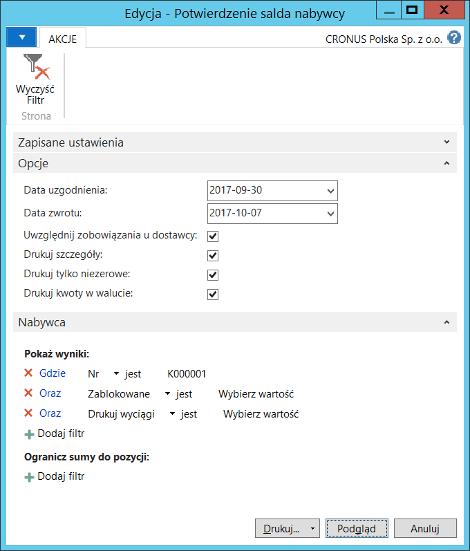
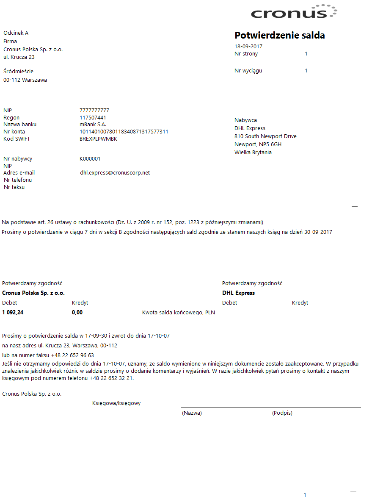

# Potwierdzenie salda nabywcy/dostawcy

## Informacje ogólne

 Na koniec każdego roku finansowego (lub innego okresu obrachunkowego,
 jeśli jest to konieczne) firmy tworzą zestawienia należności
 i zobowiązań w celu ich potwierdzenia z nabywcami i dostawcami.
 Nabywcy i dostawcy mają obowiązek dostarczyć informację zwrotną
 o zgodności lub niezgodności sald ustalonej na podstawie własnej
 ewidencji należności i zobowiązań.

 W ramach Polskiej Lokalizacji dostępne są raporty **Potwierdzenie
 salda nabywcy** i **Potwierdzenie salda dostawcy**,
 które przedstawiają stan należności lub zobowiązań na wybrany dzień.

## Obsługa

W celu wydrukowania potwierdzenia salda nabywcy, należy postępować
według następujących kroków:

1.  Należy wybrać **Działy \> Zarządzanie Finansami \> Należności \>
    Potwierdzenie salda nabywcy**.

2.  W oknie wstępnym raportu należy we właściwy sposób uzupełnić pola
    na karcie skróconej **Opcje**:

    -   **Data uzgodnienia** – w tym polu należy wprowadzić datę, na jaką
         mają być wykazane należności.
    
    -   **Data zwrotu** – data, do której nabywca powinien zwrócić
         potwierdzony odcinek dokumentu. To pole jest uzupełniane
         automatycznie datą o 7 dni późniejszą od **Daty uzgodnienia**.
         W razie potrzeby, **Datę zwrotu** można zmienić ręcznie.
    
    -   **Uwzględnij zobowiązania u dostawcy** – zaznaczenie tego pola
         spowoduje wykazanie salda kontrahenta w jednej kwocie jako różnicy
         pomiędzy jego należnościami a zobowiązaniami wobec niego. Jest
         to możliwe w sytuacji, gdy jeden kontrahent jest jednocześnie
         nabywcą i dostawcą. Kartoteka nabywcy i kartoteka dostawcy muszą
         być powiązane ze sobą za pośrednictwem kartoteki kontaktu.
    
    -   **Drukuj szczegóły** – zaznaczenie tego pola spowoduje wydrukowanie
         na odrębnej stronie zestawienia dokumentów, których niezapłacone
         kwoty składają się na saldo należności (również zobowiązań
         w sytuacji, gdy pole **Uwzględnij zobowiązania u dostawcy** jest
         zaznaczone).
    
    -   **Drukuj tylko niezerowe** – zaznaczenie tego pola spowoduje,
         że system pominie w drukowaniu **Potwierdzenia salda nabywcy**
         tych nabywców, których saldo należności na **Datę uzgodnienia**
         wynosi 0.
    
    -   **Drukuj kwoty w walucie** – zaznaczenie tego pola spowoduje
         wydrukowanie kwot składających się na saldo należności jako
         oddzielne sumy dla każdej waluty źródłowej oraz sumaryczną kwotę
         w walucie lokalnej jako równowartość według historycznego kursu
         wymiany (dotyczy to również kwot z dokumentów w zestawieniu
         szczegółów salda).
    
Na karcie skróconej **Nabywca** można w standardowy sposób ustawić
filtry ograniczające zakres danych wybranych do wydrukowania.

  

3.  Należy wybrać **Drukuj** w celu wydrukowania dokumentów
    potwierdzenia salda nabywców lub **Podgląd w **celu wyświetlenia
    ich na ekranie:

  

  

>[!NOTE]
>Po stronie zobowiązań, w analogiczny sposób, można przygotować
i wydrukować dokument **Potwierdzenie salda dostawcy**.