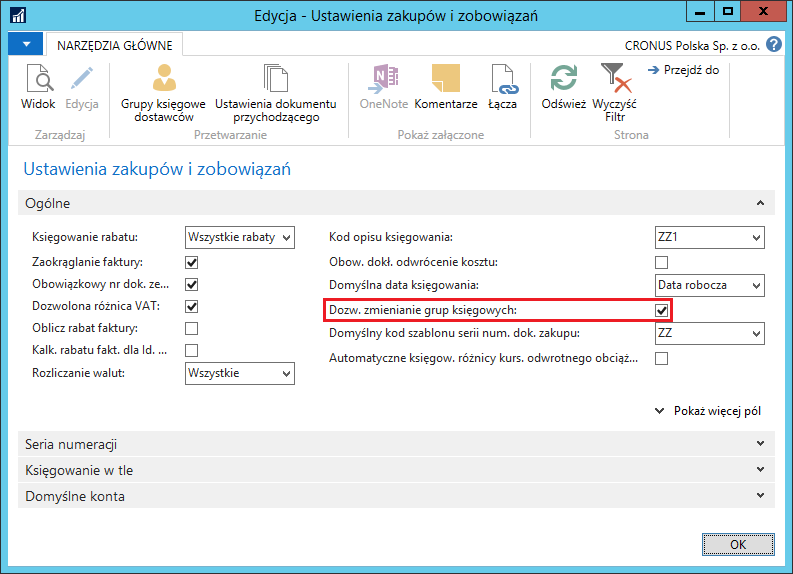
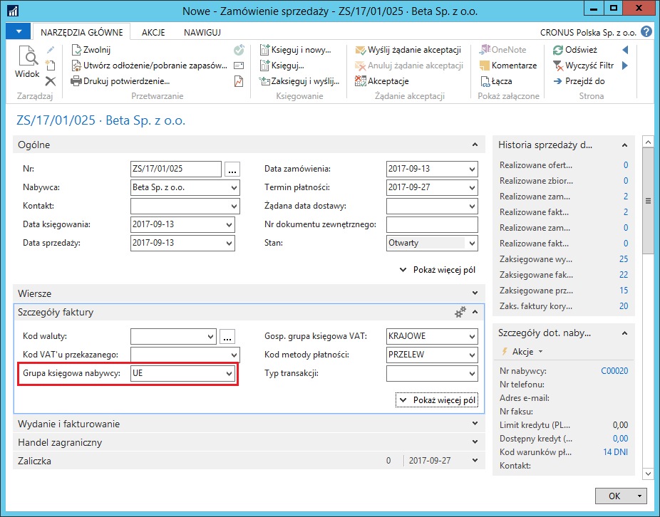
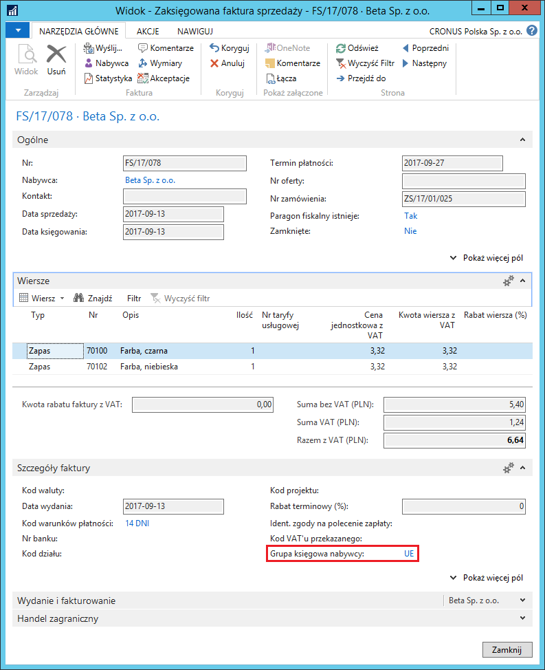
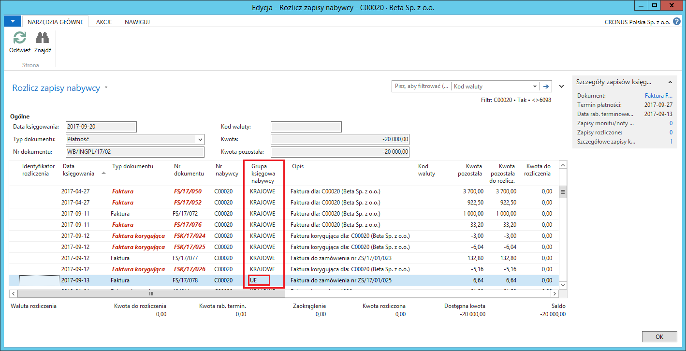
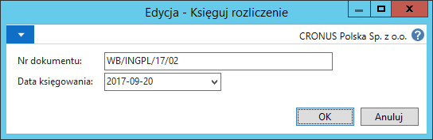
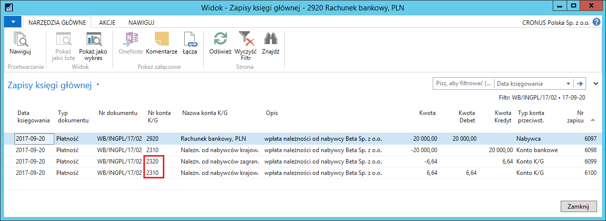

# Wiele kont należności/zobowiązań

## Informacje ogólne

Każdy nabywca (dostawca) zwykle ma zdefiniowaną w systemie jedną
kartotekę. Może być ona powiązana z jedną grupą księgową nabywcy
(dostawcy), czyli z jednym kontem K/G należności (zobowiązań). Często
zdarza się jednak, że należności (zobowiązania) jednego nabywcy
(dostawcy) księgowane powinny być na różne konta K/G, w zależności
od typu operacji gospodarczej, np. zobowiązania (należności) wynikające
z bieżącej działalności i wpłacone kaucje. Polska Lokalizacja zawiera
ułatwienie obsługi różnych typów należności (zobowiązań) w postaci
**Zastępczych grup księgowych**. Ułatwienie polega na tym,
że w kartotece nabywcy (dostawcy) przypisana jest domyślna grupa
księgowa, która kopiowana jest do wszystkich dokumentów, ale użytkownik
może zmienić tą grupę na wprowadzanym dokumencie, bez konieczności
zmiany domyślnej grupy księgowej nabywcy (dostawcy) w jego kartotece.

Możliwość zmiany grupy księgowej nabywcy (dostawcy) zależy od właściwych
ustawień i dotyczy dokumentów wprowadzanych w oknach:

-   Zamówienie sprzedaży

-   Faktura sprzedaży

-   Zamówienie zwrotu sprzedaży

-   Faktura korygująca sprzedaży

-   Nota odsetkowa

-   Faktura serwisowa

-   Serwisowa faktura korygująca

-   Zamówienie zakupu

-   Faktura zakupu

-   Zamówienie zwrotu zakupu

-   Faktura korygująca zakupu

-   Dziennik główny

-   Dziennik sprzedaży

-   Dziennik wpłat

-   Dziennik zakupu

-   Dziennik płatności

-   Wpłata gotówkowa

-   Wypłata gotówkowa

-   Dziennik wyciągów bankowych

## Ustawienia

W celu uniknięcia pomyłek przy zamianach grup księgowych nabywców (dostawców), należy zdefiniować właściwe kombinacje możliwych zamian. Dla jednej grupy księgowej można przypisać wiele grup substytutów, pamiętając o tym, aby relacje te były ustawione wzajemnie, tzn. np. dla grupy należności głównych ustawić substytut kaucji, a dla kaucji ustawić substytut należności głównych. Brak tego drugiego przykładowego ustawienia będzie skutkował tym, że w dokumencie możliwa będzie zamiana grupy księgowej z należności głównych na kaucje, ale nie będzie możliwe odwrócenie tej zamiany, gdyż kaucje nie będą miały zdefiniowanych substytutów, którymi mogą być zastąpione.

W celu zdefiniowania substytutów grup księgowych nabywców, należy
postępować według następujących kroków:

1.  Należy wybrać: **Działy \> Zarządzanie Finansami \> Administracja \>
     Grupy księgowe nabywców**

2.  W oknie **Grupy księgowe nabywców**, które się otworzy, należy
     zaznaczyć wybrany wiersz i wybrać **Substytuty**.

  

3.  W oknie **Zastępcze grupy księgowe nabywcy**, które się otworzy,
     w polu **Grupa księgowa nabywcy** należy w kolejnych wierszach
     wybrać z listy rozwijanej te grupy księgowe nabywców, na jakie
     może być zamieniana grupa, dla której definiowane są substytuty:

  

 Czynności opisane w punktach 2. i 3. należy powtórzyć dla wszystkich
 grup księgowych nabywców, które mogą być zamieniane.

W celu zdefiniowania substytutów grup księgowych dostawców, należy
postępować według następujących kroków:

1.  Należy wybrać: **Działy \> Zarządzanie Finansami \> Administracja \>
     Grupy księgowe dostawców**

2.  W oknie **Grupy księgowe dostawców**, które się otworzy, należy
     zaznaczyć wybrany wiersz i wybrać **Substytuty**.

  

3.  W oknie **Zastępcze grupy księgowe dostawcy**, które się otworzy,
     w polu **Grupa księgowa dostawcy** należy w kolejnych wierszach
     wybrać z listy rozwijanej te grupy księgowe dostawców, na jakie
     może być zamieniana grupa, dla której definiowane są substytuty:

  

 Czynności opisane w punktach 2. i 3. należy powtórzyć dla wszystkich
 grup księgowych dostawców, które mogą być zamieniane.

 Drugim ustawieniem związanym z funkcjonalnością zastępczych grup
 księgowych, jest pozwolenie na jej wykorzystanie w poszczególnych
 obszarach: Sprzedaży, Zakupów i Serwisu.

 W celu umożliwienia zamiany grup księgowych w dokumentach sprzedaży,
 należy postępować według następujących kroków:

1.  Należy wybrać **Działy \> Sprzedaż i Marketing \> Administracja \>
     Ustawienia sprzedaży i należności.**

2.  W oknie **Ustawienia sprzedaży i należn.**, które się otworzy,
     na karcie skróconej **Ogólne** należy zaznaczyć pole **Dozw.
     zmienianie grup księgowych**.

  

 W celu umożliwienia zamiany grup księgowych w dokumentach zakupu,
 należy postępować według następujących kroków:

1.  Należy wybrać **Działy \> Zakup \> Administracja \> Ustawienia
     zakupów i zobowiązań.**

2.  W oknie **Ustawienia zakupów i zobowiązań**, które się otworzy,
     na karcie skróconej **Ogólne** należy zaznaczyć pole **Dozw.
     zmienianie grup księgowych**.

  

 W celu umożliwienia zamiany grup księgowych w dokumentach serwisu,
 należy postępować według następujących kroków:

1.  Należy wybrać **Działy \> Serwis \> Administracja \> Ustawienia
     serwisu**

2.  W oknie **Ustawienia zarz. serwisem**, które się otworzy, na karcie
     skróconej **Ogólne** należy zaznaczyć pole **Dozw. zmienianie grup
     księgowych nabywcy:**

  

## Obsługa

### Księgowanie dokumentu ze zmienioną grupą księgową

Żeby zaksięgować dokument sprzedaży, zakupu lub serwisu ze zmienioną grupą księgową nabywcy, należy postępować według następujących kroków (przykład bazuje na zamówieniu sprzedaży):

1.  Należy wybrać **Działy \> Sprzedaż i Marketing \> Przetwarzanie
     zamówień \> Zamówienia sprzedaży \> Nowe.**

2.  W oknie **Zamówienie sprzedaży**, które się otworzy, należy
     standardowo uzupełnić dane nagłówkowe.

3.  Na karcie **skróconej Fakturowanie, w polu Grupa księgowa nabywcy
     widnieje kod grupy księgowej przypisanej do kartoteki wybranego
     nabywcy jako domyślna. Z listy rozwijanej w tym polu należy wybrać
     jedną z grup księgowych nabywcy, zdefiniowanych jako substytuty
     grupy domyślnej:**

  

 Wybranie w tym polu grupy księgowej, która nie jest zdefiniowana jako
 substytut grupy księgowej podlegającej zamianie, spowoduje
 wyświetlenie komunikatu o błędzie.

>[!NOTE]
>Pole **Grupa księgowa nabywcy** wyświetlone
jest w następujących dokumentach: **Zamówienie sprzedaży, Faktura
sprzedaży, Faktura korygująca sprzedaży, Zamówienie zwrotu sprzedaży,
Nota odsetkowa, Faktura serwisowa i Serwisowa faktura korygująca.** Pole
**Grupa księgowa dostawcy** wyświetlone jest w następujących
dokumentach: **Zamówienie zakupu, Faktura zakupu, Faktura korygująca
zakupu, Zamówienie zwrotu zakupu.**

4.  Należy standardowo wprowadzić wiersze dokumentu sprzedaży.

5.  Należy standardowo zaksięgować dokumenty sprzedaży (z zamówienia
     sprzedaży powinny zostać zaksięgowane 2 dokumenty: wydanie
     sprzedaży i faktura sprzedaży).

6.  Po zaksięgowaniu dokumentów sprzedaży należy je wyświetlić w formie
     kartoteki, żeby sprawdzić grupę księgową, z jaką dokumenty zostały
     zaksięgowane. W celu wyświetlenia zaksięgowanej faktury sprzedaży
     należy wybrać **Działy \> Sprzedaż i Marketing \> Archiwum \>
     Zaksięgowane faktury sprzedaży**

  

>[!NOTE]
>Pole **Grupa księgowa nabywcy** wyświetlone
jest w następujących zaksięgowanych dokumentach: **Zaksięgowane wydanie
sprzedaży, Zaksięgowana faktura sprzedaży, Zaksięgowane przyjęcie
zwrotu, Zaksięgowana faktura korygująca sprzedaży, Wygenerowana nota
odsetkowa, Zaksięgowane wydanie serwisowe, Zaksięgowana faktura
serwisowa i Zaksięgowana serwisowa faktura korygująca.** Pole **Grupa
księgowa dostawcy** wyświetlone jest w następujących zaksięgowanych
dokumentach: **Zaksięgowane przyjęcie zakupu, Zaksięgowana faktura
zakupu, Zaksięgowane wydanie zwrotu, Zaksięgowana faktura korygująca
zakupu.**

7.  Żeby zobaczyć zapisy powstałe w wyniku zaksięgowania faktury
    sprzedaży, należy wybrać akcję **Nawiguj** w oknie **Zaksięgowana
    faktura sprzedaży**. W oknie **Nawigacja** należy kolejno zaznaczać
    właściwe tabele (np. **Zapis K/G, Zapis księgi nabywców**)
    **i **wybierać **Pokaż powiązane zapisy w **celu sprawdzenia efektu
    zaksięgowania faktury sprzedaży ze zmienioną grupą księgową nabywcy.

  

  

### Księgowanie płatności ze zmienioną grupą księgową

Wpływ należności od nabywcy rejestrowany przez **Dzienniki** (dziennik
wyciągów bankowych, dziennik główny, dziennik wpłat, wpłata gotówkowa)
również może być zaksięgowany na konto KG powiązane z jedną
z zastępczych grup księgowych nabywców.

Żeby zaksięgować wpłatę należności ze zmienioną grupą księgową nabywcy, należy postępować według następujących kroków (przykład bazuje na dzienniku wyciągów bankowych):

1.  Należy wybrać **Działy \> Zarządzanie Finansami \> Zarządzanie
     środkami pieniężnymi \> Dziennik wyciągów bankowych.**

2.  W oknie **Dziennik wyciągów bankowych**, które się otworzy, należy
     standardowo wprowadzić wiersz płatności od nabywcy. W polu **Grupa
     księgowa** system automatycznie wstawi kod grupy księgowej nabywcy
     wybranej jako domyślna na kartotece nabywcy. Rozwijając listę
     w tym polu, można wybrać inną grupę księgową, jedną z tych,
     które zostały zdefiniowane jako substytuty grupy domyślnej:

  

3.  Należy zaksięgować wiersze w oknie **Dziennik wyciągów bankowych.**

4.  Po zaksięgowaniu możliwe jest sprawdzenie konta KG należności
     oraz grupy księgowej nabywcy w zapisach utworzonych na podstawie
     zaksięgowanego wyciągu bankowego. W tym celu należy użyć
     standardowej funkcji **Nawiguj** w zaksięgowanym dokumencie.

### Rozliczanie zapisów z różnymi grupami księgowymi

Jest kilka sposobów rozliczania zapisów księgi nabywcy (dostawcy).
Jednym z nich jest zaprezentowany poniżej – rozliczenie w oknie
otwieranym z kartoteki kontrahenta.

Żeby rozliczyć zapisy księgi nabywcy, należy postępować
według następujących kroków:

1.  Należy wybrać **Działy \> Zarządzanie Finansami \> Należności \>
     Nabywcy.**

2.  Na liście nabywców należy zaznaczyć wiersz z nabywcą wybranym
     do rozliczenia i wybrać **Zapisy księgi**.

3.  W oknie **Zapisy księgi nabywców**, które się otworzy, należy
     ustawić kursor w wierszu z dokumentem rozliczającym (zwykle jest
     to płatność) i wybrać **Rozlicza zapisy**.

4.  W oknie **Rozlicz zapisy nabywcy**, które się otworzy system
     automatycznie umieścił w nagłówku zapis (dokument) rozliczający.
     Z listy poniżej należy wybrać zapis do rozliczenia z inną grupą
     księgową niż w zapisie rozliczającym:

  

5.  Należy zaznaczyć wybrany zapis do rozliczenia poprzez wybranie akcji
     **Ustaw id. rozliczenia**.

6.  Należy wybrać **Księguj rozliczenie**.

7.  Zostanie wyświetlony standardowy komunikat przed zaksięgowaniem
     rozliczenia, który należy zaakceptować lub zmienić zaproponowane
     parametry na inne i zaakceptować, żeby wykonać księgowanie.

  

8.  Zaksięgowane rozliczenie utworzyło, zgodnie z wcześniej wyświetlonym
    komunikatem, dodatkowe zapisy na kontach KG, w celu uzgodnienia sald
    należności na poziomie rozliczonych grup księgowych i powiązanych
    z nimi kont KG należności:

  

{width="0.19in"
height="0.19in"}**Uwaga:** Funkcjonalność **Zastępczych grup
księgowych** w obszarze **Zakupy** działa dokładnie tak samo,
jak w obszarze **Sprzedaż**.

### Sugerowanie płatności dostawcy z różnymi grupami księgowymi

Sugerując płatności dostawcy należy mieć świadomość, że zapisy księgowe
jednego dostawcy mogą mieć różne grupy księgowe. Z tego powodu zostały
wprowadzone udogodnienia.

Żeby użyć skryptu **Sugeruj płatności dostawcy** należy postępować
według następujących kroków:

1.  Należy wybrać **Działy \> Zarządzanie Finansami \> Zobowiązania \>
     Dzienniki płatności**.

2.  W oknie **Dziennik płatności**, które się otworzy, należy wybrać
     **Sugeruj płatności dostawcy**.

3.  Na karcie skróconej **Grupa księgowa dostawcy**, w polu **Kod**
     można ustawić filtr na jedną lub więcej grup księgowych, dla
     których system ma zaproponować płatności jednemu dostawcy.

  

4.  Pozostałe parametry należy uzupełnić standardowo. Zaznaczenie pola
     **Sumuj dla dostawcy** na karcie skróconej **Opcje** spowoduje
     standardowe zsumowanie zobowiązań, ale z dokładnością do grup
     księgowych użytych w zapisach zobowiązań dostawcy.

5.  Należy wybrać **OK** w celu wykonania funkcji.

6.  W oknie **Dziennik płatności** można zweryfikować zasugerowane
     przez system płatności, wprowadzone w wielu wierszach,
     odzwierciedlających ilość uwzględnionych grup księgowych.

  