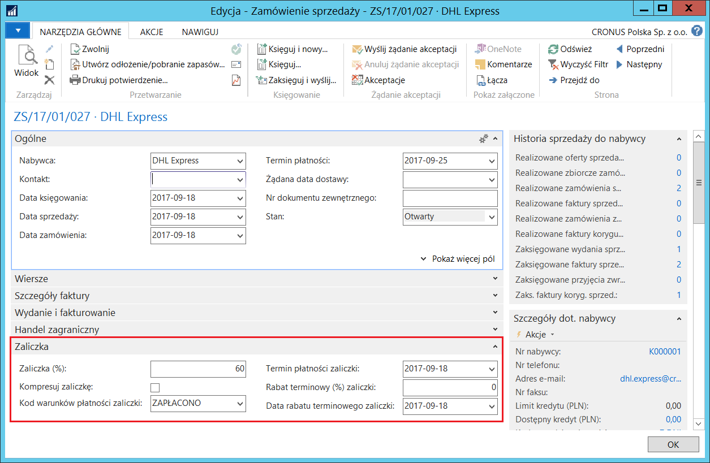
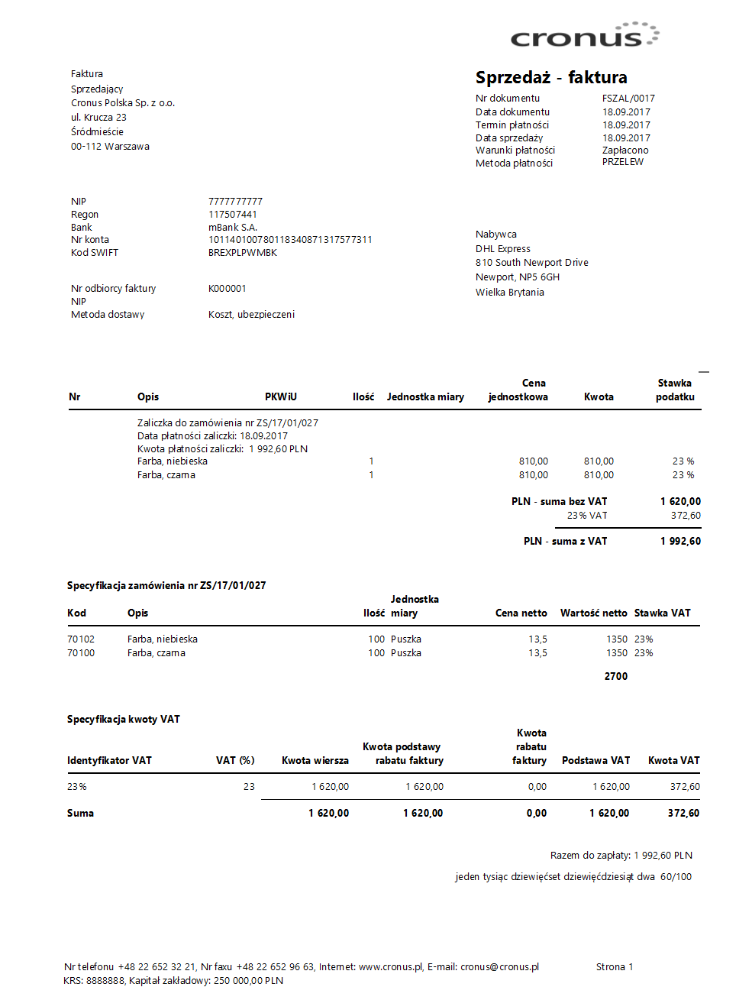

# Faktury zaliczkowe

## Informacje ogólne

Przepisy prawa polskiego w zakresie VAT wymagają wystawiania faktury
zaliczkowej do wpłaconych przez nabywcę zaliczek z tytułu realizacji
zamówienia sprzedaży. W systemie Microsoft Dynamics 365 Business Central
on‑premises, faktury zaliczkowe są wystawiane i księgowane przy pomocy
funkcjonalności faktur zaliczkowych. Polska Lokalizacja rozszerza
standardową funkcjonalność faktur zaliczkowych w zakresie dostosowania
jej do wymagań przepisów polskiego prawa.

## Ustawienia

Rozszerzenie funkcjonalności do obsługi faktur korygujących sprzedaży
dodane w ramach Polskiej Lokalizacji zawiera m.in. obowiązek podawania
**Przyczyny korekty**. Wymaganie to obejmuje również faktury korygujące
zaliczki sprzedaży. Ponieważ faktury korygujące zaliczki mają tylko
jedną funkcję: wycofują wszystkie zaksięgowane faktury zaliczkowe
do zamówienia, dlatego przyczyna korekty zawsze będzie taka sama.
Aby nie było konieczne przypisywanie tej przyczyny dla każdej
pojedynczej faktury korygującej zaliczki sprzedaży, w ustawieniach
zostało dodane pole domyślnej przyczyny, która będzie wstawiana
automatycznie do wszystkich faktur korygujących zaliczki sprzedaży.
W celu zdefiniowania tego ustawienia, należy postępować
według następujących kroków:

1.  Należy wybrać **Działy \> Sprzedaż i Marketing \> Administracja \>
    Ustawienia sprzedaży i należności**.

2.  W oknie **Ustawienia sprzedaży i należn.**, które się otworzy,
     na karcie skróconej **Ogólne**, **z **listy rozwijanej w polu
     **Kod przyczyny korekty zaliczki** należy wybrać jedną z wcześniej
     zdefiniowanych przyczyn korekty.

  

## Obsługa

Większość opisanych funkcji jest dostępna zarówno w module sprzedaży,
jak i w module zakupy, z wyjątkiem specyficznych modyfikacji procesu
wystawiania faktur zaliczkowych sprzedaży.

Aby wystawić fakturę zaliczkową do zamówienia sprzedaży, należy
postępować według następujących kroków:

1.  Należy wybrać **Działy \> Sprzedaż i Marketing \> Przetwarzanie
    zamówień \> Zamówienia sprzedaży.**

2.  W oknie, które się otworzy należy wybrać zamówienie sprzedaży
    i otworzyć je w trybie edycji, wybierając **Edytuj.** Należy zwrócić
    uwagę na pole **Stan** – musi być w nim opcja **Otwarty**.

3.  Na karcie skróconej **Zaliczka** należy odpowiednio wypełnić pola:

    -   **Zaliczka (%)** – na podstawie wartości procentowej wpisanej w tym
         polu, system skalkuluje proponowaną kwotę zaliczki, bazując
         na wartości zamówienia sprzedaży. Kwota zaliczki kalkulowana jest
         odrębnie dla każdego wiersza zamówienia.
    
    >[!NOTE]
    >Pole **Zaliczka (%)** może być uzupełniane
    automatycznie właściwą wartością, jeśli zostanie ona wprowadzona
    w kartotece nabywcy (dostawcy) w polu **Zaliczka (%) na **karcie
    skróconej **Fakturowanie**.
    
    -   **Kompresuj zaliczkę** – to pole należy zaznaczyć, aby połączyć
        zaliczki z wierszy zamówienia sprzedaży, które spełniają warunki:
    
        -   mają takie samo konto księgi głównej do obsługi zaliczek (wybrane
             w polu **Konto zaliczek sprzedaży** w oknie **Główne ustawienia
             księgowań**, dla kombinacji kodów głównych grup księgowych użytych
             w wierszach zamówienia)
        
        -   mają takie same wymiary.
        
        Pole należy pozostawić puste, jeśli wiersze faktury zaliczkowej mają
        odpowiadać wierszom zamówienia sprzedaży.
    
    -   **Kod warunków płatności zaliczki** – z listy rozwijanej w tym polu
         należy wybrać warunki płatności, na podstawie których system
         ustali termin płatności należnej zaliczki.
    
    -   **Termin płatności zaliczki** – data, do której nabywca powinien
         wpłacić należną zaliczkę. Data ta kalkulowana jest na podstawie
         warunków wybranych w polu **Kod warunków płatności zaliczki**.
    
    -   **Rabat terminowy (%) zaliczki** – w tym polu można wprowadzić
         procentową wysokość rabatu udzielonego w przypadku, gdy należność
         z tytułu zaliczki zostanie uiszczona do dnia wprowadzonego w polu
         **Data rabatu terminowego zaliczki**. Pole jest uzupełniane
         domyślnie na podstawie parametrów zdefiniowanych dla warunków
         płatności wybranych w polu **Kod warunków płatności zaliczki**.
    
    -   **Data rabatu terminowego zaliczki** – w tym polu wprowadzana jest
         data końcowa okresu, w którym nabywca powinien uiścić należną
         zaliczkę w celu otrzymania rabatu terminowego. Pole jest
         uzupełniane domyślnie na podstawie parametrów zdefiniowanych
         dla warunków płatności wybranych w polu **Kod warunków płatności
         zaliczki** oraz **Daty dokumentu.**

>[!NOTE]
>W zamówieniu zakupu konieczne jest wprowadzenie właściwych numerów dokumentów jednym z dwóch pól,
w zależności od tego, czy księgowana jest faktura zaliczkowa, czy
faktura korygująca zaliczkę: **Nr faktury dostawcy na **karcie
skróconej **Ogólne** (numer faktury zaliczkowej wystawionej
przez dostawcę) oraz **Nr faktury kor. dostawcy na **karcie skróconej
**Zaliczka** (numer faktury korygującej zaliczkę wystawionej
przez dostawcę).

  
4.  Po uzupełnieniu w kartotece zamówienia wymaganych informacji
    o zaliczce, należy przejść do okna **Statystyka sprzedaży
    Zamówienie** i na karcie skróconej **Zaliczka** sprawdzić kwoty
    skalkulowane przez system.

  

5.  W razie potrzeby, można ręcznie zmienić zasugerowaną przez system
    kwotę w polu **Kwota zaliczki z VAT**. Na podstawie nowej kwoty,
    system skalkuluje i zmieni kwotę w polu **Kwota zaliczki bez VAT**.

>[!NOTE]
>Zmiany w funkcjonalności **Zaliczek**
wprowadzone w ramach **Polskiej Lokalizacji** pozwalają na zmianę
w oknie **Statystyka sprzedaży** jedynie kwoty brutto sugerowanej
zaliczki, niezależnie od tego, czy na zamówieniu sprzedaży zaznaczone
jest pole **Ceny z VAT.** Możliwość zmiany kwoty netto została
wyłączona. Ponadto algorytm używany do alokowania części kwoty
zaliczki do wierszy zamówienia sprzedaży został zmieniony: teraz
system oblicza proporcję na podstawie kwoty brutto w wierszu
zamówienia sprzedaży.

6.  Fakturę zaliczkową można testowo wydrukować przed wystawieniem.
    W tym celu, w oknie **Zamówienie sprzedaży** należy wybrać
    **Zaliczka** **\> Raport testowy zaliczki**, a następnie
    **Drukuj** lub **Podgląd wydruku**.

7.  Jeżeli wszystkie dane niezbędne do wystawienia faktury zaliczkowej
    zostały poprawnie uzupełnione, należy, w oknie **Zamówienie
    sprzedaży**, wybrać **Zaliczka \> Księguj fakturę zaliczkową
    lub Zaliczka \> Księguj i drukuj fakturę zaliczkową**.

8.  Zaksięgowanie faktury zaliczkowej powoduje zmianę **Stanu**
     zamówienia sprzedaży na **Oczekuje na zaliczkę**. Takie stan
     powoduje uniemożliwienie edycji danych w zamówieniu.

>[!NOTE]
>Jeśli zajdzie potrzeba zaksięgowania
(wystawienia) większej ilości faktur zaliczkowych do jednego
zamówienia sprzedaży, należy zmienić stan zamówienia z **Oczekuje
na zaliczkę na Otwarty**, a następnie w oknie statystyk zamówienia,
na karcie skróconej **Zaliczka** należy zmienić kwotę w polu **Kwota
zaliczki z VAT**. Nowa kwota wprowadzona w tym polu powinna być sumą
poprzedniej i bieżącej faktury zaliczkowej. Następnie należy
zweryfikować pozostałe dane w zamówieniu i wybrać **Zaliczka \>
Księguj fakturę zaliczkową lub Zaliczka \> Księguj i drukuj fakturę
zaliczkową.**

  

W sytuacji, gdy faktura zaliczkowa została wystawiona pomyłkowo
lub nieprawidłowo, można ją skorygować, wystawiając fakturę korygującą
zaliczkę. Faktura korygująca zaliczkę dokładnie odwraca fakturę
zaliczkową, dlatego nie można wprowadzać żadnych zmian w wierszach
zamówienia sprzedaży przed zaksięgowaniem faktury korygującej zaliczkę.
W celu zaksięgowania faktury korygującej sprzedaży, należy postępować
według następujących kroków:

1.  W kartotece zamówienia sprzedaży, do którego została zaksięgowana
    faktura zaliczkowa, należy wybrać **Zaliczka \> Księguj fakturę
    korygującą zaliczkę lub Zaliczka \> Księguj i drukuj fakturę
    korygującą zaliczkę**.

>[!NOTE]
>Zaksięgowanie faktury korygującej zaliczkę
powoduje wycofanie wszystkich faktur zaliczkowych wystawionych
do danego zamówienia**.**

  
2.  Po otrzymaniu komunikatu o poprawnym zaksięgowaniu faktury
     korygującej zaliczkę, należy w oknie zamówienia sprzedaży wybrać
     **Otwórz ponownie**, aby zmienić stan zamówienia na **Otwarty**
     i dokonać niezbędnych zmian w jego danych.

3.  W celu zaksięgowania faktury zaliczkowej po naniesieniu poprawek,
     należy postępować w sposób opisany powyżej.

Kiedy wszystkie faktury zaliczkowe do danego zamówienia sprzedaży
są wystawione, a towary dostarczone, można zaksięgować ostateczną
fakturę sprzedaży, w sposób standardowy dla wszystkich faktur sprzedaży.
Można też dokonać fakturowania częściowego.

  

Z punktu widzenia użytkownika, nie ma więcej różnic w obsłudze tego
procesu, w porównaniu z międzynarodowym standardem funkcjonalności
zaliczek. Występują natomiast dwie różnice w zakresie rozliczenia kwoty
zaliczek:

1.  Potrącenie zaliczki podczas ostatecznego częściowego fakturowania.

    Podczas ostatecznego częściowego fakturowania, standardowa
    funkcjonalność zmniejsza kwotę częściowej faktury ostatecznej o kwotę
    skalkulowaną jako proporcja łącznej kwoty zaliczek do kwoty
    zamówienia. Ten algorytm został zmodyfikowany i system potrąca tyle
    kwoty zaliczki, ile jest to możliwe i w przypadku, gdy łączna kwota
    zaliczek jest wyższa niż kwota częściowej faktury ostatecznej, kwota
    częściowej faktury ostatecznej będzie zerowa, natomiast, jeżeli łączna
    kwota zaliczek jest niższa niż kwota częściowej faktury ostatecznej,
    kwota częściowej faktury ostatecznej zostanie pomniejszona o łączną
    kwotę zaliczek.

2.  Podział potrąconych kwot do kwot faktur zaliczkowych.

    Standardowa funkcjonalność pomniejsza kwotę ostatecznej faktury
    o łączną kwotę zaliczek do zamówienia. Przepisy polskiego prawa
    wymagają pokazania na ostatecznej fakturze sprzedaży numerów i kwot
    potrąconych faktur zaliczkowych i w wyniku zmodyfikowania standardowej
    funkcjonalności, system wykazuje faktury zaliczkowe sprzedaży
    według numeru, daty sprzedaży, kwoty netto, kwoty VAT i kwoty brutto.

Polska Lokalizacja wprowadziła też zmiany w standardowej obsłudze
zaliczek w walucie obcej. Standardowa funkcjonalność nie dokonuje
żadnych automatycznych przeszacowań zaliczek, ale po modyfikacjach
wprowadzonych przez Polską Lokalizację, system kalkuluje kwoty
ostatecznych faktur w następujący sposób:

1.  Wiersze potrącenia zaliczek są kalkulowane według historycznego
    kursu wymiany użytego na fakturze zaliczkowej (lub fakturach
    zaliczkowych, jeśli było ich więcej zaksięgowanych dla danego
    zamówienia sprzedaży..

2.  Wiersze zamówienia sprzedaży są kalkulowane według nowego kursu
    wymiany użytego do wystawienia ostatecznej faktury.

3.  System kalkuluje kwotę wiersza w zamówieniu sprzedaży
    według historycznego kursu wymiany użytego na fakturze
    zaliczkowej, a następnie oblicza różnicę pomiędzy tą kwotą,
    a wartością wierszy zamówienia sprzedaży skalkulowaną
    według nowego kursu wymiany użytego do wystawienia ostatecznej
    faktury. Kwota netto różnic jest zaksięgowana na konto K/G
    dodatnich lub ujemnych różnic kursowych, a kwota VAT różnic jest
    zaksięgowana na konto K/G VAT'u należnego. Utworzony też zostaje
    odpowiedni zapis VAT.

4.  System księguje należność od nabywcy w kwocie różnicy pomiędzy kwotą
    brutto zamówienia sprzedaży a wartością faktur zaliczkowych,
    według nowego kursu wymiany użytego do zaksięgowania ostatecznej
    faktury sprzedaży.