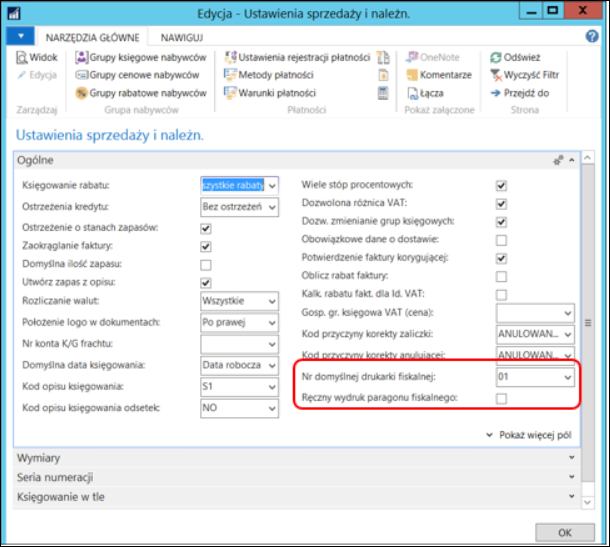
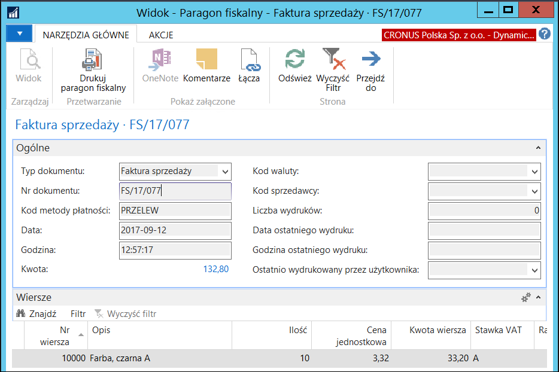
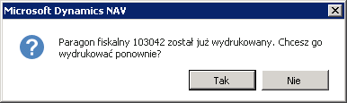

# Drukowanie paragonów fiskalnych

## Informacje ogólne

W ramach Polskiej Lokalizacji systemu Microsoft Dynamics 365 Business
Central on‑premises zostało udostępnione narzędzie umożliwiające
komunikację pomiędzy systemem a drukarką fiskalną, w celu drukowania
paragonów fiskalnych potwierdzających sprzedaż zaewidencjonowaną
w systemie.

## Ustawienia

Przed przystąpieniem do definiowania ustawień w systemie Microsoft
Dynamics 365 Business Central on‑premises konieczne jest sprawdzenie
i ewentualne skorygowanie formatowania liczb w ustawieniach komputera,
do którego jest podłączona drukarka fiskalna. Ważne są 2 parametry:

-   **Symbol dziesiętny** – przecinek

-   **Symbol grupowania cyfr** – spacja

  

W celu zdefiniowania parametrów drukarki fiskalnej, należy postępować
według następujących kroków:

1.  Należy wybrać **Działy \> Administracja \> Administracja IT \>**
    **Ogólne \> Drukarki fiskalne**.

2.  W oknie **Drukarki fiskalne**, które się otworzy, należy wybrać
    **Nowe**.

3.  W oknie **Ustawienia drukarki fiskalnej**, które się otworzy, należy
    wprowadzić właściwe parametry, zgodnie z poniższym opisem:

    -   Karta skrócona **Ogólne**:
    
        -   **Nr drukarki fiskalnej** – w tym polu należy wprowadzić unikalny
             numer, pod którym będzie identyfikowana drukarka fiskalna.
        
        -   **Nr portu seryjnego** – w tym polu należy wprowadzić numer portu,
             po jakim odbywa się komunikacja.
        
        -   **Nr unikatowy** – pole nieedytowalne, system automatycznie wstawia
             unikatowy numer zwracany przez drukarkę w wyniku testów.
        
        -   **Protokół drukarki fiskalnej** – w tym polu należy wprowadzić
             protokół drukarki.
        
        -   **Połączenie** – z listy rozwijanej w tym polu należy wybrać jedną
             z opcji:
        
            -   **Klient** – wybór tej opcji oznacza połączenie drukarki fiskalnej
                 portem szeregowym lokalnie do komputera.
            
            -   **Serwer** – wybór tej opcji oznacza połączenie drukarki fiskalnej
                 przez MOXę.
        
        -   **Identyfikator kasjera** – z listy rozwijanej w tym polu należy
             wybrać jedną z opcji:
        
            -   **Kod kasjera** – wybór tej opcji spowoduje wydrukowanie
                 na paragonie kodu sprzedawcy wybranego w polu **Kod sprzedawcy**
                 w fakturze sprzedaży.
            
            -   **Nazwisko kasjera** – wybór tej opcji spowoduje wydrukowanie
                 na paragonie nazwy sprzedawcy wybranego w polu **Kod sprzedawcy**
                 w fakturze sprzedaży.
        
        -   **Otwórz szufladę** – zaznaczenie tego pola spowoduje otwarcie
             szuflady drukarki w momencie drukowania paragonu.
        
        -   **Limit czasu połączenia drukarki** – w tym polu należy wpisać czas
             w milisekundach.
        
        -   **Potwierdzenie wymiany danych** – pole używane wyłącznie do testów
             – każde prawidłowe połączenie z drukarką zwraca stosowną
             informację.
        
        -   **Min długość nazwy** – w tym polu należy wprowadzić minimalną
             ilość znaków dla długości nazwy (linii) wysyłanej do drukarki.
        
        -   **Max długość nazwy** – w tym polu należy wprowadzić maksymalną
             ilość znaków dla długości nazwy (linii) wysyłanej do drukarki.
        
        -   **Parametr komunikacji (ms)**

        >[!NOTE]
        >W polach **Min długość nazwy** i **Max długość nazwy**
        domyślne wartości wstawiają się automatycznie po wybraniu protokołu
        drukarki, ale niektóre można modyfikować w zakresie dozwolonym
        dla wybranego protokołu drukarki.

    -   Karta skrócona **Stawki VAT**
    
        -   **VAT A**– w tym polu należy wpisać wartość procentową stawki VAT
             o kodzie A.
        
        -   **Bez VAT A**– to pole należy zaznaczyć, jeżeli stawka VAT
             o kodzie A jest zwolniona.
        
        -   **VAT B** – w tym polu należy wpisać wartość procentową stawki VAT
             o kodzie B.
        
        -   **Bez VAT B** – to pole należy zaznaczyć, jeżeli stawka VAT
             o kodzie B jest zwolniona.
        
        -   **VAT C** – w tym polu należy wpisać wartość procentową stawki VAT
             o kodzie C.
        
        -   **Bez VAT C** – to pole należy zaznaczyć, jeżeli stawka VAT
             o kodzie C jest zwolniona.
        
        -   **VAT D** – w tym polu należy wpisać wartość procentową stawki VAT
             o kodzie D.
        
        -   **Bez VAT D** – to pole należy zaznaczyć, jeżeli stawka VAT
             o kodzie D jest zwolniona.
        
        -   **VAT E**– w tym polu należy wpisać wartość procentową stawki VAT
             o kodzie E.
        
        -   **Bez VAT E**– to pole należy zaznaczyć, jeżeli stawka VAT
             o kodzie E jest zwolniona.
        
        -   **VAT F** – w tym polu należy wpisać wartość procentową stawki VAT
             o kodzie F.
        
        -   **Bez VAT F** – to pole należy zaznaczyć, jeżeli stawka VAT
             o kodzie F jest zwolniona.
        
        -   **VAT G** – w tym polu należy wpisać wartość procentową stawki VAT
             o kodzie G.
        
        -   **Bez VAT G** – to pole należy zaznaczyć, jeżeli stawka VAT
             o kodzie G jest zwolniona.
        
        -   **VAT H** – w tym polu należy wpisać wartość procentową stawki VAT
             o kodzie H.
        
        -   **Bez VAT H** – to pole należy zaznaczyć, jeżeli stawka VAT
             o kodzie H jest zwolniona.
    
        >[!NOTE]
        >Wyżej wymienione stawki VAT nie muszą być wprowadzane
        ręcznie, mogą być pobrane z drukarki fiskalnej. W tym celu należy użyć
        akcji Aktualizuj **stawki VAT.**
    
        -   **Tow. grupa księgowa bez VAT** – w tym polu należy wybrać kod
             **Towarowej grupy księgowej VAT** stosowany dla stawki VAT
             zwolniona podczas ewidencji sprzedaży w systemie.
    
    -   Karta skrócona **Status drukarki**
    
        -   **Data ostatniego testu** – pole uzupełniane automatycznie
             przez system podczas przeprowadzania testów komunikacji
             z drukarką.
        
        -   **Wynik ostatniego testu** – pole uzupełniane automatycznie
             przez system podczas przeprowadzania testów komunikacji
             z drukarką.

  

4.  Należy przeprowadzić test ustawień drukarki fiskalnej, używając
     niektórych z akcji znajdujących się na wstążce w oknie
     **Ustawienia drukarki fiskalnej**:

    -   **Drukuj paragon testowy** – uruchamiając tę akcję można wydrukować
         paragon testowy. Paragon ten zawsze ma kwotę 25gr brutto.
    
    -   **Test szuflady** – uruchamiając tę akcję można przetestować
         otwieranie szuflady.
    
    -   **Test wymiany danych** – uruchamiając tę akcję można sprawdzić,
         czy dane są odbierane i wysyłane pomiędzy drukarką a systemem.
    
    -   **Połączenie drukarki** – uruchamiając tę akcję można sprawdzić,
         czy drukarka jest połączona z systemem.

5.  Należy otworzyć okno **Ustawienia użytkownika** wybierając
    **Działy \> Administracja \> Ustawienia aplikacji \>
    Użytkownicy \> Ustawienia użytkownika**. W oknie tym można
    przypisać poszczególne drukarki fiskalne do poszczególnych
    użytkowników. W tym celu, w wierszu z ustawieniami wybranego
    użytkownika, należy z listy rozwijanej w polu **Nr drukarki
    fiskalnej** wybrać właściwą drukarkę fiskalną.

  

>[!NOTE]
>Brak przypisania konkretnej drukarki fiskalnej
do użytkownika oznacza, że dany użytkownik będzie drukował paragony
na domyślnej drukarce fiskalnej wybranej w oknie **Ustawienia
sprzedaży i należn.**

6.  Należy otworzyć okno **Ustawienia sprzedaży i należn.** wybierając
    **Działy \> Sprzedaż i Marketing \> Administracja \> Ustawienia
    sprzedaży i należności**. **W **oknie, które się otworzy, na karcie
    skróconej **Ogólne**, należy wypełnić pola:

    -   **Nr domyślnej drukarki fiskalnej** – z listy rozwijanej w tym polu
         należy wybrać domyślną drukarkę. Będą na niej drukowane paragony
         fiskalne przez użytkowników, którzy nie mają przypisanej
         konkretnej drukarki w oknie **Ustawienia użytkownika**.
    
    -   **Ręczny wydruk paragonu fisk**. – zaznaczenie tego pola spowoduje,
         że paragon będzie musiał być ręcznie drukowany w każdym przypadku
         sprzedaży fiskalnej. Brak znacznika oznacza, że uruchomienie
         funkcji księgującej fakturę sprzedaży spowoduje jednoczesny wydruk
         paragonu fiskalnego.

  

7.  Na paragonie fiskalnym drukowana jest informacja o metodzie
    płatności. Takie same metody płatności mogą mieć różne kody
    w ustawieniach drukarki fiskalnej i ustawieniach systemu, więc
    konieczne jest ich zmapowanie. Dokonuje się tego w oknie
    **Mapowanie metod płatności** otwieranym poprzez wybranie
    **Działy \> Administracja \> Administracja IT \>** **Ogólne \>
    Mapowanie metod płatności**. W oknie, które się otworzy, należy
    wybrać **Nowe i **uzupełnić pola zgodnie z opisem:

    -   **Protokół drukarki fiskalnej** – z listy rozwijanej w tym polu
         należy wybrać protokół drukarki, dla którego zmapowane zostaną
         metody płatności.
    
    -   **Nr drukarki fiskalnej** - należy z listy rozwijanej w tym polu
         wybrać właściwą drukarkę fiskalną.
    
    -   **Gotówka** – z listy rozwijanej w tym polu należy wybrać kod
         metody płatności zdefiniowany w systemie, odpowiadający metodzie
         płatności **Gotówka** ustawionej dla wybranego protokołu drukarki
         fiskalnej.
    
    -   **Karta** – z listy rozwijanej w tym polu należy wybrać kod metody
         płatności zdefiniowany w systemie, odpowiadający metodzie
         płatności **Karta** ustawionej dla wybranego protokołu drukarki
         fiskalnej.
    
    -   **Czek** – z listy rozwijanej w tym polu należy wybrać kod metody
         płatności zdefiniowany w systemie, odpowiadający metodzie
         płatności **Czek** ustawionej dla wybranego protokołu drukarki
         fiskalnej.
    
    -   **Bon towarowy** – z listy rozwijanej w tym polu należy wybrać kod
         metody płatności zdefiniowany w systemie, odpowiadający metodzie
         płatności **Bon towarowy** ustawionej dla wybranego protokołu
         drukarki fiskalnej.
    
    -   **Inne** – z listy rozwijanej w tym polu należy wybrać kod metody
         płatności zdefiniowany w systemie, odpowiadający metodzie
         płatności **Inne** ustawionej dla wybranego protokołu drukarki
         fiskalnej.
    
    -   **Kredyt** – z listy rozwijanej w tym polu należy wybrać kod metody
         płatności zdefiniowany w systemie, odpowiadający metodzie
         płatności **Kredyt** ustawionej dla wybranego protokołu drukarki
         fiskalnej.
    
    -   **Konto nabywcy** – z listy rozwijanej w tym polu należy wybrać kod
         metody płatności zdefiniowany w systemie, odpowiadający metodzie
         **Konto nabywcy** płatności ustawionej dla wybranego protokołu
         drukarki fiskalnej.
    
    -   **Kupon** – z listy rozwijanej w tym polu należy wybrać kod metody
         płatności zdefiniowany w systemie, odpowiadający metodzie
         płatności **Kupon** ustawionej dla wybranego protokołu drukarki
         fiskalnej.
    
  

## Obsługa

>[!NOTE]
>Funkcja drukowania paragonów fiskalnych działa identycznie
w **Fakturach sprzedaży i Zamówieniach sprzedaży**. W dokumentacji
proces ten opisany jest na przykładzie **Faktury sprzedaży**.

W celu wydrukowania paragonu fiskalnego, należy postępować
według następujących kroków:

1.  Należy wybrać **Działy \> Sprzedaż i Marketing \> Przetwarzanie
    zamówień \>** **Faktura sprzedaży**, a następnie **Nowe**.

2.  W oknie nowej faktury sprzedaży konieczne jest zaznaczenie dwóch pól
    na karcie skróconej **Fakturowanie**:

    -   **Paragon fiskalny**
    
    -   **Ceny z VAT**
    
     Brak zaznaczenia któregokolwiek z ww. pól spowoduje uniemożliwienie
     wydruku paragonu fiskalnego.

  

>[!NOTE]
>Pola **Paragon fiskalny** i **Ceny z VAT** można zaznaczyć
domyślnie na kartotece nabywcy. W dokumentach sprzedaży wystawianych
temu nabywcy system będzie automatycznie zaznaczał analogiczne pola.

3.  Pozostałe dane o sprzedaży należy wprowadzić w standardowy sposób.

4.  Fakturę należy zaksięgować poprzez wybranie **Księguj**. Akcja ta
     spowoduje jednoczesne wydrukowanie paragonu fiskalnego.

5.  Można sprawdzić, czy paragon fiskalny został wydrukowany. W tym celu
     należy otworzyć zaksięgowaną fakturę sprzedaży, wybierając
    **Działy \> Sprzedaż i Marketing \> Archiwum \>** **Zaksięgowane
    faktury sprzedaży**.

6.  W oknie z listą zaksięgowanych faktur sprzedaży należy odnaleźć
    właściwy dokument i otworzyć go w trybie widoku.

7.  Jeśli w polu **Paragon fiskalny istnieje** jest opcja **Tak**,
    to oznacza, że proces został przeprowadzony prawidłowo.

  

>[!NOTE]
>Standardowo w dokumentach z istniejącym paragonem fiskalnym
 niedozwolone jest ponowne drukowanie paragonu.

 Proces drukowania paragonów fiskalnych czasami może się nie powieść,
 np. w wyniku awarii sprzętowej lub awarii połączenia. Wtedy uprawniony
 użytkownik może wykonać następujące czynności:

1.  Z przyczyn losowych, np. utraty zasilania, drukarka może przerwać
    drukowanie paragonu. Wtedy w oknie **Ustawienia drukarki
    fiskalnej** wybranej drukarki można uruchomić akcję **Anuluj
     transakcję**. Akcja ta wysyła do drukarki sekwencję anulowania
     rozpoczętego drukowania paragonu. Dzięki temu, drukarka nie
     pozostanie w trakcie transakcji drukowania paragonu. W zależności
     od typu drukarki, anulowanie może nastąpić automatycznie, ale np.
     dopiero po 30 minutach.

2.  Istniejący paragon fiskalny, powiązany z zaksięgowaną fakturą
     sprzedaży, może być ponownie wydrukowany tylko przez uprawnionego
     użytkownika. W celu ponownego wydrukowania, należy otworzyć
     kartotekę wybranej zaksięgowanej faktury sprzedaży, a następnie
     w menu **Nawiguj** wybrać **Paragon fiskalny**. Otworzy się okno
     z kartoteką utworzonego paragonu do faktury i w tym oknie należy
     wybrać akcję **Drukuj paragon fiskalny**:

    

    System wyświetli komunikat z ostrzeżeniem, którego zaakceptowanie
    spowoduje ponowne wydrukowanie tego samego paragonu:

    

W systemie zapamiętywana jest informacja o wydrukach paragonów:

  