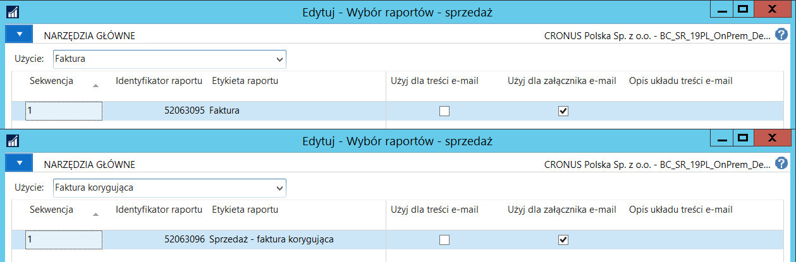
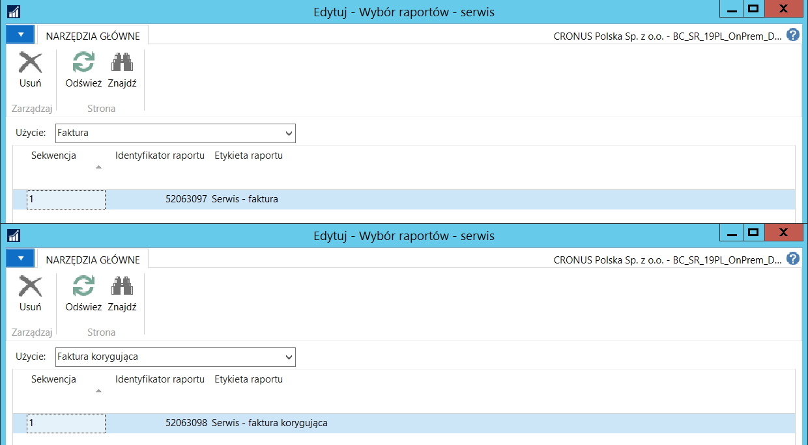

# Wydruki dokumentów sprzedaży

## Informacje ogólne

W ramach Polskiej Lokalizacji systemu Microsoft Dynamics 365 Business
Central on‑premises wydruki dokumentów sprzedaży zostały przygotowane
zgodnie z wymaganiami ustawowymi i zawierają wszystkie wymagane
elementy.

Nowe wydruki są dostępne dla:

-   zaksięgowanych faktur sprzedaży

-   zaksięgowanych faktur korygujących sprzedaży

-   zaksięgowanych faktur sprzedaży serwisu

-   zaksięgowanych faktur korygujących sprzedaży serwisu

## Ustawienia

W celu przypisania raportów przygotowanych w ramach Polskiej
Lokalizacji, jako domyślnych do drukowania wybranych rodzajów
dokumentów sprzedaży, należy wykonać następujące kroki:

1.  Należy wybrać **Działy \> Administracja \> Administracja IT \>
    Raporty \> Wybór raportów -- sprzedaż**.

2.  W oknie **Wybór raportów -- sprzedaż**, które się otworzy, z listy
    rozwijanej w polu **Użycie** należy wybrać właściwy typ dokumentu
    (zgodnie z poniższą tabelką), następnie w polu **Identyfikator
    raportu** należy wprowadzić właściwy numer (zgodnie z poniższą
    tabelką).

|**Użycie**    |           **Identyfikator raportu**|
|------------------------|---------------------------|
|**Faktura**             | 52063095|
|**Faktura korygująca**  | 52063096|

3.  Należy wybrać **Działy \> Administracja \> Administracja IT \>
    Raporty \> Wybór raportów -- serwis**.

4.  W oknie **Wybór raportów -- serwis**, które się otworzy, z listy
    rozwijanej w polu **Użycie** wybierz właściwy typ dokumentu (zgodnie
    z poniższą tabelką), następnie w polu **Identyfikator raportu**
    wprowadź właściwy numer (zgodnie z poniższą tabelką).

|**Użycie**               |**Identyfikator raportu**|
|------------------------|---------------------------|
|**Faktura**             | 52063097|
|**Faktura korygująca**  | 52063098|

