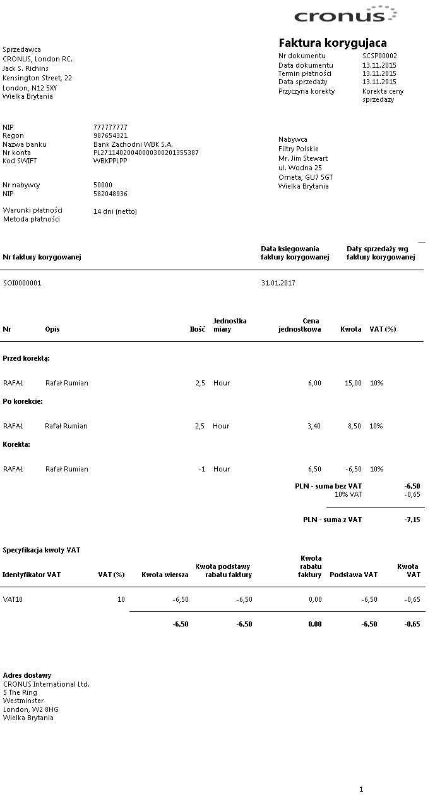

# Wydruk faktury korygującej sprzedaży serwisu

## Informacje ogólne

W ramach Polskiej Lokalizacji systemu Microsoft Dynamics 365 Business
Central on‑premises wydruk faktury korygującej sprzedaży serwisu został
dostosowany do wymagań ustawowych i zawiera wszystkie wymagane elementy.

## Obsługa

W celu wydrukowania faktury korygującej sprzedaży serwisu, należy
wykonać następujące kroki:

1.  Należy wybrać **Działy \> Serwis \> Archiwum \>** **Zaksięgowane
    faktury korygujące serwisu**.

2.  W oknie z listą zaksięgowanych faktur korygujących sprzedaży serwisu
    należy zaznaczyć wybrany wiersz i wybrać **Drukuj, a **następnie
    **Drukuj** lub **Podgląd**.

  