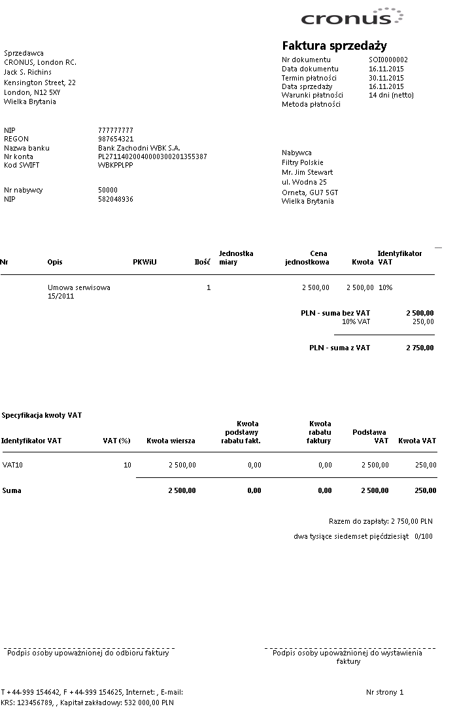

# Wydruk faktury sprzedaży serwisu

## Informacje ogólne

W ramach Polskiej Lokalizacji systemu Microsoft Dynamics 365 Business
Central on‑premises wydruk faktury sprzedaży serwisu został dostosowany
do wymagań ustawowych i zawiera wszystkie wymagane elementy.

## Obsługa

W celu wydrukowania faktury sprzedaży serwisu, należy wykonać
następujące kroki:

1.  Należy wybrać **Działy \> Serwis \> Archiwum \>** **Zaksięgowane
    faktury serwisu**.

2.  W oknie z listą zaksięgowanych faktur sprzedaży serwisu należy
    zaznaczyć wybrany wiersz i wybrać **Drukuj, a **następnie
    **Drukuj** lub **Podgląd**.

  