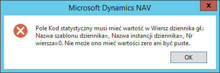
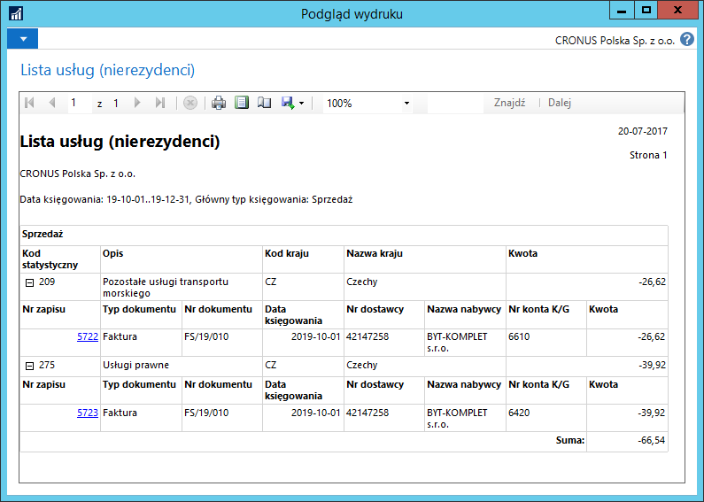

# Sprawozdanie kwartalne GUS DNU-K

## Informacje ogólne

W sprawozdaniu kwartalnym DNU-K sporządzanym na potrzeby Głównego Urzędu
Statystycznego wykazywane są usługi dostarczone i nabyte
od nierezydentów. W ramach Polskiej Lokalizacji dostępne jest narzędzie
do przygotowania danych w celu sporządzenia sprawozdania DNU-K.

## Ustawienia

W Microsoft Dynamics 365 Business Central on‑premises konieczne jest
zdefiniowanie kodów statystycznych do oznaczania usług pozostałych
transakcji objętych sprawozdawczością. W tym celu należy postępować
według następujących kroków:

1.  Należy wybrać **Działy \> Zarządzanie Finansami \> Kody
    statystyczne \> Kody statystyczne**.

2.  W oknie **Kody statystyczne**, które się otworzy, należy wprowadzić
    kod i właściwy dla niego opis.

    Szczegółowy opis kodów usług i pozostałych transakcji objętych
    sprawozdawczością dostępny jest w wersji elektronicznej pod adresem
    <http://form.stat.gov.pl/formularze/2017/index.htm> przy wzorze
    formularza DNU-K.
    
  

Podawanie tych kodów w transakcjach sprzedaży usług jest konieczne
do poprawnego wygenerowania danych do sprawozdania DNU-K. Możliwe jest
zdefiniowanie reguł obowiązku podawania kodów statystycznych, w tym celu
należy postępować według następujących kroków:

1.  Należy wybrać **Działy \> Zarządzanie Finansami \> Kody
    statystyczne \> Ustawienia kodów statystycznych**.

2.  W oknie **Ustawienia kodów statystycznych**, które się otworzy,
    należy zdefiniować reguły obowiązywania kodów statystycznych zgodnie
    z poniższym opisem:

    -   **Gł. gosp. grupa księgowa** – w tym polu należy wybrać kod Głównej
        gospodarczej grupy księgowej przypisanej do nabywcy lub dostawcy,
        dla którego będzie wymagane podawanie kodu statystycznego
    
    -   **Nr konta K/G** – w tym polu należy wybrać numer konta z planu
        kont, dla którego będzie wymagane podawanie kodu statystycznego
    
    -   **Księgowanie wartości** – w tym polu należy wybrać jedną z opcji:
    
        -   **Kod obowiązkowy** – dla każdej transakcji z kombinacją wartości
             z pól **Gł. gosp. grupa księgowa** i **Nr konta K/G** wymagane
             jest podanie kodu statystycznego. W przypadku, gdy dla danego
             ustawienia pole **Kod statystyczny** jest wypełnione, system
             domyślnie wstawi tę wartość w transakcji, ale użytkownik będzie
             mógł zmienić ją na inną. W przypadku, gdy dla danego ustawienia
             pole **Kod statystyczny** jest puste, użytkownik będzie miał
             obowiązek podać kod statystyczny ręcznie w każdej transakcji.
        
        -   **Ten sam kod** – dla każdej transakcji z kombinacją wartości z pól
             **Gł. gosp. grupa księgowa** i **Nr konta K/G** wymagane jest
             podanie kodu statystycznego, który dla danego ustawienia wybrany
             jest w polu **Kod statystyczny**. Wybranie tej opcji powoduje,
             że użytkownik nie będzie miał możliwości zmiany w transakcji
             domyślnego kodu statystycznego na inny.
        
             Przy tej opcji wymagane jest wypełnienie pola **Kod statystyczny**.
        
        -   **Bez kodu** – wybranie tej opcji spowoduje, że w transakcji
             z kombinacją wartości z pól **Gł. gosp. grupa księgowa** i **Nr
             konta K/G** nie będzie możliwości podania kodu statystycznego.
        
    -   **Kod statystyczny** – w tym polu można wybrać domyślny kod
         statystyczny dla kombinacji wartości z pól **Gł. gosp. grupa
         księgowa** i **Nr konta K/G**. Wypełnienie pola jest wymagane
         tylko wtedy, jeśli w polu **Księgowanie wartości** wybrana jest
         opcja **Ten sam kod**. W pozostałych przypadkach wypełnienie pola
         jest dobrowolne.

  

## Obsługa

Wprowadzając nowy dokument zakupu lub sprzedaży z usługami dotyczącymi
nierezydentów, w wierszach należy podać kod statystyczny. W tym celu
należy postępować według następujących kroków:

1.  Należy wybrać **Działy \> Zarządzanie Finansami \> Należności \>
    Faktury sprzedaży**.

2.  W oknie **Faktury sprzedaży**, które się otworzy, należy wybrać
    **Nowe.**

3.  Pola faktury sprzedaży należy wypełnić tak jak zwykle.

4.  W wierszach sprzedaży należy zwrócić uwagę na pole **Kod
     statystyczny** i odpowiednio je wypełnić w wierszach, które tego
     wymagają:

  

5.  Wybierz **Księguj**, a następnie potwierdź komunikat wybierając
     **Tak**, aby zaksięgować fakturę sprzedaży.

     Próba zaksięgowania faktury sprzedaży bez uzupełnionego kodu
     statystycznego w wierszu, w którym jest to wymagane zgodnie
     z ustawieniami kodów statystycznych, zakończy się niepowodzeniem,
     a system wyświetli stosowny komunikat o błędzie:

  

>[!NOTE]
>Pole **Kod statystyczny** jest dostępne w wierszach **Faktury sprzedaży**, **Faktury korygującej
sprzedaży**, **Zamówienia sprzedaży**, **Zamówienia zwrotu sprzedaży**,
**Faktury zakupu**, **Faktury korygującej zakupu**, **Zamówienia
zakupu**, **Zamówienia zwrotu zakupu**, **Faktury serwisu**, **Faktury
korygującej serwisu** oraz w **Dzienniku głównym i Dzienniku wyciągów
bankowych**.

Aby wygenerować dane do sporządzenia sprawozdania DNU-K, należy
postępować według następujących kroków:

1.  Należy wybrać **Działy \> Zarządzanie Finansami \> Księga główna \>
    Raporty \> Kody statystyczne \> Zestawienie usług dla/od
    nierezydentów**.

2.  W oknie z opcjami wstępnymi raportu należy wprowadzić odpowiednie
     filtry (mogą być używane w różnych kombinacjach), aby wygenerować
     wymagane dane z wybranego konta K/G, za wybrany okres,
     dla wybranego typu transakcji, dla wybranego typu źródła, np.:

  

3.  Należy wybrać **Podgląd**, aby wyświetlić raport na ekranie
     lub **Drukuj**, aby wydrukować raport na drukarce lub zapisać jako
     plik w wybranym formacie.

  