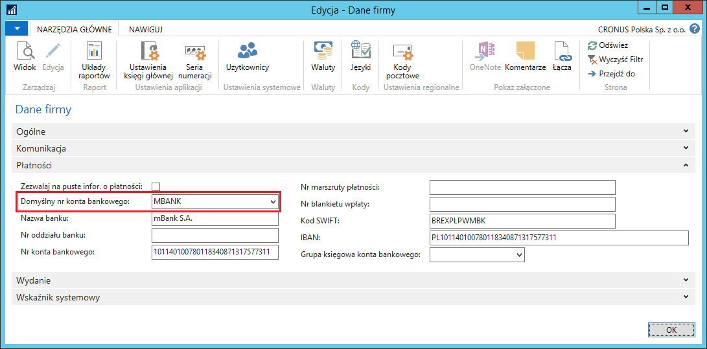
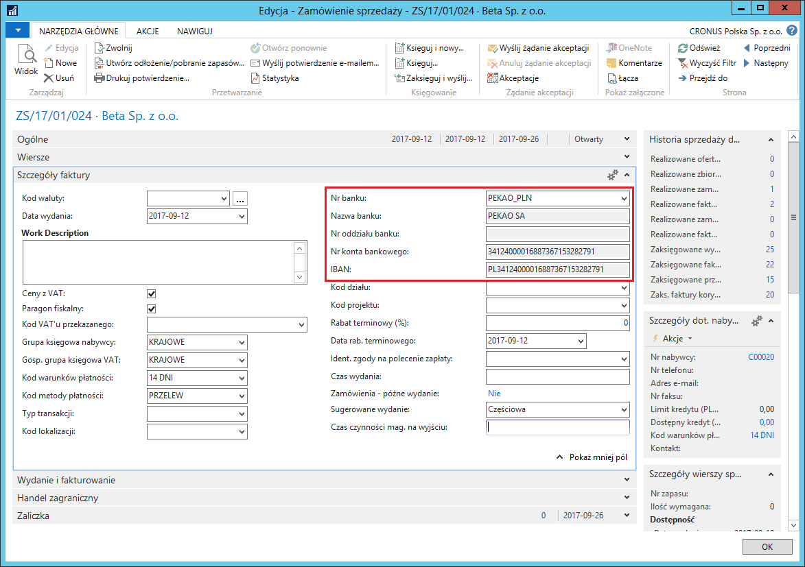
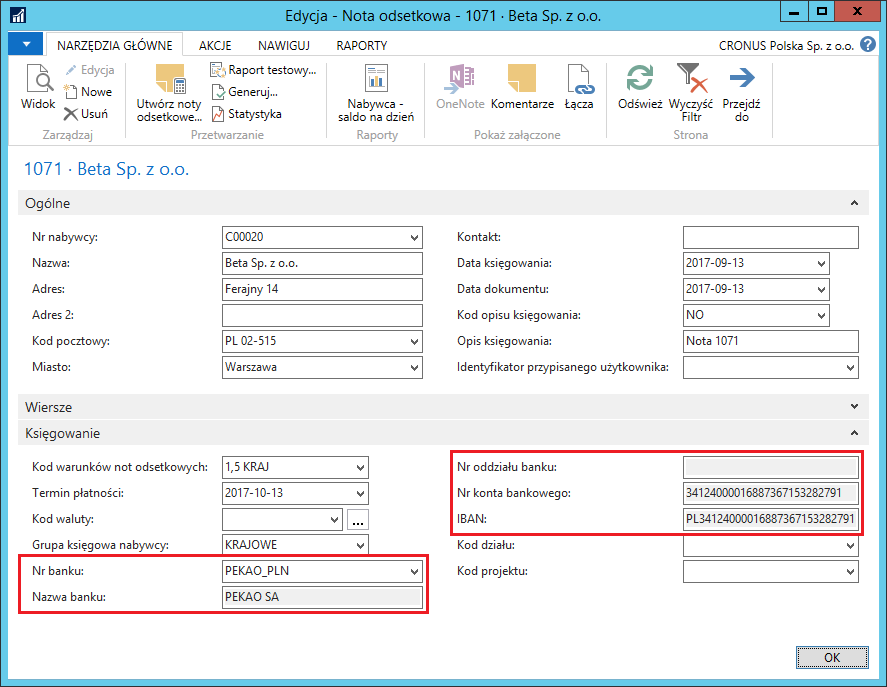

# Wybór konta bankowego na dokumentach sprzedaży

## Informacje ogólne

Wiele firm dysponuje wieloma kontami bankowymi w wielu różnych
instytucjach bankowych, w celu obniżenia kosztów obsługi transakcji
finansowych. Z tego powodu, do standardowej obsługi sprzedaży
w programie Microsoft Dynamics 365 Business Central on‑premises, została
dodana możliwość wyboru konta bankowego spośród zdefiniowanych
w systemie, którego dane mają być drukowane na dokumencie sprzedaży.

## Ustawienia

W celu wybrania konta bankowego, którego dane będą domyślnie drukowane
na dokumentach sprzedaży, należy postępować według następujących kroków:

1.  Należy wybrać **Działy \> Administracja \> Ustawienia aplikacji \>**
    **Ogólne \>** **Dane firmy**.

2.  W oknie **Dane firmy**, które się otworzy, na karcie skróconej
     **Płatności**, w polu **Domyślny numer konta bankowego** należy
     z listy rozwijanej wybrać numer jednego z wcześniej zdefiniowanych
     kont bankowych, a pozostałe pola z danymi o domyślnym koncie
     bankowym system uzupełni automatycznie, na podstawie danych
     wybranego konta bankowego, umieszczonych w jego kartotece.

  
## Obsługa

Konto bankowe wybrane jako domyślne drukowane jest w następujących
dokumentach:

1.  Oferta sprzedaży

2.  Potwierdzenie zamówienie sprzedaży

3.  Wydanie sprzedaży

4.  Faktura sprzedaży

5.  Faktura korygująca sprzedaży

6.  Monit

7.  Nota odsetkowa

W każdym z wyżej wymienionych dokumentów, domyślne konto bankowe może
być zmienione na inne -- jednorazowo dla danego dokumentu, podczas jego
wprowadzania (przed zaksięgowaniem).

W przypadku: oferty sprzedaży, potwierdzenia zamówienia sprzedaży,
wydania sprzedaży, faktury sprzedaży i faktury korygującej sprzedaży
kroki postępowania są następujące:

1.  Należy wybrać **Działy \> Sprzedaż i Marketing \> Przetwarzanie
     zamówień**

2.  W oknie wprowadzanego dokumentu sprzedaży, na karcie skróconej
     **Fakturowanie**, pola związane z firmowym kontem bankowym
     uzupełnione są danymi domyślnego konta bankowego, wybranego
     w oknie **Dane firmy**. W polu **Nr banku** należy wybrać z listy
     rozwijanej kod innego konta bankowego niż domyślne. System
     automatycznie uzupełni w dokumencie sprzedaży dane o wybranym
     koncie bankowym.

  

3.  Wybór akcji **Księguj i drukuj** spowoduje przeniesienie informacji
    o wybranym koncie bankowym do zaksięgowanego dokumentu
    oraz umieszczenie ich na wydruku dokumentu.

W przypadku: monitu i noty odsetkowej kroki postępowania są następujące:

1.  Należy wybrać **Działy \> Zarządzanie Finansami \> Działania
    okresowe \> Należności**

2.  W oknie wprowadzanego dokumentu: monitu lub noty odsetkowej,
     na karcie skróconej **Księgowanie**, pola związane z firmowym
     kontem bankowym uzupełnione są danymi domyślnego konta bankowego,
     wybranego w oknie **Dane firmy**. W polu **Nr banku** należy
     wybrać z listy rozwijanej kod innego konta bankowego niż domyślne.
     System automatycznie uzupełni w dokumencie sprzedaży dane
     o wybranym koncie bankowym.

  

3.  Wybór akcji **Generuj i **zaznaczenie opcji **Drukuj** spowoduje
    przeniesienie informacji o wybranym koncie bankowym
    do wygenerowanego dokumentu oraz umieszczenie ich na wydruku
    dokumentu.

>[!NOTE]
>Dane konta bankowego są przenoszone z Oferty Sprzedaży
do Zamówienia Sprzedaży podczas wykonywania skryptu **Utwórz
zamówienie**. Ponadto, podczas tworzenia nowego dokumentu sprzedaży przy
użyciu funkcji **Kopiuj dokument,** dane o koncie bankowym
są przenoszone z kopiowanego dokumentu.