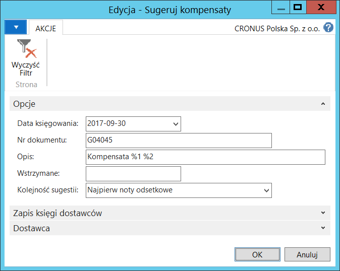

# Sugerowanie i księgowanie kompensaty

## Informacje ogólne

Zobowiązania i należności, nawet jednego kontrahenta, rejestrowane
są bez wzajemnego powiązania, stąd wynika konieczność kompensowania
należności z zobowiązaniami. Dodane do Polskiej Lokalizacji funkcje
ułatwiają przygotowanie księgowań kompensujących należności
i zobowiązania jednego kontrahenta.

## Obsługa

W celu skompensowania należności z zobowiązaniami, należy postępować
według następujących kroków:

1.  Należy wybrać **Działy \> Zarządzanie Finansami \> Zobowiązania \>
    Dziennik płatności**

2.  W oknie **Dziennik płatności** należy wybrać proces **Sugeruj
    kompensaty**.

3.  W oknie wstępnym skryptu, które się otworzy, na karcie skróconej
    **Opcje** należy wprowadzić parametry do przygotowania kompensaty:

    -   **Data księgowania** – data, jaka zostanie wstawiona do wierszy
         dziennika, z jaką zostanie zaksięgowana kompensata
    
    -   **Numer dokumentu** – numer dokumentu, jaki zostanie wstawiony
         do wierszy dziennika, z jakim zostanie zaksięgowana kompensata
    
    -   **Opis** – opis, jaki zostanie wstawiony do wierszy dziennika,
         z jakim zostanie zaksięgowana kompensata
    
    -   **Wstrzymane** – wprowadzenie danych w tym polu spowoduje,
         że system pominie zapisy księgi nabywców i dostawców,
         które zostały oznaczone jako wstrzymane
    
    -   **Kolejność sugestii** – w tym polu można wybrać kolejność
         dla automatycznego sugerowania kompensaty. Dostępne są opcje:
    
        -   **Najpierw noty odsetkowe** – zapisy pochodzące z not odsetkowych
             będą uwzględniane w pierwszej kolejności
        
        -   **Najpierw faktury** – zapisy pochodzące z faktur będą uwzględniane
             w pierwszej kolejności
        
        -   **Według numeru zapisu** – zapisy będą rozpatrywane
             według kolejności księgowania.
    
  

4.  Kliknięcie przycisku **OK** powoduje wykonanie skryptu, w wyniku
    czego system wypełnia wiersze dziennika płatności zgodnie
    z parametrami wprowadzonymi w oknie wstępnym skryptu.

  

W oknie **Dziennik płatności** z wierszami kompensaty zasugerowanymi
przez system, należy wybrać **Propozycja kompensaty** w celu
wydrukowania dokumentu, który można wysłać do kontrahenta w celu
uzyskania potwierdzenia zaproponowanej kompensaty:

  

5.  Po otrzymaniu potwierdzenia propozycji kompensaty, należy ją
     zaksięgować. W oknie **Dziennik płatności** należy wybrać
     **Księguj** lub **Księguj i drukuj.**

6.  Po zaksięgowaniu kompensaty można ją wydrukować wybierając
     **Działy** **\>** Zarządzanie **Finansami \> Zobowiązania \>
     Dokumenty \> Deklaracja kompensaty.**

7.  W oknie **Deklaracja kompensaty**, które się otworzy, na karcie
     skróconej **Zapis księgi nabywcy** należy wypełnić pola: **Nr
     nabywcy** i **Nr dokumentu**, a następnie wybrać **Drukuj**
     lub **Podgląd**:

  