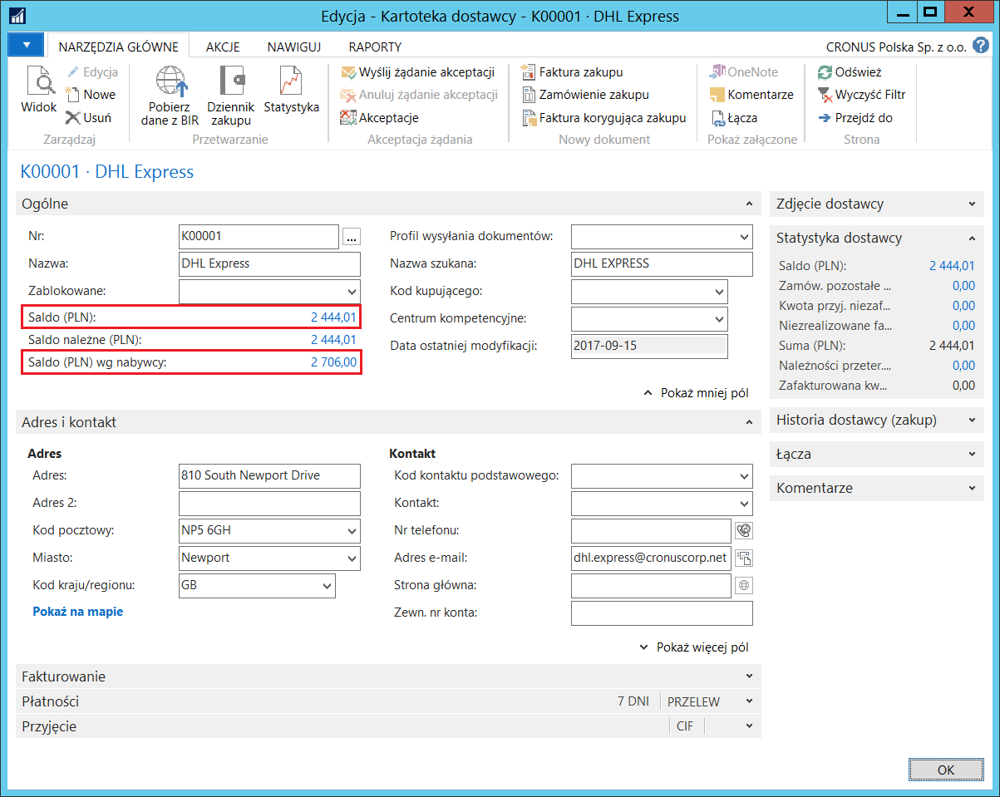

#  Wyświetlanie salda jako dostawca/nabywca

## Informacje ogólne

W systemie Microsoft Dynamics 365 Business Central on‑premises
kontrahenci definiowani są jako nabywcy lub dostawcy, w zależności
od tego, jakiego rodzaju transakcje są z nimi dokonywane. Jednak czasami
zdarza się, że jeden kontrahent występuje w transakcjach zakupów
i sprzedaży. Wtedy konieczne jest zarejestrowanie jego danych dwa razy:
raz jako nabywcy i raz jako dostawcy.

Polska Lokalizacja umożliwia bieżącą kontrolę salda
należności/zobowiązań oraz ich kompensatę poprzez powiązanie kartoteki
nabywcy z kartoteką dostawcy jednego kontrahenta za pośrednictwem
kartoteki kontaktu.

## Ustawienia

Warunkiem koniecznym do powiązania kartoteki nabywcy z kartoteką
dostawcy jednego kontrahenta jest uruchomienie funkcjonalności
**Kontakty** w dziale **Marketing**. W celu ustanowienia takiego
powiązania, należy postępować według następujących kroków:

1.  Należy wybrać **Działy \> Sprzedaż i Marketing \> Marketing \>
     Kontakty**.

2.  Należy zdefiniować kartotekę kontaktu w standardowy sposób.

3.  Z poziomu kartoteki nowego kontaktu należy wybrać akcję **Utwórz
     jako** **\>** **Nabywca**, żeby system automatycznie utworzył
     kartotekę nabywcy na podstawie danych kontrahenta umieszczonych
     w kartotece kontaktu.

  

4.  Z poziomu kartoteki nowego kontaktu należy wybrać akcję **Utwórz
    jako** **\>** **Dostawca**, żeby system automatycznie utworzył
    kartotekę dostawcy na podstawie danych kontrahenta umieszczonych
    w kartotece kontaktu.

  
Rezultatem tych czynności będą nowe kartoteki: dostawcy i nabywcy,
które można sprawdzić z poziomu kartoteki kontaktu wybierając
**Nabywca/dostawca/konto bank.**:

  

## Obsługa

W celu sprawdzenia salda należności/zobowiązania jednego kontrahenta,
należy postępować według następujących kroków:

1.  Należy wybrać **Działy \> Sprzedaż i Marketing \> Sprzedaż \>
     Nabywcy**

2.  Dane wybranego nabywcy należy wyświetlić w formie kartoteki.

3.  Na karcie skróconej **Ogólne** w polu **Saldo (PLN)** wyświetlane
     jest saldo należności, a w polu **Saldo (PLN) wg dostawcy**
     wyświetlane jest saldo zobowiązań:

  

4.  Należy wybrać **Działy \> Zakup \> Planowanie \> Dostawcy**

5.  Dane wybranego dostawcy należy wyświetlić w formie kartoteki.

6.  Na karcie skróconej **Ogólne** w polu **Saldo (PLN)** wyświetlane
     jest saldo zobowiązań, a w polu **Saldo (PLN) wg nabywcy**
     wyświetlane jest saldo należności:

  