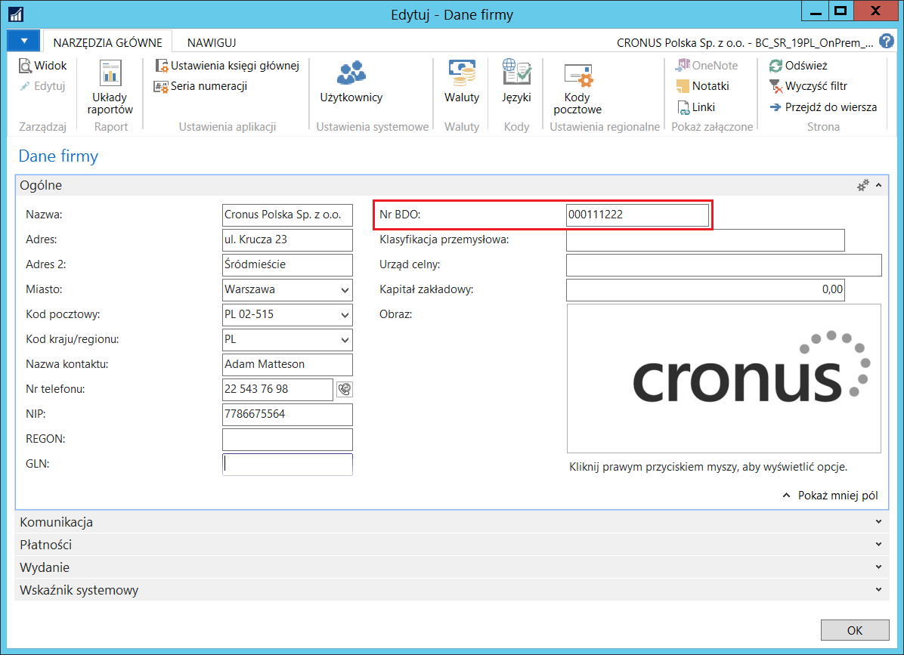
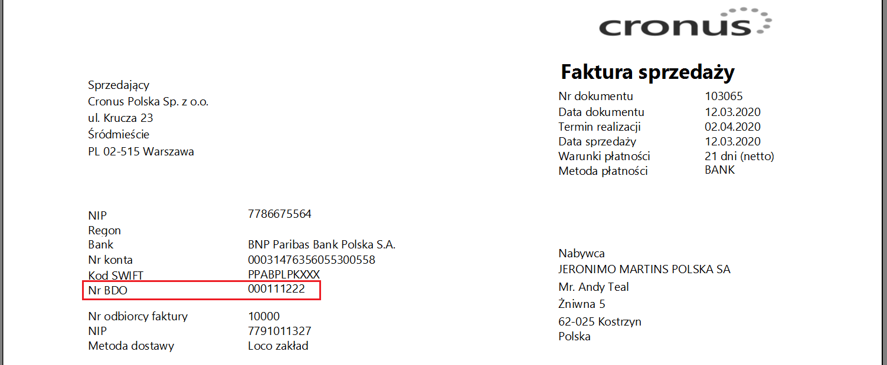

# Baza Danych Odpadowych (BDO)

## Informacje ogólne

Baza Danych Odpadowych (BDO) jest rejestrem przedsiębiorców, którzy
wprowadzają do obrotu określone produkty, produkty w opakowaniach
lub gospodarują odpadami.

Obowiązek rejestracji w BDO dotyczy podmiotów, które m.in.:

-   wytwarzają odpady i prowadzą ich ewidencję,

-   wprowadzają do obrotu krajowego produkty w opakowaniach, pojazdy,
    oleje, smary, opony, baterie lub akumulatory, sprzęt elektryczny i
    elektroniczny,

-   są producentami, importerami lub wewnątrzwspólnotowymi nabywcami
    opakowań.

Przedsiębiorca otrzymuje numer rejestrowy (Nr BDO), który ma obowiązek
umieszczać na dokumentach wystawianych w ramach prowadzonej
działalności.

W ramach Polskiej Lokalizacji systemu Microsoft Dynamics 365 Business
Central on‑premises dodana została możliwość umieszczenia w systemie
informacji o numerze BDO przypisanym do przedsiębiorcy oraz drukowania
tego numeru na dokumentach sprzedaży.

## Ustawienia

W celu wprowadzenia numeru BDO do danych przedsiębiorcy w systemie,
należy wykonać następujące kroki:

1.  Należy wybrać **Działy \> Administracja \> Ustawienia aplikacji \>
    Ogólne \> Dane firmy**.

2.  W oknie **Dane firmy**, które się otworzy, na karcie skróconej
    **Ogólne** należy w polu **Nr BDO** wpisać numer rejestrowy w Bazie
    Danych Odpadowych przypisany do przedsiębiorcy.

  

Na wydrukach dokumentów sprzedaży numer BDO prezentowany jest w sekcji
nagłówka.

  