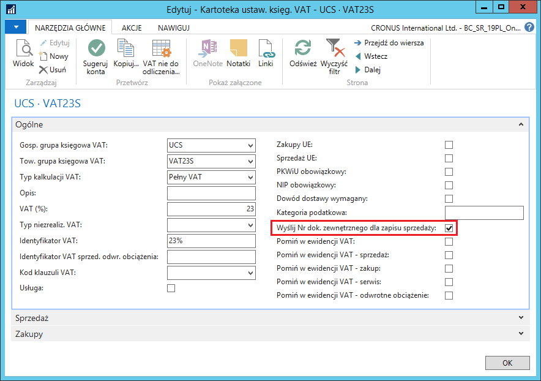

# Dodatkowe ustawienia dla pliku JPK\_VAT

W przypadku niektórych transakcji związanych z zakupem, w których
naliczany jest VAT należny, ale niedotyczących odwrotnego obciążenia
(np. uproszczonej procedury celnej) wymagane jest, aby dla pozycji z
należnym VAT w pliku JPK\_VAT prezentowany był numer dokumentu
zewnętrznego jako numer dokumentu. Do tego celu służy pole **Wyślij Nr
dok. zewnętrznego dla zapisu sprzedaży** w **Ustawieniach księgowych
VAT**. Aby zdefiniować to ustawienie, należy wykonać następujące
kroki:

1.  Należy wybrać **Działy \> Zarządzanie Finansami \> Administracja \>
    Grupy księgowe VAT \> Ustawienia księgowe VAT**.

2.  W oknie **Ustawienia księgowe VAT**, które się otworzy, należy
    zaznaczyć wiersz z wybraną kombinacją grup księgowych VAT,
    a następnie na wstążce kliknąć **Edytuj**.

3.  Na karcie skróconej **Ogólne** należy zaznaczyć pole **Wyślij Nr
    dok. zewnętrznego dla zapisu sprzedaży**.

  