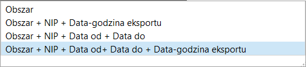
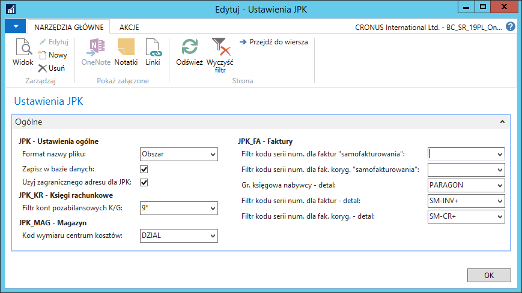

# Ustawienia ogólne JPK

## Obsługa

W celu zdefiniowania ogólnych ustawień JPK, należy wykonać następujące
kroki:

1.  Należy wybrać **Działy \> Zarządzanie Finansami \> Administracja \>
    Ustawienia JPK \> Ustawienia JPK.**

2.  W oknie **Ustawienia JPK**, które się otworzy, należy uzupełnić pola
    zgodnie z poniższym opisem:

    -   **Format nazwy pliku** – w tym polu należy wybrać opcję generowania
         nazwy pliku podpowiadanej podczas zapisywania pliku, opcje
         dostępne w tym polu:
    
        -   **Obszar** – w nazwie pliku zawarta jest tylko informacja o typie
             pliku, np. JPK\_KR\_V10.xml,
        
        -   **Obszar + NIP + Data-godzina eksportu** – w nazwie pliku zawarta
             jest informacja o typie pliku, NIP podatnika oraz czasie
             utworzenia pliku, np. JPK\_KR\_V10\_\_7777777777\_070616 1706.xml,
        
        -   **Obszar + NIP + Data od + Data do** – w nazwie pliku zawarta jest
             informacja o typie pliku, NIP podatnika oraz okresie, z którego
             pochodzą dane w pliku,
             np. JPK\_KR\_V10\_\_7777777777\_010116\_310116.xml,
        
        -   **Obszar + NIP + Data od + Data do + Data-godzina eksportu** -
             w nazwie pliku zawarta jest informacja o typie pliku, NIP
             podatnika, okresie, z którego pochodzą dane w pliku oraz czasie
             utworzenia pliku, np.
             JPK\_KR\_V10\_\_7777777777\_010116\_310116\_070616 1706.xml.
    
    >[!NOTE]
    >W nazwie pliku typu JPK\_FA
    zostanie dodatkowo dodany **Kod waluty**, jeśli dane w pliku
    są w innej walucie niż PLN. W nazwie pliku typu JPK\_MAG zostanie
    dodatkowo dodany **Kod lokalizacji** (oznaczenie magazynu, z którym
    powiązane są dane w pliku).
    
      
    
    -   **Zapisz w bazie danych** – pole należy zaznaczyć, jeśli w systemie
         mają być przechowywane informacje o każdorazowym generowaniu
         plików JPK,
    
    -   **Użyj zagranicznego adresu dla JPK** – zaznaczenie tego pola
         spowoduje przesłanie do pliku JPK\_FA danych adresu zagranicznego,
         wprowadzonych w oknie **Ustawienia raportowania ustawowego**,
    
    -   **Filtr kont pozabilansowych K/G** – w tym polu należy wprowadzić
         zakres numeracji kont, które traktowane są jako pozabilansowe
         (techniczne), w postaci filtra np. 90000\|90005..90008 lub 9\*,
    
    -   **Kod wymiaru centrum kosztów** – w** **tym polu należy wybrać kod
         wymiaru, według którego klasyfikowane są koszty z dokumentu RW,
    
    -   **Filtr kodu serii num. dla faktur „samofakturowania"** – w tym
         polu należy wprowadzić jeden lub więcej kodów serii numeracji
         faktur sprzedaży księgowanych w ramach samofakturowania,
    
    -   **Filtr kodu serii num. dla fak. koryg. „samofakturowania"** – w
         tym polu należy wprowadzić jeden lub więcej kodów serii numeracji
         faktur korygujących sprzedaży księgowanych w ramach
         samofakturowania,
    
    -   **Grupa księgowa nabywcy – detal** – w tym polu należy wprowadzić
         kod grupy księgowej nabywców identyfikującej sprzedaż paragonową
         pomijaną w pliku JPK\_FA,
    
    -   **Filtr kodu serii num. dla faktur – detal** – w tym polu należy
         wprowadzić jeden lub więcej kodów serii numeracji dokumentów
         używanych do księgowania sprzedaży paragonowej pomijanej w pliku
         JPK\_FA,
    
    -   **Filtr kodu serii num. dla fak. koryg. – detal** – w tym polu
         należy wprowadzić jeden lub więcej kodów serii numeracji
         dokumentów używanych do księgowania korekt sprzedaży paragonowej
         pomijanej w pliku JPK\_FA.

  