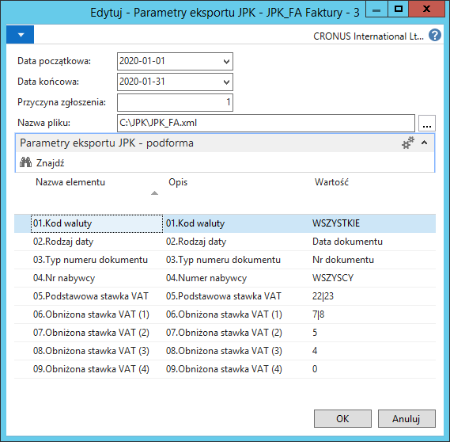

# Generowanie pliku JPK\_FA

## Obsługa

W celu wygenerowania pliku JPK\_FA za wybrany okres, należy wykonać
następujące kroki:

1.  Należy wybrać **Działy \> Zarządzanie Finansami \> Działania
    okresowe \> Księga główna \> Eksport SAFT JPK**.

2.  W oknie **Eksport JPK**, które się otworzy, należy zaznaczyć wiersz
    z obszarem JPK\_FA. Następnie na wstążce należy kliknąć **Eksportuj
    JPK**.

3.  W oknie **Parametry eksportu JPK**, które się otworzy należy
    wypełnić pola odpowiednimi wartościami:

    -   **Data początkowa** – w tym polu należy wybrać datę początkową
        okresu, za który  generowany jest plik (według daty wybranej w polu
        **Rodzaj daty**),
    
    -   **Data końcowa** – w tym polu należy wybrać datę końcową okresu,
        za który  generowany jest plik (według daty wybranej w polu **Rodzaj
        daty**),
    
    -   **Przyczyna zgłoszenia** – w tym polu należy wpisać **1**
        dla złożenia pliku JPK\_FA po raz pierwszy za dany okres,
    
    -   **Nazwa pliku** – w tym polu należy wskazać lokalizację, w której
        zostanie zapisany wygenerowany plik.

4.  Następnie należy wypełnić wartości elementów zdefiniowanych dla
    danego obszaru. Dla obszaru JPK\_FA domyślnie są to:

    -   **Kod waluty** – domyślnie jest ustawiona opcja **WSZYSTKIE** (od
        wersji JPK\_FA(3) generowany jest jeden plik dla wszystkich walut),
        opcjonalnie można w tym polu wybrać walutę dokumentów sprzedaży,
        których dane mają zostać przekazane do generowanego pliku JPK\_FA.
        Pole należy pozostawić puste, jeśli generowany plik JPK\_FA dotyczy
        faktur w walucie lokalnej,
    
    -   **Rodzaj daty** – w tym polu należy wybrać typ daty, według której
        wybrane zostaną dane do przygotowania pliku (dotyczy okresu
        wyznaczonego datami wprowadzonymi w polach **Data początkowa** i
        **Data końcowa**), dostępne opcje:
    
        -   **Data obowiązku VAT**,
        
        -   **Data księgowania**,
        
        -   **Data wpływu dokumentu/sprzedaży**
        
        -   **Data dokumentu**.
    
    -   **Typ numeru dokumentu** – w tym polu należy wybrać typ numeracji,
        która ma być zapisana w danych pliku JPK\_FA. Pole to ma zawierać
        kolejny numer faktury, nadany w ramach jednej lub więcej serii,
        który w sposób jednoznaczny identyfikuje fakturę. W przypadku
        prowadzenia ksiąg przez biuro rachunkowe często numer faktury
        sprzedaży wystawionej przez podmiot, zapisywany jest w księgach jako
        numer dokumentu zewnętrznego. Opcje dostępne w tym polu:
    
        -   **Nr dokumentu**,
        
        -   **Nr dokumentu zewnętrznego**.

    -   **Nr nabywcy** – domyślnie ustawiona jest opcja **WSZYSCY**,
        opcjonalnie można w tym polu wybrać jednego nabywcę, aby wygenerować
        plik z dokumentami sprzedaży wystawionymi w danym okresie tylko
        dla wybranego nabywcy,
    
    -   **Podstawowa stawka VAT** – w tym polu należy wpisać aktualny %
        podstawowej stawki VAT lub wpisać jako filtr więcej niż jedną
        stawkę, np. 22\|23,
    
    -   **Obniżona stawka VAT (1)** – w tym polu należy wpisać aktualny %
        pierwszej obniżonej stawki VAT lub wpisać jako filtr więcej
        niż jedną stawkę, np. 7\|8,
    
    -   **Obniżona stawka VAT (2)** – w tym polu należy wpisać aktualny %
        drugiej obniżonej stawki VAT lub wpisać jako filtr więcej niż jedną
        stawkę,
    
    -   **Obniżona stawka VAT (3)** – pole rezerwowe – w tym polu należy
        wpisać % trzeciej obniżonej stawki VAT lub wpisać jako filtr więcej
        niż jedną stawkę,
    
    -   **Obniżona stawka VAT (4)** – pole rezerwowe – w tym polu należy
        wpisać % czwartej obniżonej stawki VAT lub wpisać jako filtr
        więcej niż jedną stawkę.

5.  Po zatwierdzeniu przyciskiem **OK** plik zostanie zapisany w
    wybranej lokalizacji.

  