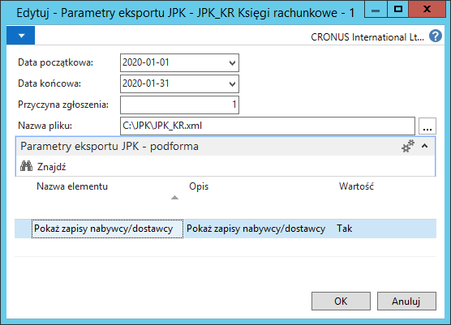

# Generowanie pliku JPK\_KR

## Obsługa

W celu wygenerowania pliku JPK\_KR za wybrany okres, należy wykonać
następujące kroki:

1.  Należy wybrać **Działy \> Zarządzanie Finansami \> Działania
    okresowe \> Księga główna \> Eksport SAFT JPK**.

2.  W oknie **Eksport JPK**, które się otworzy, należy zaznaczyć wiersz
    z obszarem JPK\_KR. Następnie na wstążce należy kliknąć **Eksportuj
    JPK**.

3.  W oknie **Parametry eksportu JPK**, które się otworzy należy
    wypełnić pola odpowiednimi wartościami:

-   **Data początkowa** – w tym polu należy wybrać datę początkową
    okresu, za który generowany jest plik (według daty księgowania),

    -   **Data końcowa**– w tym polu należy wybrać datę końcową okresu,
        za który generowany jest plik (według daty księgowania),
    
    -   **Przyczyna zgłoszenia** – w tym polu należy wpisać **1**
        dla złożenia pliku JPK\_KR po raz pierwszy za dany okres,
    
    -   **Nazwa pliku** – w tym polu należy wskazać lokalizację, w której
        zostanie zapisany wygenerowany plik.

4.  Następnie należy wypełnić wartości elementów zdefiniowanych dla
    danego obszaru. Dla obszaru JPK\_KR domyślnie są to:

    -   **Pokaż zapisy nabywcy/dostawcy** – w tym polu należy wybrać, czy
        zapisy z ksiąg pomocniczych nabywców i dostawców mają być zawarte w
        pliku. Dostępne opcje to **Tak** oraz **Nie**.

5.  Po zatwierdzeniu przyciskiem **OK** plik zostanie zapisany w
    wybranej lokalizacji.

  