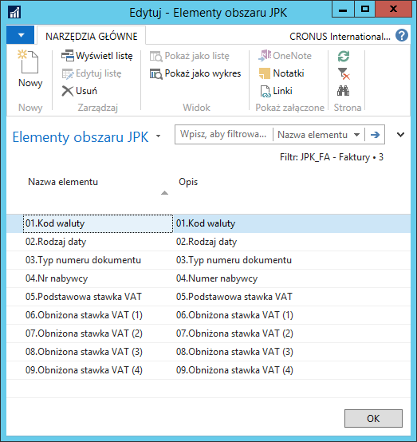

# Elementy obszarów JPK

## Informacje ogólne

Każdy z obszarów JPK zawiera dodatkowe, dedykowane opcje, które będą
musiały być wypełniane podczas eksportu pliku dla danego obszaru.

## Obsługa

W celu zmiany elementów obszaru JPK, definiowanych przy eksporcie
pliku, należy wykonać następujące kroki:

1.  Należy wybrać **Działy \> Zarządzanie Finansami \> Administracja \>
    Ustawienia JPK \> Obszary JPK**.

2.  W oknie **Obszary JPK**, które się otworzy, wyświetlona jest lista
    dostępnych obszarów, dla których można wygenerować plik JPK. W celu
    określenia elementów, których wypełnienie będzie wymagane podczas
    eksportu pliku, należy zaznaczyć wiersz z wybranym obszarem, a
    następnie na wstążce kliknąć **Elementy obszarów**.

3.  W oknie **Elementy obszaru JPK**, które się otworzy, wyświetlona
    jest lista elementów zdefiniowanych dla bieżącej wersji wybranego
    obszaru. Jeśli to konieczne, należy wprowadzić wymagane zmiany.

  