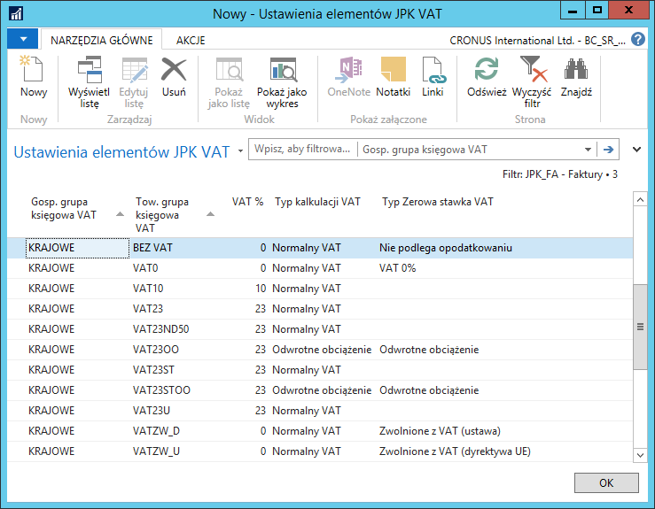

# Ustawienia elementów obszaru JPK\_FA

## Informacje ogólne

W przypadku dostawy towarów lub świadczenia usług zwolnionych
od podatku na podstawie art. 43 ust. 1, art. 113 ust. 1 i 9
lub przepisów wydanych na podstawie art. 82 ust. 3, należy wskazać
przepis ustawy lub aktu wydanego na podstawie ustawy, na podstawie
którego podatnik stosuje zwolnienie od podatku, albo należy wskazać
przepis dyrektywy 2006/112/WE, który zwalnia od podatku taką dostawę
towarów lub takie świadczenie usług, albo inną podstawę prawną
wskazującą na to, że dostawa towarów lub  świadczenie usług korzysta
ze zwolnienia.

Ponadto, gdy faktura sprzedaży nie zawiera kwoty VAT, konieczne jest
wskazanie przyczyny braku tej kwoty.

Dla VAT należnego pochodzącego z zakupu, jako numer dokumentu w pliku
JPK\_FA przekazywany jest numer dokumentu zewnętrznego, na podstawie
którego została obliczona kwota VAT należnego.

## Obsługa

W celu zdefiniowania dodatkowych ustawień na potrzeby generowania pliku
JPK\_FA, należy wykonać następujące kroki:

1.  Należy wybrać **Działy \> Zarządzanie Finansami \> Administracja \>
    Ustawienia JPK \> Obszary JPK**.

2.  W oknie **Obszary JPK**, które się otworzy, wyświetlona jest lista
    dostępnych obszarów, dla których można wygenerować plik JPK. W celu
    określenia dodatkowych ustawień, należy zaznaczyć wiersz z obszarem
    JPK\_FA, a następnie na wstążce kliknąć **Ustawienia elementów
    wg grup księgowych VAT**.

3.  W oknie **Ustawienia elementów JPK VAT**, które się otworzy, dla
    określonych kombinacji gospodarczych grup księgowych VAT oraz
    towarowych grup księgowych VAT, które dotyczą sprzedaży zwolnionej,
    sprzedaży ze stawką 0%, sprzedaży niepodlegającej VAT i sprzedaży
    z odwrotnym obciążeniem (czyli w przypadku, gdy przy sprzedaży
    nie jest kalkulowany VAT należny), należy uzupełnić pole **Typ
    Zerowa stawka VAT,** wybierając jedną spośród dostępnych opcji:

    -   **VAT 0%** – dla transakcji, które dotyczą sprzedaży ze stawką 0%,
    
    -   **Zwolnione z VAT (ustawa)** – dla transakcji, które dotyczą
        sprzedaży zwolnionej (na podstawie przepisów ustawy albo aktu
        wydanego na podstawie ustawy),
    
    -   **Zwolnione z VAT (dyrektywa UE)** – dla transakcji, które dotyczą
        sprzedaży zwolnionej (przepis dyrektywy 2006/112/WE, który zwalnia
        od podatku taką dostawę towarów lub takie świadczenie),
    
    -   **Zwolnione z VAT (inne)** – dla transakcji, które dotyczą
        sprzedaży zwolnionej (inna podstawa prawna wskazująca na to,
        że dostawa towarów lub świadczenie usług korzysta ze zwolnienia),
    
    -   **Nie podlega opodatkowaniu** – dla transakcji, które dotyczą
        sprzedaży niepodlegającej VAT,
    
    -   **Odwrotne obciążenie** – dla transakcji, które dotyczą sprzedaży
        z odwrotnym obciążeniem.

>[!NOTE]
>Transakcje objęte obowiązkową
podzieloną płatnością MPP oznaczane są na podstawie danych z systemu i
modułu Split payment.

  