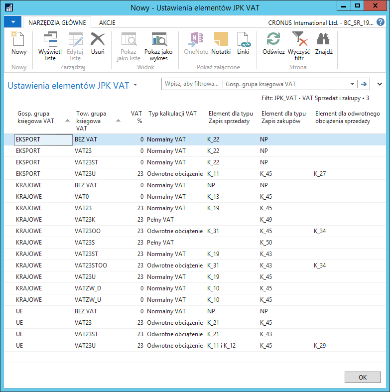

# Ustawienia elementów obszaru JPK\_VAT

## Informacje ogólne

Przygotowana struktura pliku dokładnie odwzorowuje aktualną deklarację
podatku VAT‑7 (19). Według interpretacji Ministerstwa Finansów, dane
w pliku JPK\_VAT muszą być w pełni zgodne ze składaną przez podatnika
deklaracją VAT-7. Ze względu na strukturę pliku JPK\_VAT niezbędne jest
zdefiniowanie dodatkowych ustawień.

Przesyłane dane w pliku JPK\_VAT dotyczą:

-   Sprzedaży oraz nabyć towarów i usług, dla których podmiot
    ma obowiązek naliczyć VAT należny - tj. wewnątrzwspólnotowe nabycia
    towarów, import towarów podlegających rozliczeniu zgodnie z art.
    33 a ustawy, import usług z wyłączeniem usług nabywanych
    od podatników podatku od wartości dodanej, do których stosuje się
    art. 28 b ustawy, import usług nabywanych od podatników podatku
    od wartości dodanej, do których stosuje się art. 28 b ustawy,
    dostawy towarów, dla których podatnikiem jest nabywca zgodnie z art.
    17 ust. 1 pkt 5 ustawy (wypełnia nabywca), dostawy towarów,
    dla których podatnikiem jest nabywca zgodnie z art. 17 ust. 1 pkt 7
    lub 8 ustawy (wypełnia nabywca).

-   Zakupów VAT.

## Obsługa

W celu zdefiniowania dodatkowych ustawień wymaganych dla obszaru
JPK\_VAT, należy wykonać następujące kroki:

1.  Należy wybrać **Działy \> Zarządzanie Finansami \> Administracja \>
    Ustawienia JPK \> Obszary JPK**.

2.  W oknie **Obszary JPK**, które się otworzy, wyświetlona jest lista
    dostępnych obszarów, dla których można wygenerować plik JPK. W celu
    określenia dodatkowych ustawień, należy zaznaczyć wiersz z obszarem
    JPK\_VAT, a następnie na wstążce kliknąć **Ustawienia elementów wg
    grup księgowych VAT**.

3.  W oknie **Ustawienia elementów JPK VAT**, które się otworzy, dla
    określonych kombinacji gospodarczych grup księgowych VAT oraz
    towarowych grup księgowych VAT należy wypełnić odpowiednie pola:

    -   **Element dla typu Zapis sprzedaży** – w tym polu należy wybrać
         pole deklaracji VAT-7, w którym wykazywana jest podstawa podatku
         należnego wynikającego z dostawy towarów i usług. Dostępne opcje:
    
        -   **K\_10** (Dostawa towarów oraz świadczenie usług na terytorium
             kraju, zwolnione od podatku),
        
        -   **K\_11** (Dostawa towarów oraz świadczenie usług poza terytorium
             kraju),
        
        -   **K\_11 i K\_12** (w tym świadczenie usług, o których mowa w art.
             100 ust. 1 pkt 4 ustawy),
        
        -   **K\_13** (Dostawa towarów oraz świadczenie usług na terytorium
             kraju, opodatkowane stawką 0%),
        
        -   **K\_13 i K\_14** (w tym dostawa towarów, o której mowa w art. 129
             ustawy),
        
        -   **K\_15** (Dostawa towarów oraz świadczenie usług na terytorium
             kraju, opodatkowane stawką 5%),
        
        -   **K\_17** (Dostawa towarów oraz świadczenie usług na terytorium
             kraju, opodatkowane stawką 7% albo 8%),
        
        -   **K\_19** (Dostawa towarów oraz świadczenie usług na terytorium
             kraju, opodatkowane stawką 22% albo 23%),
        
        -   **K\_21** (Wewnątrzwspólnotowa dostawa towarów),
        
        -   **K\_22** (Eksport towarów),
        
        -   **K\_23** (Wewnątrzwspólnotowe nabycie towarów),
        
        -   **K\_25** (Import towarów podlegający rozliczeniu zgodnie z art. 33a
             ustawy),
        
        -   **K\_27** (Import usług z wyłączeniem usług nabywanych od podatników
             podatku od wartości dodanej, do których stosuje się art. 28b
             ustawy),
        
        -   **K\_29** (Import usług nabywanych od podatników podatku od wartości
             dodanej, do których stosuje się art. 28b ustawy),
        
        -   **K\_31** (Dostawa towarów oraz świadczenie usług, dla których
             podatnikiem jest nabywca zgodnie z art. 17 ust. 1 pkt 7 lub 8
             ustawy),
        
        -   **K\_32** (Dostawa towarów, dla których podatnikiem jest nabywca
             zgodnie z art. 17 ust. 1 pkt 5 ustawy (wypełnia nabywca)),
        
        -   **K\_34** (Dostawa towarów oraz świadczenie usług, dla których
             podatnikiem jest nabywca zgodnie z art. 17 ust. 1 pkt 7 lub 8
             ustawy (wypełnia nabywca)),
        
        -   **NP** (Niepodlegający opodatkowaniu VAT – opcja wybierana
             dla transakcji, które nie są ujmowane w deklaracji VAT.
    
    -   **Element dla typu Zapis zakupów** – w tym polu należy wybrać pole
         deklaracji VAT‑7, w którym wykazywana jest podstawa podatku
         naliczonego wynikającego z nabycia towarów i usług, dostępne
         opcje:
    
        -   **K\_43** (Nabycie towarów i usług zaliczanych u podatnika do
             środków trwałych),
        
        -   **K\_45** (Nabycie towarów i usług pozostałych),
        
        -   **NP** (Niepodlegający opodatkowaniu VAT) – opcja wybierana
             dla transakcji, które nie są ujmowane w deklaracji VAT.

        Dla kombinacji grup księgowych VAT dedykowanych ewidencji korekt
        podatku naliczonego na podstawie art. 89b ust. 1 i 4, należy wybrać
        opcje:

        -   **K\_49** (Korekta podatku naliczonego, o której mowa w art. 89b ust.
            1 ustawy),
        
        -   **K\_50** (Korekta podatku naliczonego, o której mowa w art. 89b ust.
            4 ustawy).

    -   **Element dla odwrotnego obciążenia sprzedaży** – w tym polu należy
        wybrać pole deklaracji VAT-7, w którym wykazywana jest podstawa
        podatku należnego wynikającego z nabycia towarów i usług, dostępne
        opcje:
    
        -   **K\_23** (Wewnątrzwspólnotowe nabycie towarów),
        
        -   **K\_25** (Import towarów podlegający rozliczeniu zgodnie z art. 33a
            ustawy),
        
        -   **K\_27** (Import usług z wyłączeniem usług nabywanych od podatników
            podatku od wartości dodanej, do których stosuje się art. 28b
            ustawy),
        
        -   **K\_29** (Import usług nabywanych od podatników podatku od wartości
            dodanej, do których stosuje się art. 28b ustawy),
        
        -   **K\_32** (Dostawa towarów, dla których podatnikiem jest nabywca
            zgodnie z art. 17 ust. 1 pkt 5 ustawy (wypełnia nabywca)),
        
        -   **K\_34** (Dostawa towarów oraz świadczenie usług, dla których
            podatnikiem jest nabywca zgodnie z art. 17 ust. 1 pkt 7 lub 8
            ustawy (wypełnia nabywca)),
        
        -   **NP** (Niepodlegający opodatkowaniu VAT) – opcja wybierana
            dla transakcji, które nie są ujmowane w deklaracji VAT.

>[!NOTE]
>W przypadku transakcji z typem „odwrotne obciążenie" i zaznaczonym polem **Odwrotne
obciążenie przy zakupie**, przy wyborze opcji dla pola **Element dla
odwrotnego obciążenia sprzedaży**, wartości będą prezentowane zgodnie
z wybraną dla tego pola opcją, natomiast pola wybrane dla ustawienia
**Element dla typu Zapis sprzedaży** będą zerowe. Np. dla ustawienia
grup UE i VAT23 prawidłowe ustawienia to: **Element dla typu Zapis
sprzedaży** – K\_21, **Element dla typu Zapis zakupów** – K\_45
i **Element dla odwrotnego obciążenia sprzedaży** – K\_23.
W przypadku WDT kwota netto będzie w polu 21, w przypadku WNT – kwota
netto w polu 45 i kwota VAT naliczonego w polu 46 oraz kwota netto
w polu 23 i kwota VAT należnego w polu 24.

>[!NOTE]
>W celu odpowiedniego przydziału zapisów VAT do właściwych pól deklaracji, wymagane jest
stosowanie osobnych grup towarowych VAT dla towarów, usług i środków
trwałych.

  