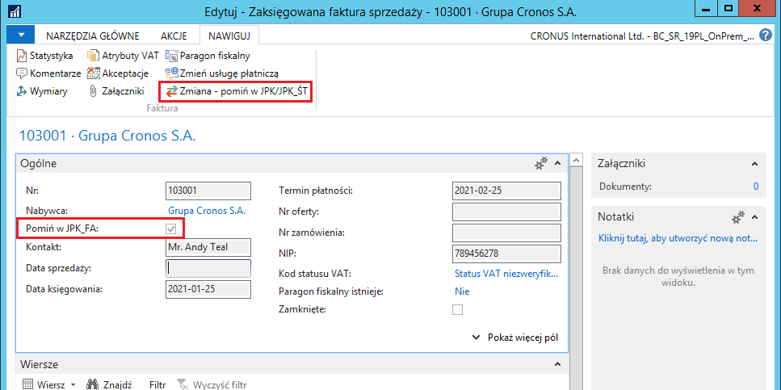

# Przygotowanie danych pliku JPK\_FA

## Obsługa 

W celu przygotowania danych do wygenerowania pliku JPK\_FA za wybrany
okres, można zarządzać uwzględnieniem poszczególnych dokumentów
sprzedaży w plikach JPK\_FA. W nagłówkach zaksięgowanych dokumentów
dodane zostało pole **Pomiń w JPK\_FA**, które może mieć zastosowanie
do dokumentów wewnętrznych, anulowanych, które nie pojawiły się w
obiegu gospodarczym. Takie dokumenty nie muszą być prezentowane w
pliku JPK\_FA(3).

Pole **Pomiń w JPK\_FA** znajduje się w nagłówkach zaksięgowanych
dokumentów, na karcie skróconej **Ogólne** i jest obsługiwane przez
akcję **Zmiana - pomiń w JPK/JPK\_ŚT**:

-   **Zaksięgowana faktura sprzedaży,**

-   **Zaksięgowana faktura korygująca sprzedaży,**

-   **Zaksięgowana faktura serwisu,**

-   **Zaksięgowana faktura korygująca serwisu**.

  