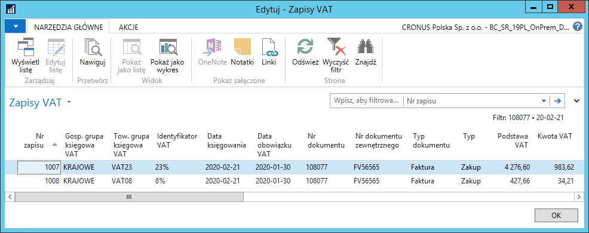
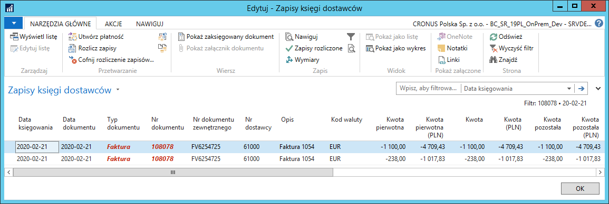
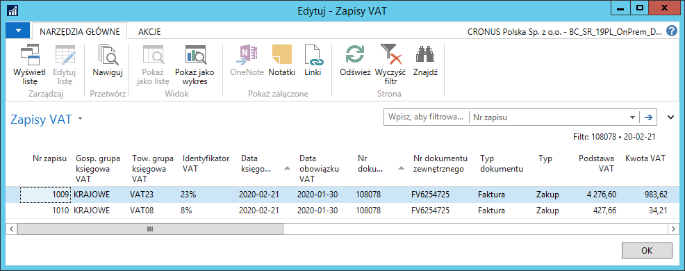

# Dodatkowy kurs wymiany waluty do przeliczenia VAT 

## Informacje ogólne

Podczas księgowania faktur zakupu z naliczonym VAT od dostawców
krajowych, wystawionych w obcej walucie, jak również w przypadku
wystawiania faktur sprzedaży w obcej walucie z VAT dla nabywców
krajowych, w niektórych sytuacjach konieczne jest zastosowanie innego
kursu wymiany waluty do przeliczenia podstawy i kwoty VAT, niż do
przeliczenia wartości kosztów/przychodów i zobowiązania/należności. W
Polskiej Lokalizacji systemu Microsoft Dynamics 365 Business Central
on-premises zostało dodane narzędzie umożliwiające podanie dwóch różnych
kursów wymiany waluty w dokumentach zakupu i dokumentach sprzedaży. W
wyniku działania tej funkcji, powstają dwa zapisy księgi
dostawcy/nabywcy, w podziale na kwotę VAT i pozostałą część
zobowiązania/należności.

Dodatkowy zapis księgi dostawcy/nabywcy z kwotą VAT może być
utworzony:

-   w walucie lokalnej

-   w walucie obcej

 >[!NOTE]
 >Opis ustawień i obsługi dodatkowego kursu wymiany waluty
 do przeliczenia VAT zamieszczony w dalszej części rozdziału bazuje
 na przykładzie faktury zakupu. W dokumentach sprzedaży mechanizm
 jest identyczny, więc należy wzorować się na opisie dotyczącym
 zakupu.

## Ustawienia

Sposób tworzenia zapisów księgi dostawcy dla zobowiązań w zakresie kwoty
VAT księgowanej z dokumentu zakupu określany jest indywidualnie dla
każdego dokumentu. Może być też ustawiony jako domyślny dla dostawcy, w
tym celu należy wykonać następujące kroki:

1.  Należy wybrać **Działy \> Zarządzanie Finansami \> Zobowiązania \>
    Dostawcy.**

2.  W oknie **Dostawcy**, które się otworzy, należy zaznaczyć wiersz z
    wybranym dostawcą i kliknąć na wstążce **Edytuj**.

3.  W kartotece dostawcy, która się otworzy, na karcie skróconej
    **Fakturowanie**, z listy rozwijanej w polu **Typ księgowania
    płatności VAT (wal. obca)** należy wybrać właściwą opcję spośród
    dostępnych:

    -   **pusta** – opcja domyślna – zapis zobowiązania będzie jeden, nie
        będzie księgowany dodatkowy zapis księgi dostawców dla kwoty VAT;
        w tej sytuacji nie będzie możliwości podania innego kursu wymiany
        waluty do przeliczenia VAT,
    
    -   **Waluta lokalna** – dla dokumentów zakupu w walucie obcej
        dodatkowy zapis księgi dostawców dla kwoty VAT zostanie zaksięgowany
        w walucie lokalnej,
    
    -   **Waluta obca** – dla dokumentów zakupu w walucie obcej dodatkowy
        zapis księgi dostawców dla kwoty VAT zostanie zaksięgowany w walucie
        dokumentu.

 Wybrana opcja będzie domyślnie wstawiana w analogicznym polu
 w księgowanych dokumentach zakupu od tego dostawcy.

  

Kwota podstawy VAT skalkulowana przez system na podstawie dodatkowego
kursu wymiany może wymagać ręcznej zmiany przez użytkownika. Aby było
to możliwe, należy zdefiniować właściwe ustawienia. W tym celu należy
wykonać następujące kroki:

1.  Należy wybrać **Działy \> Zarządzanie Finansami \> Administracja \>
    Ustawienia księgi głównej.**

2.  W oknie **Ustawienia księgi głównej**, które się otworzy, na karcie
     skróconej **Ogólne**, w polu **Maks. dozwolona różnica podstawy
     VAT** wprowadź dopuszczalną wartość, o jaką można ręcznie zmienić
     skalkulowaną kwotę podstawy VAT w walucie lokalnej w księgowanym
     dokumencie.

## Obsługa

Wprowadzając fakturę zakupu w obcej walucie od wybranego dostawcy,
system stosuje domyślne ustawienia, a w oknie **Statystyka** można
zweryfikować i, w razie potrzeby, zmienić skalkulowane przez system
wartości. W tym celu należy wykonać następujące kroki:

1.  Należy wybrać **Działy \> Zarządzanie Finansami \> Zobowiązania \>
    Faktury zakupu**.

2.  W oknie **Faktury zakupu, które się otworzy,** należy kliknąć na
    wstążce **Nowy**.

3.  Z listy rozwijanej w polu **Nr dostawcy** należy wybrać właściwego
    dostawcę. Pozostałe pola należy wypełnić w standardowy sposób.

 Pole **Typ księgowania płatności VAT (wal. obca)** przyjęło domyślną
 opcję z kartoteki wybranego dostawcy.

4.  Kurs wymiany waluty do przeliczenia VAT pobierany jest z okna
     **Kursy wymiany walut** według **Daty obowiązku VAT** wprowadzonej
     w fakturze zakupu. Zmiana **Daty obowiązku VAT** wywołuje
     komunikat, w którym należy zaznaczyć wybraną opcję i kliknąć
     **OK**. Dostępne opcje:

    -   **Kurs wymiany odwrotnego obciążenia** – wybór tej opcji spowoduje
        uaktualnienie kursu wymiany waluty do przeliczenia odwrotnego
        obciążenia,
    
    -   **Kurs wymiany VAT** – wybór tej opcji spowoduje uaktualnienie kursu
        wymiany waluty do przeliczenia VAT,
    
    -   **Oba** – wybór tej opcji spowoduje uaktualnienie obydwu kursów
        wymiany waluty: do przeliczenia odwrotnego obciążenia i do
        przeliczenia kwoty VAT,
    
    -   **Żaden** – wybór tej opcji spowoduje, że żaden z kursów wymiany
        waluty nie zostanie uaktualniony: ani do przeliczenia odwrotnego
        obciążenia, ani do przeliczenia kwoty VAT.

  

5.  Na wstążce należy kliknąć przycisk **Statystyka** (można też
    nacisnąć klawisz **F7**).

6.  W oknie **Statystyka zakupów**, które się otworzy, na karcie
    skróconej **Kalkulacja kwoty VAT (wal. obca)** prezentowane są
    informacje dotyczące przeliczenia kwoty VAT dokumentu:

    -   **Kod waluty VAT** – w tym polu prezentowana jest waluta, w jakiej
        księgowany jest dokument zakupu; można kliknąć przycisk asysty,
        aby w oknie Zmiana kursu wymiany sprawdzić i ewentualnie ręcznie
        zmienić kurs wymiany waluty zastosowany do przeliczenia kwoty VAT z
        dokumentu,
    
    -   **Data obowiązku VAT** – w tym polu prezentowana jest data obowiązku
        VAT przypisana do dokumentu,
    
    -   **Podstawa VAT (PLN)** – w tym polu prezentowana jest kwota podstawy
        VAT z dokumentu po przeliczeniu na PLN według podanego kursu wymiany
        waluty do przeliczenia VAT,
    
    -   **Kwota VAT (PLN)** – w tym polu prezentowana jest kwota VAT
        z dokumentu po przeliczeniu na PLN według podanego kursu wymiany
        waluty do przeliczenia VAT.

    Na karcie skróconej Wiersze prezentowane są informacje dotyczące
    przeliczenia kwoty VAT dokumentu według stawek VAT zastosowanych
    w dokumencie.
  

    Na karcie skróconej **Wiersze** w oknie **Statystyka zakupów** można
    ręcznie zmienić niektóre wartości wyliczone przez system, w granicach
    maksymalnych dozwolonych różnic:

    -   dla waluty lokalnej – zdefiniowanych w oknie **Ustawienia księgi
        głównej**;
    
    -   dla waluty obcej – zdefiniowanych w kartotece wybranej waluty.

  

7.  Po weryfikacji i ewentualnym poprawieniu skalkulowanych wartości
     należy kliknąć **OK**, aby zamknąć okno **Statystyka zakupów**.

8.  W oknie **Faktura zakupu**, na wstążce, należy kliknąć **Księguj**
     (można nacisnąć klawisz **F9**), aby zaksięgować fakturę zakupu.

W wyniku zaksięgowania dokumentu zakupu tworzone są m.in. zapisy księgi
dostawców i zapisy VAT. Sposób ich utworzenia zależy od opcji wybranej w
polu **Typ księgowania płatności VAT (wal. obca)** w księgowanym
dokumencie:

-   **Waluta lokalna**:

-   **Zapisy księgi dostawców** – tworzone są dwa zapisy:

    -  w kwocie netto w walucie zaksięgowanego dokumentu
    
    -  w kwocie VAT w walucie lokalnej, wynikającej z przeliczenia według
        **kursu wymiany waluty dla VAT**

-   **Zapisy VAT** – tworzony jest jeden zapis dla każdej towarowej
        grupy księgowej VAT zastosowanej w dokumencie, w którym wartość
        podstawy VAT oraz kwoty VAT wynika z przeliczenia według kursu
        wymiany waluty dla VAT.

  

  

-   **Waluta obca**:

-   **Zapisy księgi dostawców** – tworzone są dwa zapisy:

    -  w kwocie netto w walucie zaksięgowanego dokumentu
    
    -  w kwocie VAT w walucie zaksięgowanego dokumentu
    
-   **Zapisy VAT** – tworzony jest jeden zapis dla każdej towarowej
     grupy księgowej VAT zastosowanej w dokumencie, w którym wartość
     podstawy VAT oraz kwoty VAT wynika z przeliczenia według kursu
     wymiany waluty dla VAT.

  

  