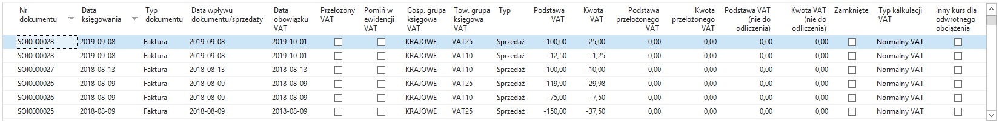
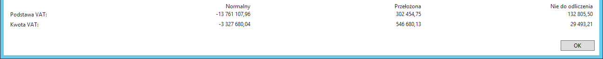
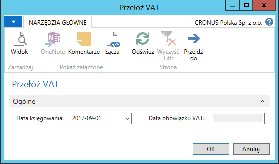
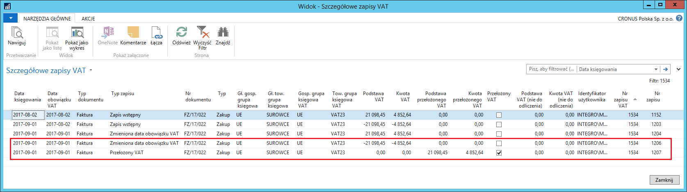
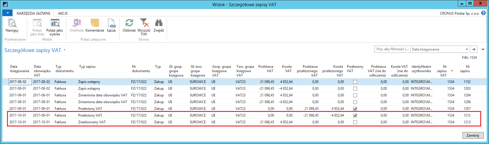
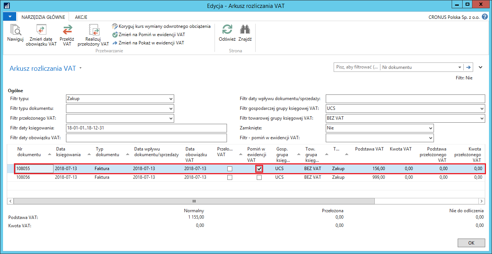
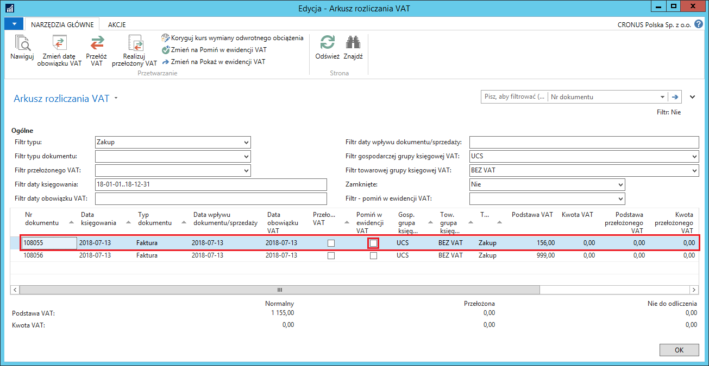

# Arkusz rozliczania VAT 

## Informacje ogólne

Dzięki Polskiej Lokalizacji użytkownik Microsoft Dynamics 365 Business
Central on‑premises uzyskuje pełną kontrolę nad działaniami związanymi
z podatkiem VAT takimi, jak: przekładanie i realizacja niektórych
zapisów VAT, zmiana daty obowiązku VAT, pomijanie w ewidencji VAT,
zmiana kursu wymiany do przeliczenia VAT z odwrotnego obciążenia.
Narzędzie **Arkusz rozliczania VAT** umożliwia zarządzanie zapisami VAT.

## Obsługa

W celu zarządzania zapisami VAT, należy postępować według następujących
kroków:

1.  Należy wybrać **Działy \> Zarzadzanie Finansami \> Działania
    okresowe \> VAT \> Arkusz rozliczania VAT**. W oknie **Arkusz
    rozliczania VAT** użytkownik może dokonać czynności wymienione
    w następnych punktach.

2.  Użytkownik może wybrać zapisy do wyświetlenia poprzez ustawienie
    filtrów w polach:

    -   **Filtr typu** – w tym polu należy wybrać typ transakcji spośród
         dostępnych opcji określając w ten sposób, czy w oknie mają zostać
         wyświetlone tylko transakcje zakupu lub tylko transakcje
         sprzedaży, albo oba typy transakcji.
    
    -   **Filtr typu dokumentu** – w tym polu można wybrać jeden
         z dostępnych typów dokumentu, do którego zostaną ograniczone dane
         wyświetlane w tym oknie. Wybranie opcji pustej oznacza brak filtru
         w tym polu.
    
    -   **Filtr przełożonego VAT** – wybranie opcji **Tak** spowoduje
         wyświetlenie wyłącznie zapisów VAT oznaczonych jako przełożony,
         wybranie opcji **Nie** spowoduje wyświetlenie wyłącznie zapisów
         VAT nieoznaczonych jako przełożony. Wybranie opcji pustej oznacza
         brak filtru w tym polu.
    
    -   **Filtr daty księgowania** – w tym polu można wprowadzić datę
         lub zakres dat, wyznaczających okres, w jakim ma przypadać data
         księgowania zapisów VAT, które będą wyświetlone w oknie. Puste
         pole oznacza brak filtru w tym polu.
    
    -   **Filtr daty obowiązku VAT** – w tym polu można wprowadzić datę
         lub zakres dat, wyznaczających okres, w jakim ma przypadać data
         obowiązku VAT zapisów VAT, które będą wyświetlone w oknie. Puste
         pole oznacza brak filtru w tym polu.
    
    -   **Filtr daty wpływu dokumentu/sprzedaży** – w tym polu można
         wprowadzić datę lub zakres dat, wyznaczających okres, w jakim ma
         przypadać data wpływu dokumentu/sprzedaży zapisów VAT, które będą
         wyświetlone w oknie. Puste pole oznacza brak filtru w tym polu.
    
    -   **Filtr gospodarczej grupy księgowej VAT** – w tym polu można
         wybrać z listy jeden lub więcej kodów **Gospodarczej grupy
         księgowej VAT**, z jakimi zostały zaksięgowane transakcje VAT,
         które będą wyświetlone w oknie. Puste pole oznacza brak filtru
         w tym polu.
    
    -   **Filtr towarowej grupy księgowej VAT** – w tym polu można wybrać
         z listy jeden lub więcej kodów **Towarowej grupy księgowej VAT**,
         z jakimi zostały zaksięgowane transakcje VAT, które będą
         wyświetlone w oknie. Puste pole oznacza brak filtru w tym polu.
    
    -   **Filtr – pomiń w ewidencji VAT** – wybranie opcji **Tak**
         spowoduje wyświetlenie wyłącznie zapisów VAT oznaczonych jako
         pominięte w ewidencji VAT, wybranie opcji **Nie** spowoduje
         wyświetlenie wyłącznie zapisów VAT nieoznaczonych jako pominięte w
         ewidencji VAT. Wybranie opcji pustej oznacza brak filtru w tym
         polu.
    
    -   **Zamknięty** – w tym polu są do wyboru 3 opcje:
    
        -   **Nie** – wybór tej opcji powoduje ograniczenie zakresu
            wyświetlonych zapisów VAT do tych, które są otwarte;
        
        -   **Tak** – wybór tej opcji powoduje ograniczenie zakresu
            wyświetlonych zapisów VAT do tych, które są zamknięte;
        
        -   **Oba** – wybór tej opcji powoduje wyświetlenie wszystkich zapisów
            VAT, niezależnie od tego, czy zostały zamknięte.
    
    >[!NOTE]
    >Zapisy VAT zostają oznaczone jako zamknięte w wyniku użycia
    funkcji **Oblicz i księguj dekl. VAT**.
    
      
    
3.  Zapisy VAT w oknie **Arkusz rozliczania VAT** są pogrupowane
    według numeru dokumentu. Każdy zapis VAT zawiera:
    
    -   **Nr dokumentu** – numer zaksięgowanego dokumentu związanego
         z zapisem VAT
    
    -   **Nr dokumentu zewnętrznego** – numer dokumentu źródłowego
         związanego z zapisem VAT
    
    -   **Data księgowania** – data księgowania dokumentu związanego
         z zapisem VAT
    
    -   **Typ dokumentu** – typ zaksięgowanego dokumentu związanego
         z zapisem VAT
    
    -   **Data wpływu dokumentu/sprzedaży** – data wpływu dokumentu (dla
         transakcji zakupu) lub data sprzedaży (dla transakcji sprzedaży)
         w zaksięgowanym dokumencie związanym z zapisem VAT
    
    -   **Data obowiązku VAT** – data obowiązku VAT w zaksięgowanym
         dokumencie związanym z zapisem VAT
    
    -   **Przełożony VAT** – jeśli pole jest zaznaczone, kwota podstawy VAT
         i kwota VAT z transakcji są umieszczone w polach **Podstawa
         przełożonego VAT** i **Kwota przełożonego VAT**, zamiast w polach
         **Podstawa VAT** i **Kwota VAT.** Kwota przełożonego podatku VAT
         może być zaksięgowana na inne konto księgi głównej niż standardowe
         konto do księgowania VAT (konta wybrane w polach **Konto przełoż.
         należnego VAT** i **Konto przełoż. naliczonego VAT** w oknie
         **Ustawienia księgowe VAT**).
    
    -   **Pomiń w ewidencji VAT** – jeśli pole jest zaznaczone, zapis VAT
         nie zostanie przekazany do pliku JPK\_VAT, a w narzędziach do
         rozliczania VAT może zostać wykluczony poprzez ustawienie
         właściwego filtru
    
    -   **VAT niezrealizowany** – w polu wykazana jest kwota podatku VAT,
         która w danym zapisie oczekuje na realizację (rozliczenie
         należności lub zobowiązania z płatnością)
    
    -   **Gosp. grupa księgowa VAT** – kod **Gospodarczej grupy księgowej
         VAT** w zaksięgowanym dokumencie związanym z zapisem VAT
    
    -   **Tow. grupa księgowa VAT**– kod **Towarowej grupy księgowej VAT**
         w zaksięgowanym dokumencie związanym z zapisem VAT
    
    -   **Typ** – typ transakcji związanej z zapisem VAT: **Zakup**
         lub **Sprzedaż**.
    
    -   **Podstawa VAT** – kwota podstawy do kalkulacji podatku VAT
         (podlegającego odliczeniu w przypadku zakupu) z zaksięgowanego
         dokumentu związanego z zapisem. Kwota jest zerowa w przypadku,
         gdy zapis VAT został oznaczony jako **Przełożony VAT.**
    
    -   **Kwota VAT** – kwota podatku VAT z zaksięgowanego dokumentu
         związanego z zapisem. Kwota jest zerowa w przypadku, gdy zapis VAT
         został oznaczony jako **Przełożony VAT.**
    
    -   **Podstawa przełożonego VAT** – kwota podstawy do kalkulacji
         przełożonego podatku VAT z zaksięgowanego dokumentu związanego
         z zapisem. Kwota jest niezerowa w przypadku, gdy zapis VAT został
         oznaczony jako **Przełożony VAT.**
    
    -   **Kwota przełożonego VAT** – kwota przełożonego podatku VAT
         z zaksięgowanego dokumentu związanego z zapisem. Kwota jest
         niezerowa w przypadku, gdy zapis VAT został oznaczony jako
         **Przełożony VAT.**
    
    -   **Podstawa VAT (nie do odliczenia)** – kwota podstawy do kalkulacji
         podatku VAT niepodlegającego odliczeniu z zaksięgowanego dokumentu
         związanego z zapisem.
    
    -   **Kwota VAT (nie do odliczenia)** – kwota podatku VAT
         niepodlegającego odliczeniu z zaksięgowanego dokumentu związanego
         z zapisem.
    
    -   **Zamknięte** – pole jest zaznaczone w tych zapisach VAT,
         które zostały zamknięte przy użyciu funkcji **Oblicz i księguj
         dekl. VAT**.
    
    -   **Typ kalkulacji VAT** – w polu prezentowany jest typ kalkulacji
         VAT zdefiniowany w **Ustawieniach księgowych VAT** dla kombinacji
         **Gosp. grupy księgowej VAT** i **Tow. grupy księgowej VAT**
         użytej w danym zapisie VAT.
    
    -   **Inny kurs dla odwrotnego obciążenia** – pole zaznaczane jest
         automatycznie w zapisach VAT z **Typem kalkulacji VAT**:
         **Odwrotne obciążenie**, utworzonych na podstawie faktury w obcej
         walucie, jeśli zastosowane zostały różne kursy wymiany dla kwoty
         faktury i kwoty odwrotnego obciążenia, gdy nie była włączona opcja
         automatycznego księgowania różnicy w kwocie odwrotnego obciążenia.

  

4.  Na dole okna **Arkusz rozliczania VAT** są pola sumujące kwoty
     z zapisów VAT wyfiltrowanych w oknie arkusza:

    -   **Podstawa VAT (Normalny)** – suma kwot w polu **Podstawa VAT**
         wyfiltrowanych zapisów VAT.
    
    -   **Kwota VAT (Normalny)** – suma kwot w polu **Kwota VAT**
         wyfiltrowanych zapisów VAT.
    
    -   **Podstawa VAT (Przełożony)** – suma kwot w polu **Podstawa
         przełożonego VAT** wyfiltrowanych zapisów VAT.
    
    -   **Kwota VAT (Przełożony)** – suma kwot w polu **Kwota przełożonego
         VAT** wyfiltrowanych zapisów VAT.
    
    -   **Podstawa VAT (Nie do odliczenia)** – suma kwot w polu **Podstawa
         VAT (nie do odliczenia)** wyfiltrowanych zapisów VAT.
    
    -   **Kwota VAT (Nie do odliczenia)** – suma kwot w polu **Kwota VAT
         (nie do odliczenia)** wyfiltrowanych zapisów VAT.

  

W celu zmiany daty obowiązku VAT w wybranym zapisie VAT, należy
postępować według następujących kroków:

1.  W oknie **Arkusz rozliczania VAT** należy zaznaczyć wiersz, w którym
    data obowiązku VAT ma zostać zmieniona i wybrać **Zmień datę
    obowiązku VAT.**

2.  W oknie **Zmień datę obowiązku VAT**, które się otworzy, należy
    uzupełnić dwa pola z datami (pola są domyślnie uzupełnione datą
    roboczą).

    -   **Data księgowania** – zmiana daty obowiązku VAT faktycznie
         dokonywana jest jako wyksięgowanie zapisu ze starą datą obowiązku
         VAT i zaksięgowanie zapisu z nową datą obowiązku VAT. Data
         księgowania wprowadzona w tym polu będzie użyta jako data
         księgowania zmiany daty obowiązku VAT.
    
    -   **Data obowiązku VAT** – w tym polu należy wprowadzić nową datę
         obowiązku VAT.

3.  Należy wybrać **OK** w celu wykonania skryptu.

  

4.  Rezultatem zmiany daty obowiązku VAT są nowe szczegółowe zapisy VAT,
    które odwracają zapisy ze starą datą obowiązku VAT i tworzą nowe
    zapisy z nową datą obowiązku VAT, a w efekcie w zapisie VAT zostaje
    zmieniona data w polu **Data obowiązku VAT**:

  

  

W celu przełożenia podatku VAT w wybranym zapisie VAT, należy postępować
według następujących kroków:

1.  W oknie **Arkusz rozliczania VAT** należy zaznaczyć wiersz, w którym
    podatek VAT ma zostać przełożony i wybrać **Przełóż VAT.**

2.  W oknie **Przełóż VAT**, które się otworzy, należy uzupełnić pole
    z datą księgowania (pole jest domyślnie uzupełnione datą roboczą).

    -   **Data księgowania** – przełożenie VAT faktycznie dokonywane jest
         jako wyksięgowanie zwykłego zapisu i zaksięgowanie zapisu jako
         przełożony VAT. Data księgowania wprowadzona w tym polu będzie
         użyta jako data księgowania przełożenia VAT.
    
    -   **Data obowiązku VAT** – pole jest nieedytowalne.

3.  Należy wybrać **OK** w celu wykonania skryptu.

  

4.  Rezultatem przełożenia VAT są nowe szczegółowe zapisy VAT,
    które odwracają zwykłe zapisy VAT i tworzą nowe zapisy z przełożonym
    podatkiem VAT, a w efekcie w zapisie VAT zostaje wstawiony znacznik
    w polu **Przełożony VAT**, a kwoty z pól **Podstawa VAT** i **Kwota
    VAT** zostają przeniesione do pól **Podstawa przełożonego VAT**
    i **Kwota przełożonego VAT.**

  

  

W celu zrealizowania przełożonego podatku VAT w wybranym zapisie VAT,
należy postępować według następujących kroków:

1.  W oknie **Arkusz rozliczania VAT** należy zaznaczyć wiersz, w którym
    przełożony podatek VAT ma zostać zrealizowany i wybrać **Realizuj
    przełożony VAT.**

2.  W oknie **Realizuj przełożony VAT** które się otworzy, należy
    uzupełnić 2 pola z datami (pola są domyślnie uzupełnione datą
    roboczą).

    -   **Data księgowania** – realizacja przełożonego VAT faktycznie
        dokonywana jest jako wyksięgowanie zapisu przełożonego VAT
        i zaksięgowanie zwykłego zapisu VAT z nową datą obowiązku VAT.
        Data księgowania wprowadzona w tym polu będzie użyta jako data
        księgowania realizacji podatku VAT.
    
    -   **Data obowiązku VAT** – w tym polu należy wprowadzić nową datę
        obowiązku VAT.

3.  Należy wybrać **OK** w celu wykonania skryptu.

  

4.  Rezultatem zrealizowania przełożonego VAT są nowe szczegółowe zapisy
    VAT, które odwracają zapisy VAT z przełożonym podatkiem VAT i tworzą
    nowe, zwykłe zapisy VAT. W efekcie w zapisie VAT zostaje zdjęty
    znacznik z pola **Przełożony VAT**, kwoty z pól **Podstawa
    przełożonego VAT** i **Kwota przełożonego VAT** zostają przeniesione
    do pól **Podstawa VAT** i **Kwota VAT** i w polu **Data obowiązku
    VAT** pojawia się nowa data obowiązku VAT.

  

  

>[!NOTE]
>Funkcjonalność **Przełożony VAT** jest wykorzystywana
do oznaczania faktur korygujących sprzedaży jako podpisane
przez odbiorcę, dlatego przekładanie podatku VAT i jego realizacja nie
są dostępne w oknie **Arkusz rozliczania VAT** dla dokumentów
sprzedaży typu faktura korygująca.

W celu pominięcia wybranego zapisu VAT w ewidencji VAT, należy
postępować według następujących kroków:

1.  W oknie **Arkusz rozliczania VAT** należy zaznaczyć wiersz (lub
    wiele wierszy), który ma być pominięty w ewidencji VAT i wybrać
    **Zmień na Pomiń w ewidencji VAT**.

2.  Rezultatem wykonania tej akcji jest wstawiony znacznik w polu
     **Pomiń w ewidencji VAT** we wszystkich wybranych zapisach VAT.

  

W celu pokazania zapisu VAT, który jest oznaczony jako pominięty
w ewidencji VAT, należy postępować według następujących kroków:

1.  W oknie **Arkusz rozliczania VAT** należy zaznaczyć wiersz (lub
    wiele wierszy) oznaczony jako pomijany w ewidencji VAT, który ma być
    pokazany w ewidencji VAT i wybrać **Zmień na Pokaż w ewidencji
    VAT**.

2.  Rezultatem wykonania tej akcji jest usunięcie znacznika z pola
     **Pomiń w ewidencji VAT** we wszystkich wybranych zapisach VAT.

  