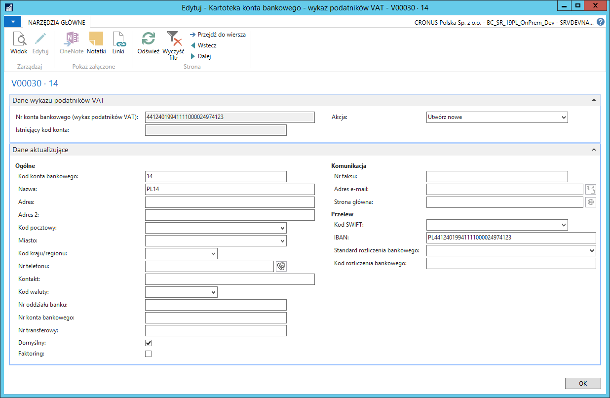

# Aktualizacja kont bankowych 

## Informacje ogólne

W przypadku kontrahentów, dla których zdefiniowana jest już kartoteka
dostawcy lub kartoteka nabywcy w systemie Microsoft Dynamics 365
Business Central on‑premises, z Wykazu podatników VAT można pobrać
informację o jego zarejestrowanych rachunkach bankowych i na tej
podstawie zaktualizować konta bankowe przypisane do kartoteki
dostawcy/nabywcy lub założyć nowe.

>[!NOTE]
>Opis aktualizacji kont bankowych zamieszczony w dalszej
części rozdziału **bazuje na przykładzie kartoteki dostawcy.
W kartotece nabywcy mechanizm jest identyczny, więc należy wzorować
się na opisie dotyczącym kartoteki dostawcy**.

## Obsługa

W celu pobrania informacji o zarejestrowanych rachunkach bankowych
dostawcy, należy wykonać następujące kroki:

1.  Należy wybrać **Działy \> Zakup \> Przetwarzanie zamówień \>
    Dostawcy**.

2.  W oknie **Dostawcy**, które się otworzy, należy zaznaczyć wiersz z
    wybranym dostawcą, następnie na wstążce należy kliknąć **Konta
    bankowe**.

3.  W oknie **Lista kont bank. dostawcy**, które się otworzy, należy na
    wstążce kliknąć **Pobierz dane z wyk. podat. VAT**.

  

4.  Dane w oknie **Lista kont bankowych wykazu podatników VAT**, które
    się otworzy, należy wypełnić zgodnie z poniższym opisem:

    -   **Istniejący kod konta** – w tym polu wyświetlony jest kod konta
        bankowego zdefiniowanego już w systemie dla danego kontrahenta,
        które rozpoznawane jest na podstawie numeru IBAN,
    
    -   **Nr konta bankowego (wykaz podatników VAT)** – w tym polu znajduje
        się numer rachunku bankowego pobrany z wykazu podatników VAT,
    
    -   **Akcja** – w wierszu z wybranym numerem rachunku bankowego, który
        ma być przypisany do kontrahenta w systemie, należy wybrać jedną z
        opcji:

    -   **Puste** – dany rachunek bankowy nie zostanie przypisany do
        kartoteki kontrahenta w systemie lub konto nie zostanie
        zaktualizowane,
    
    -   **Utwórz nowe** – dany rachunek bankowy zostanie przypisany
        do kartoteki kontrahenta w systemie (zostanie założone nowe konto
        bankowe dostawcy) – tę opcję można wybrać, jeśli pole **Istniejący
        kod konta** jest puste,
    
    -   **Zaktualizuj istniejące** – informacje o danym rachunku bankowym
        zastąpią informacje w istniejącym w systemie koncie bankowym
        kontrahenta – tę opcję można wybrać, jeśli pole **Istniejący kod
        konta** nie jest puste.

  

5.  Należy zaznaczyć wiersz z wybranym rachunkiem bankowym, dla którego
    zostało wypełnione pole **Akcja**, następnie na wstążce należy
    kliknąć **Edycja**.

6.  W oknie **Kartoteka konta bankowego** – **wykaz podatników VAT** na
    karcie skróconej **Dane aktualizujące** wyświetlone są domyślne
    informacje o rachunku bankowym. W razie potrzeby należy ręcznie
    wprowadzić zmiany, a następnie kliknąć **OK**, aby zamknąć okno.

W razie potrzeby, czynności opisane w krokach 5. i 6. należy powtórzyć
dla wszystkich rachunków z wypełnionym polem **Akcja**.

  

7.  W oknie **Lista kont bankowych wykazu podatników VAT** na wstążce
    należy kliknąć **Zaktualizuj konta bankowe dostawców**.

8.  W oknie komunikatu, które się wyświetli, należy kliknąć **Tak**.

  

9.  W komunikacie potwierdzającym utworzenie i/lub zaktualizowanie
    informacji o kontach bankowych dostawcy należy kliknąć **OK**.

W wyniku powyższych działań, lista kont bankowych zdefiniowanych
dla wybranego dostawcy, została zaktualizowana:

  