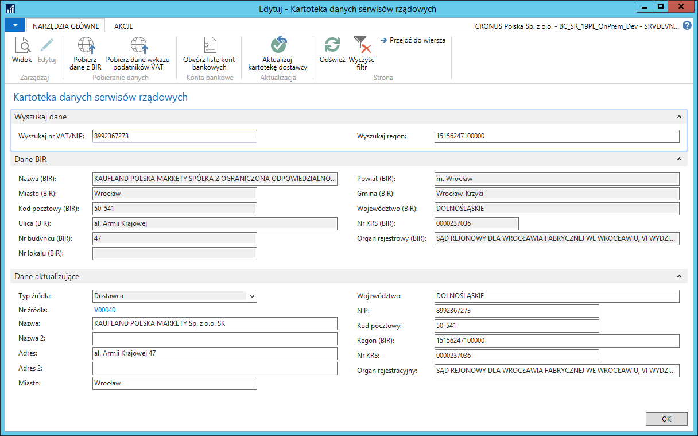
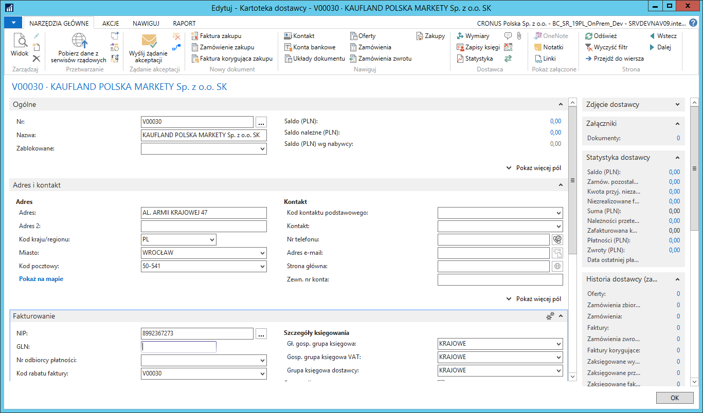

# Dane kontrahentów w Bazie Internetowej Regon (BIR)

## Informacje ogólne

Główny Urząd Statystyczny udostępnia aktualną informację o podatnikach
VAT w Bazie Internetowej Regon (BIR), którą każdy może dowolnie
przeszukiwać.

Polska Lokalizacja umożliwia bezpośrednie połączenie z systemu Microsoft
Dynamics 365 Business Central on‑premises z Bazą Internetową Regon
i wyszukiwanie podmiotów podając numer NIP lub regon. Możliwe jest
również tworzenie i aktualizacja danych nabywców, dostawców i kontaktów
w oparciu o dane w Bazie Internetowej Regon.

## Ustawienia

W Bazie Internetowej Regon dane kontrahentów zdefiniowane są w pełnym
brzmieniu, np. spółka z ograniczoną odpowiedzialnością. Aby system
automatycznie podpowiadał w nazwie kontrahenta skrót np. sp. z o.o.,
należy wcześniej zdefiniować te skróty. W tym celu należy wykonać
następujące kroki:

1.  Należy wybrać **Działy \> Zarządzanie Finansami \> Administracja \>
    Ustawienia \> Skróty danych BIR**.

2.  W oknie **Skróty danych BIR**, które się otworzy, w pierwszym wolnym
    wierszu należy w polu **Tekst** wprowadzić treść danych BIR, dla
    których w polu **Skrót** należy zdefiniować ich skróconą formę:

   

3.  Zmiany należy zatwierdzić klikając przycisk **OK**.

## Obsługa

Wprowadzając do bazy nowego dostawcę, należy wykonać następujące kroki:

1.  Należy wybrać **Działy \> Zakup \> Przetwarzanie zamówień \>
    Dostawcy.**

2.  W oknie **Dostawcy**, które się otworzy, na wstążce należy kliknąć
     **Nowy**.

3.  W nowej kartotece dostawcy, która się otworzy, na wstążce należy
     kliknąć **Pobierz dane z serwisów rządowych**.

4.  W oknie **Kartoteka danych serwisów rządowych**, które się otworzy,
    w polu **Wyszukaj nr VAT/NIP** należy wprowadzić NIP (10 cyfr)
    kontrahenta, którego wprowadzamy do bazy. Jest też możliwość
    wyszukiwania kontrahenta według numeru regon, w tym celu należy
    wypełnić pole **Wyszukaj regon**.

5.  Na wstążce należy kliknąć **Pobierz dane z BIR**.
    
    

    W wyniku działania akcji **Pobierz dane z BIR**, w oknie **Kartoteka
    danych serwisów rządowych** pojawi się nowa karta skrócona **Dane BIR**,
    w której prezentowane są dane kontrahenta zarejestrowane w Bazie
    Internetowej Regon. Pola tej karty skróconej są nieedytowalne.
    
    W polach na karcie skróconej **Dane aktualizujące** jest kopia danych
    z Bazy Internetowej Regon. Wszystkie pola są edytowalne -- użytkownik
    może zmienić ich zawartość. Dane z tych pól zostaną skopiowane
    do kartoteki dostawcy po kliknięciu akcji **Aktualizuj kartotekę
    dostawcy**.
    
  

6.  W oknie **Kartoteka danych serwisów rządowych** na wstążce należy
    kliknąć **Aktualizuj kartotekę dostawcy**, a następnie **OK**.

 >[!NOTE]
 >Jeśli wcześniej pobrane były dane kontrahenta z Wykazu
 podatników VAT lub pola na karcie skróconej **Dane aktualizujące**
 były wypełnione ręcznie, pojawi się komunikat z pytaniem, czy zastąpić
 dane aktualizujące danymi z Bazy Internetowej Regon.

System automatycznie wypełnił pola w kartotece dostawcy danymi z karty
skróconej **Dane aktualizujące** w **Kartotece danych serwisów
rządowych**.

  

Funkcja **Pobierz dane z BIR** w oknie **Kartoteka danych serwisów
rządowych** może być uruchomiona również w istniejącej kartotece
dostawcy i służyć do sprawdzenia, czy dany kontrahent jest aktualnie
zarejestrowany jako czynny podatnik VAT. W tej sytuacji funkcja
**Pobierz dane z BIR** automatycznie pobiera NIP z kartoteki kontrahenta
w celu przeszukania Bazy Internetowej Regon. W przypadku, gdy dany NIP
nie zostanie odnaleziony, zostanie wyświetlony stosowny komunikat:

  

W sytuacji, gdy podatnik zostanie odnaleziony, a jego dane się nie
zmieniły, nie ma potrzeby uruchamiania akcji **Aktualizuj kartotekę
dostawcy**.