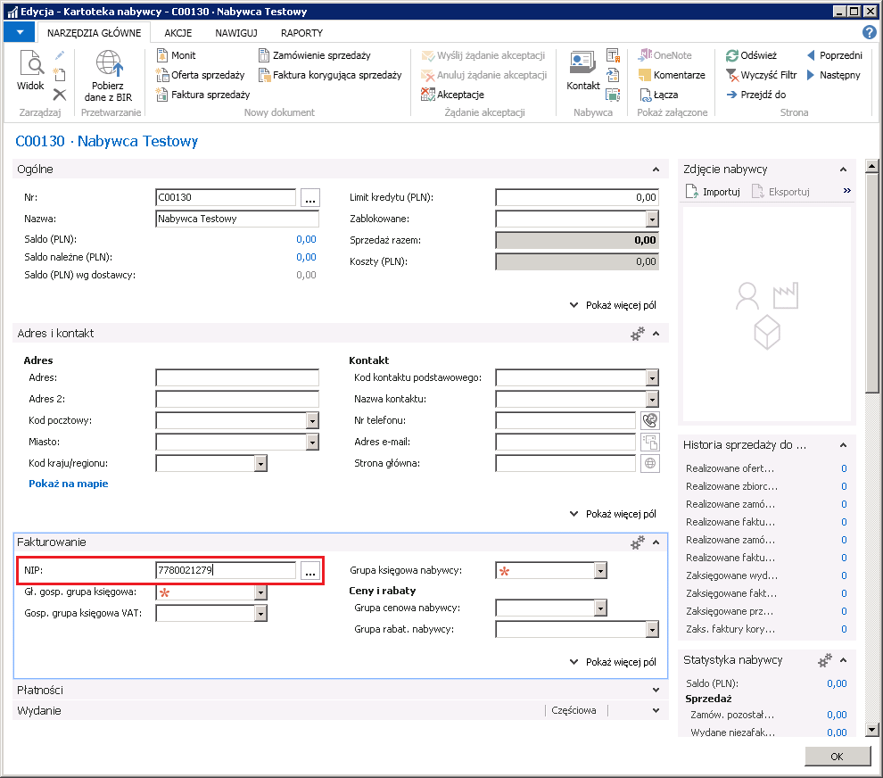
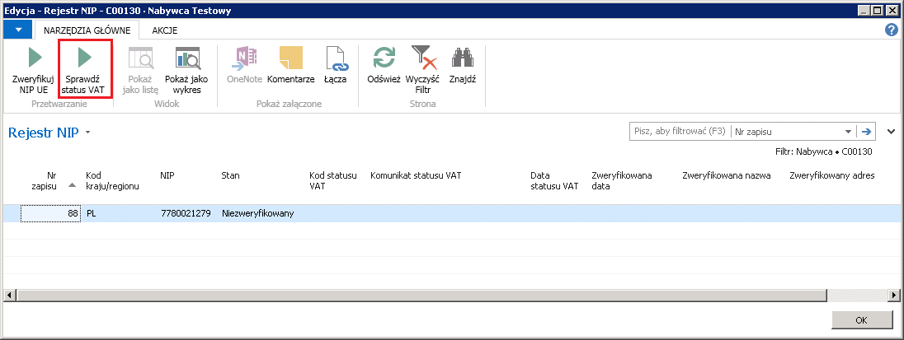
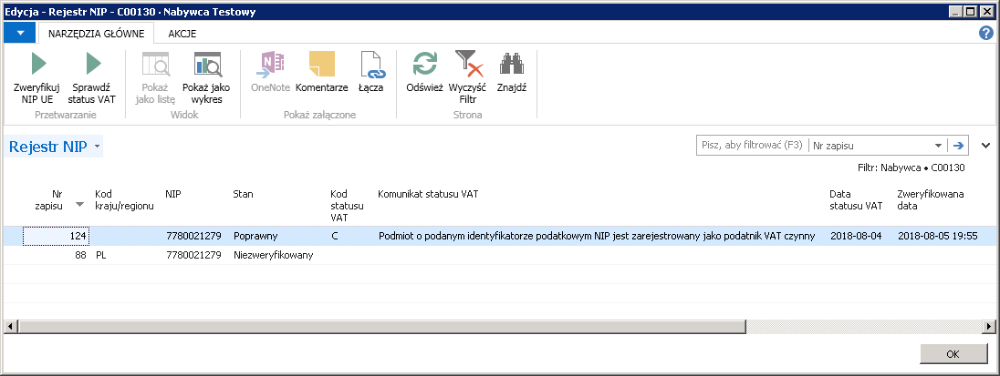
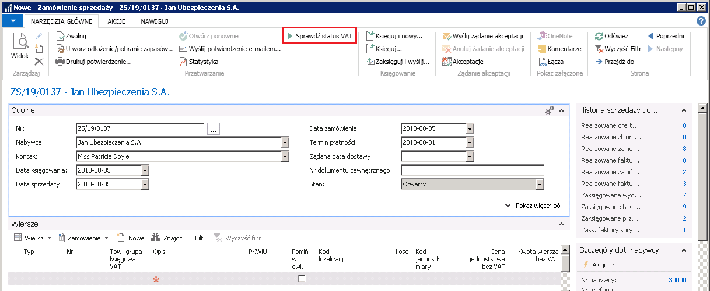
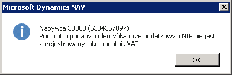
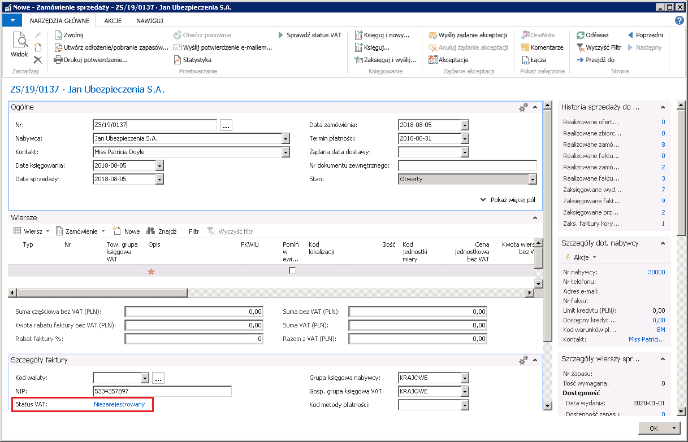
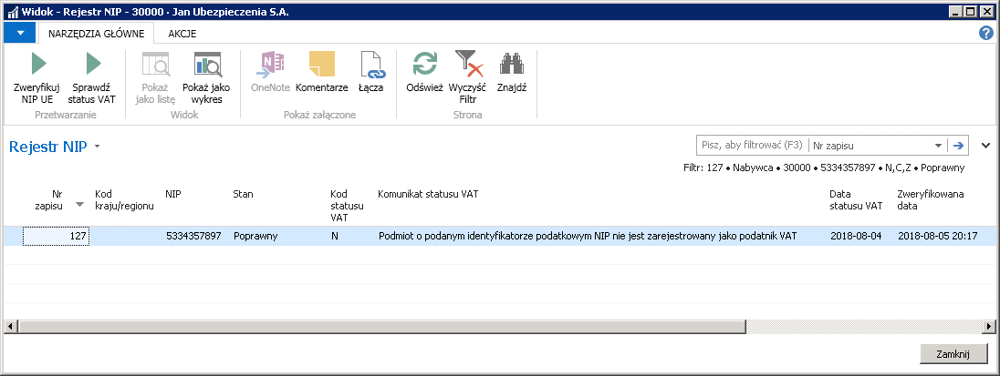
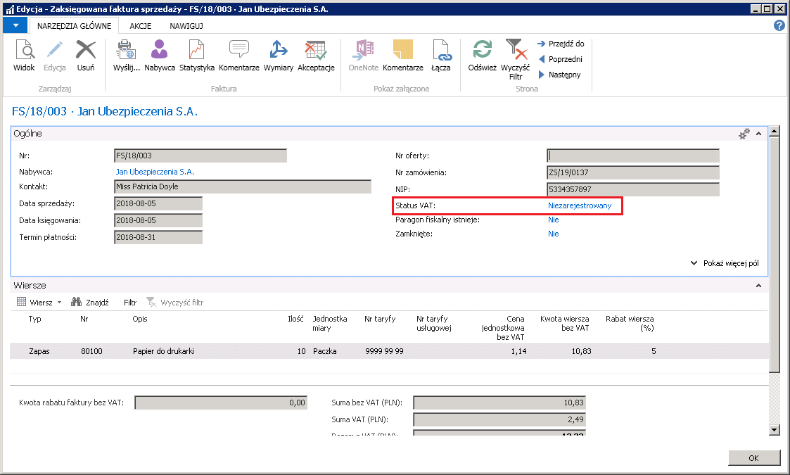

# Sprawdzenie statusu podmiotu w VAT 

## Informacje ogólne

W kwietniu 2018 roku Ministerstwo Finansów poinformowało, że
udostępnione zostało API do dostępnej na Portalu Podatkowym usługi
*Sprawdzenie statusu podmiotu w VAT*. Przedstawione zostały zasady
wymiany informacji pomiędzy usługą sieciową udostępnioną przez
Ministerstwo Finansów a oprogramowaniem interfejsowym systemów
klienckich, pobierających informacje dotyczące statusu podatników jako
płatników podatku VAT.

Aktualnie dostępna jest tylko usługa *SprawdzNIP*, która na podstawie
numeru NIP weryfikuje, czy podmiot jest zarejestrowany jako podatnik VAT
w dniu poprzedzającym przesłanie zapytania. W planach Ministerstwa
Finansów jest uruchomienie usługi *SprawdzNIPNaDzien*.

W odpowiedzi na przesłane zapytanie usługa *SprawdzNIP* zwraca **Kod**
oraz **Komunikat**:

-   **Kod** – jednoznakowy kod rezultatu wykonanej operacji, może
     oznaczać status rejestracji podmiotu jako podatnika VAT lub błąd
     zapytania.

     Możliwe kody statusu rejestracji:

    -   **N** – podmiot o podanym identyfikatorze podatkowym NIP nie jest
         zarejestrowany jako podatnik VAT,
    
    -   **C** – podmiot o podanym identyfikatorze podatkowym NIP jest
         zarejestrowany jako podatnik VAT czynny,
    
    -   **Z** – podmiot o podanym identyfikatorze podatkowym NIP jest
         zarejestrowany jako podatnik VAT zwolniony.

    Możliwe kody błędów:

    -   **I** – błąd zapytania – niepoprawny Numer Identyfikacji
         Podatkowej.
    
-   **Komunikat** – opis kodu rezultatu wykonanej operacji.

    Użytkownik może otrzymać jeden z trzech poniższych komunikatów:

    -   Podmiot o podanym identyfikatorze podatkowym NIP nie jest
         zarejestrowany jako podatnik VAT.
    
    -   Podmiot o podanym identyfikatorze podatkowym NIP jest zarejestrowany
         jako podatnik VAT czynny.
    
    -   Podmiot o podanym identyfikatorze podatkowym NIP jest zarejestrowany
         jako podatnik VAT zwolniony.

W ramach Polskiej Lokalizacji, do standardowej funkcjonalności systemu Microsoft Dynamics 365 Business Central on‑premises została dodana funkcja **Sprawdź status VAT**, którą można stosować zarówno w transakcjach zakupu, jak i sprzedaży.

## Ustawienia

 Funkcjonalność sprawdzania statusu podmiotu w VAT wymaga aktywnego
 połączenia z Internetem.

Należy upewnić się, że w oknie **Kraje/Regiony**, dla kodu kraju PL
wypełnione jest pole **Kod kraju/regionu UE** również PL.

## Obsługa

Funkcjonalność sprawdzania statusu podmiotu w VAT dostępna jest w
kartotekach: **Nabywcy**, **Dostawcy**, **Kontaktu** oraz w dokumentach:
**Zamówienie sprzedaży**, **Faktura sprzedaży**, **Faktura korygująca
sprzedaży**, **Zamówienie zakupu**, **Faktura zakupu**, **Faktura
korygująca zakupu**.

W celu sprawdzenia statusu VAT w kartotece kontrahenta, należy
postępować według następujących kroków:

1.  Należy otworzyć kartotekę wybranego nabywcy, dostawcy lub kontaktu,
     a następnie kliknąć przycisk asysty w polu **NIP**.

2.  W oknie **Rejestr NIP**, które się otworzy, na wstążce należy wybrać
     akcję **Sprawdź status VAT**.

3.  W oknie **Rejestr NIP** pojawi się odpowiedź systemu sprawdzania
    statusu podmiotu w VAT, poprzez wypełnienie poszczególnych pól:

    -   **Nr zapisu** – kolejny numer w rejestrze NIP,
    
    -   **NIP** – NIP, dla którego sprawdzany był status,
    
    -   **Stan** – możliwe opcje:
    
        -   **Niezweryfikowany**,
        
        -   **Poprawny**,
        
        -   **Niepoprawny.**
    
    -   **Kod statusu VAT** – możliwe kody:
    
        -   **N** – podmiot o podanym identyfikatorze podatkowym NIP nie jest
             zarejestrowany jako podatnik VAT,
        
        -   **C** – podmiot o podanym identyfikatorze podatkowym NIP jest
             zarejestrowany jako podatnik VAT czynny,
        
        -   **Z** – podmiot o podanym identyfikatorze podatkowym NIP jest
             zarejestrowany jako podatnik VAT zwolniony.
    
    -   **Komunikat statusu VAT –** możliwe komunikaty:
    
        -   Podmiot o podanym identyfikatorze podatkowym NIP nie jest
             zarejestrowany jako podatnik VAT,
        
        -   Podmiot o podanym identyfikatorze podatkowym NIP jest zarejestrowany
             jako podatnik VAT czynny,
        
        -   Podmiot o podanym identyfikatorze podatkowym NIP jest zarejestrowany
             jako podatnik VAT zwolniony.
    
    -   **Data statusu VAT** – data dnia poprzedzającego dzień sprawdzenia
         statusu,
    
    -   **Zweryfikowana data** – data i godzina weryfikacji,
    
    -   **Identyfikator użytkownika** – identyfikator użytkownika
         sprawdzającego status.

W celu sprawdzenia statusu VAT w dokumencie sprzedaży, należy postępować
według następujących kroków:

1.  Należy utworzyć nową kartotekę zamówienia sprzedaży, faktury
    sprzedaży lub faktury korygującej sprzedaży, a następnie wybrać
    nabywcę.

2.  Na wstążce należy wybrać akcję **Sprawdź status VAT**.

3.  System wyświetli okno informacyjne z jednym z komunikatów:

    -   Podmiot o podanym identyfikatorze podatkowym NIP nie jest
         zarejestrowany jako podatnik VAT,
    
    -   Podmiot o podanym identyfikatorze podatkowym NIP jest zarejestrowany
         jako podatnik VAT czynny,
    
    -   Podmiot o podanym identyfikatorze podatkowym NIP jest zarejestrowany
         jako podatnik VAT zwolniony.

4.  W skróconej karcie **Szczegóły faktury** pod polem **NIP** dodane
     jest pole **Status VAT** z informacją, czy dany NIP był dla tego
     dokumentu sprawdzany i jaki był wynik sprawdzenia. Przed
     weryfikacją wyświetlany jest status: **Status nie był
     weryfikowany**. Po weryfikacji pojawi się jeden ze statusów:

    -   **Niezarejestrowany**,
    
    -   **Czynny**,
    
    -   **Zwolniony**.

     Należy kliknąć informację wyświetloną w polu **Status VAT**.

5.  W oknie **Rejestr NIP**, które się otworzy, wyświetlone są szczegóły
     weryfikacji NIP w poszczególnych polach:

    -   **Nr zapisu** – kolejny numer w rejestrze NIP,
    
    -   **NIP** – NIP, dla którego sprawdzany był status,
    
    -   **Stan** – możliwe opcje:
    
        -   **Niezweryfikowany**,
        
        -   **Poprawny**,
        
        -   **Niepoprawny.**
    
    -   **Kod statusu VAT** – możliwe kody:
    
    -   **N** – podmiot o podanym identyfikatorze podatkowym NIP nie jest
         zarejestrowany jako podatnik VAT,
    
    -   **C** – podmiot o podanym identyfikatorze podatkowym NIP jest
         zarejestrowany jako podatnik VAT czynny,
    
    -   **Z** – podmiot o podanym identyfikatorze podatkowym NIP jest
         zarejestrowany jako podatnik VAT zwolniony.
    
    -   **Komunikat statusu VAT –** możliwe komunikaty:
    
        -   Podmiot o podanym identyfikatorze podatkowym NIP nie jest
             zarejestrowany jako podatnik VAT,
        
        -   Podmiot o podanym identyfikatorze podatkowym NIP jest zarejestrowany
             jako podatnik VAT czynny,
        
        -   Podmiot o podanym identyfikatorze podatkowym NIP jest zarejestrowany
             jako podatnik VAT zwolniony.
    
    -   **Data statusu VAT** – data dnia poprzedzającego dzień sprawdzenia
         statusu,
    
    -   **Zweryfikowana data** – data i godzina weryfikacji,
    
    -   **Identyfikator użytkownika** – identyfikator użytkownika
         sprawdzającego status.

W wyniku zaksięgowania dokumentu sprzedaży, informacja o przeprowadzonej
weryfikacji VAT przenoszona jest do zaksięgowanego dokumentu. W celu
sprawdzenia weryfikacji VAT w zaksięgowanym dokumencie sprzedaży, należy
postępować według następujących kroków:

1.  Należy otworzyć kartotekę zaksięgowanej faktury sprzedaży lub
     zaksięgowanej faktury korygującej sprzedaży.

2.  W skróconej karcie **Ogólne** pod polem **NIP** dodane jest pole
     **Status VAT** z informacją, czy dany NIP był dla tego dokumentu
     sprawdzany i jaki był wynik sprawdzenia. Przed weryfikacją
     wyświetlany jest status: **Status nie był weryfikowany**. Po
     weryfikacji pojawi się jeden ze statusów:

    -   **Niezarejestrowany**,
    
    -   **Czynny**,
    
    -   **Zwolniony**.

     Należy kliknąć informację wyświetloną w polu **Status VAT**.

3.  W oknie **Rejestr NIP**, które się otworzy, wyświetlone są szczegóły
     weryfikacji NIP w poszczególnych polach:

    -   **Nr zapisu** – kolejny numer w rejestrze NIP,
    
    -   **NIP** – NIP, dla którego sprawdzany był status,
    
    -   **Stan** – możliwe opcje:
    
        -   **Niezweryfikowany**,
        
        -   **Poprawny**,
        
        -   **Niepoprawny.**
        
    -   **Kod statusu VAT** – możliwe kody:
    
        -   **N** – podmiot o podanym identyfikatorze podatkowym NIP nie jest
             zarejestrowany jako podatnik VAT,
        
        -   **C** – podmiot o podanym identyfikatorze podatkowym NIP jest
             zarejestrowany jako podatnik VAT czynny,
        
        -   **Z** – podmiot o podanym identyfikatorze podatkowym NIP jest
             zarejestrowany jako podatnik VAT zwolniony.
    
    -   **Komunikat statusu VAT –** możliwe komunikaty:
    
        -   Podmiot o podanym identyfikatorze podatkowym NIP nie jest
             zarejestrowany jako podatnik VAT,
        
        -   Podmiot o podanym identyfikatorze podatkowym NIP jest zarejestrowany
             jako podatnik VAT czynny,
        
        -   Podmiot o podanym identyfikatorze podatkowym NIP jest zarejestrowany
             jako podatnik VAT zwolniony.
    
    -   **Data statusu VAT** – data dnia poprzedzającego dzień sprawdzenia
         statusu,
    
    -   **Zweryfikowana data** – data i godzina weryfikacji,
    
    -   **Identyfikator użytkownika** – identyfikator użytkownika
         sprawdzającego status.

>[!NOTE]
> Funkcjonalność sprawdzania statusu podmiotu w VAT w
dokumentach zakupu (**Zamówienie zakupu**, **Faktura zakupu**,
**Faktura korygująca zakupu**, **Zaksięgowana faktura zakupu**,
**Zaksięgowana faktura korygująca zakupu**), działa analogicznie, jak
w dokumentach sprzedaży, z tą różnicą, że akcja w niezaksięgowanych
dokumentach zakupu ma nazwę Sprawdź kontrahenta i oprócz weryfikacji
statusu podatnika, obejmuje też weryfikację rachunków bankowych
dostawcy. Więcej szczegółów na ten temat w rozdziale
2.17.5. Sprawdzanie danych dostawcy.