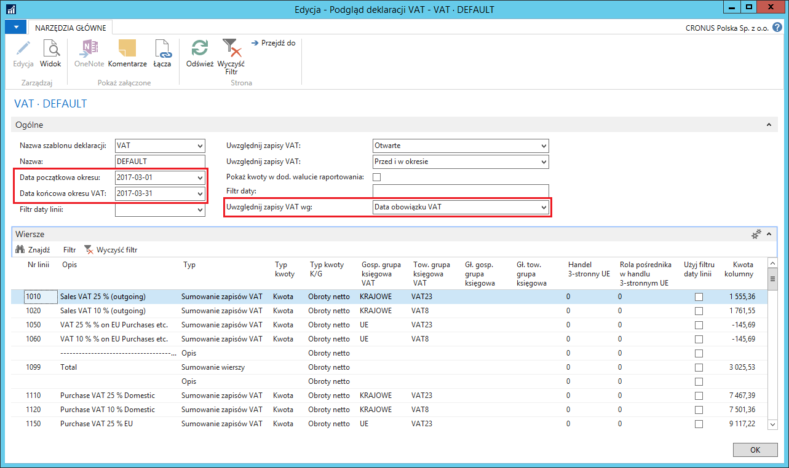

# Deklaracja VAT  

## Informacje ogólne

**Deklaracja VAT** jest standardowym narzędziem pomocnym w przygotowaniu
deklaracji na potrzeby Urzędu Skarbowego. Narzędzie umożliwia
generowanie sprawozdania dla wybranego, wcześniej zdefiniowanego, okresu
VAT.

## Obsługa

W celu podglądu danych deklaracji VAT dla wybranego okresu VAT, należy
postępować według następujących kroków:

1.  Należy wybrać **Działy \> Zarządzanie Finansami \> Działania
    okresowe \> VAT \> Deklaracje VAT**.

2.  W oknie **Deklaracja VAT,** które się otworzy, z listy rozwijanej
    w polu **Nazwa** należy wybrać jedną z wcześniej zdefiniowanych
    deklaracji. Następnie należy wybrać **Podgląd**.

3.  W oknie **Podgląd deklaracji VAT**, które się otworzy, można
    uzupełnić nowe pola:

    -   W polu **Data początkowa okresu VAT** należy wprowadzić datę
         początkową wybranego okresu, zgodną z okresami zdefiniowanymi
         wcześniej w oknie **Okresy VAT**.
    
    -   Pole **Data końcowa okresu VAT** zostanie uzupełnione automatycznie
         na podstawie daty w polu **Data początkowa okresu VAT** i okresów
         zdefiniowanych wcześniej w oknie **Okresy VAT**.
    
    -   W polu **Uwzględnij zapisy VAT** należy wybrać datę w oknie **Zapisy
         VAT**, na którą będzie zakładany filtr okresu VAT. Dostępne opcje
         to: **Data obowiązku VAT i Data księgowania**.

  

Po uzgodnieniu danych w oknie **Podgląd deklaracji VAT**, można na
ich podstawie obliczyć i zaksięgować rozliczenie podatku VAT. W tym celu
należy postępować według następujących kroków:

1.  W oknie **Deklaracja VAT** należy wybrać **Oblicz i księguj dekl.
    VAT.**

2.  W oknie wstępnym skryptu **Oblicz i księguj dekl. VAT** należy
    standardowo wprowadzić właściwe parametry w standardowych polach.

    Nowe pola należy uzupełnić następująco:

    -   W polu **Data początkowa** należy wprowadzić datę początkową
        wybranego okresu (lub wybrać z listy rozwijanej w tym polu),
        zgodną z okresami zdefiniowanymi wcześniej w oknie **Okresy VAT**.
    
    -   Pole **Data końcowa** zostanie uzupełnione automatycznie
        na podstawie daty w polu **Data początkowa** i okresów
        zdefiniowanych wcześniej w oknie **Okresy VAT**. Data może zostać
        zmieniona ręcznie.

  

3.  Następnie w tym samym oknie należy wybrać **Podgląd lub Drukuj**
    w celu wykonania skryptu.

>[!NOTE]
>Zaznaczenie pola **Księguj** spowoduje zaksięgowanie
dokumentu po wybraniu **Podgląd lub Drukuj**. Aby uruchomić skrypt
w trybie testowym, pole **Księguj** nie może być zaznaczone.

  

>[!NOTE]
>System filtruje **Zapisy VAT** używając **Daty obowiązku
VAT** (w odróżnieniu od **Daty księgowania**) **i **przygotowuje
raport pokazujący zapisy, które zostaną przeksięgowane na konto KG
wybrane w polu **Konto rozliczeniowe.** Wydruk (i podgląd wydruku)
zawiera również informację o **Dacie obowiązku VAT**.

4.  Należy powrócić do okna **Oblicz i księguj dekl. VAT** i zaznaczyć
     pole **Księguj**, a następnie ponownie wykonać skrypt.

5.  System zaksięguje przeniesienie kwoty podatku VAT należnego
     i naliczonego na konto rozliczeniowe i zamknie rozliczony **Okres
     VAT.**

  

  

