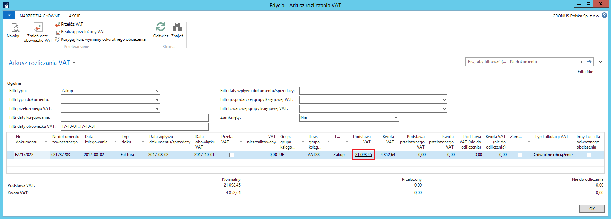
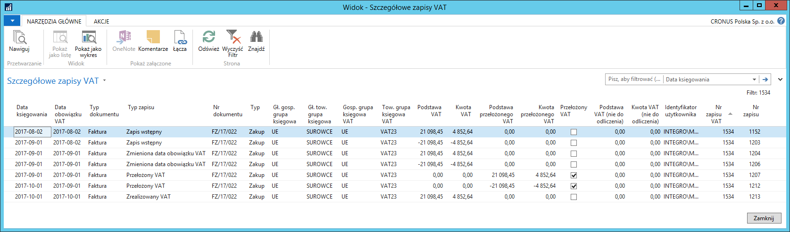
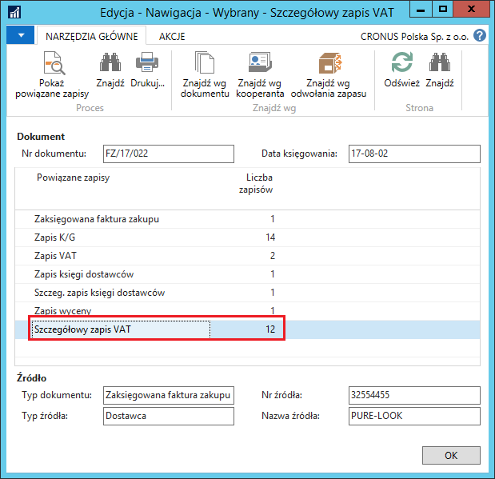

Szczegółowe zapisy VAT {#szczegółowe-zapisy-vat .Poziom-1}
----------------------

### Informacje ogólne

Funkcjonalność **Szczegółowe zapisy VAT** została dodana do systemu
Microsoft Dynamics 365 Business Central on‑premises w celu
dokładniejszej obsługi i większej kontroli nad zmianą wartości podatku
VAT, który ma być rozliczony w danym okresie.

Zasada działania szczegółowych zapisów VAT jest podobna do zasady
działania szczegółowych zapisów w innych księgach pomocniczych
w systemie, takich jak szczegółowe zapisy księgi nabywców i szczegółowe
zapisy księgi dostawców. Oznacza to, że w **Szczegółowych zapisach VAT**
system przechowuje, w postaci oddzielnych zapisów, informacje o zmianach
wartości **Zapisów VAT**. Kwoty w **Zapisach VAT** są sumą kwot
zarejestrowanych w **Szczegółowych zapisach VAT** powiązanych z danym
**Zapisem VAT.**

### Obsługa

Użytkownik może dokonać przeglądu **Szczegółowych zapisów VAT**
uzyskując do nich dostęp za pomocą dwóch najczęściej stosowanych metod:

[Z okna **Arkusz rozliczania VAT.**]{.underline}

W tym celu należy postępować według następujących kroków:

1.  Należy wybrać: **Działy \> Zarządzanie Finansami \> Działania
    > okresowe \> VAT \> Arkusz rozliczania VAT**

2.  W oknie **Arkusz rozliczania VAT**, które się otworzy, w wybranym
    > wierszu należy kliknąć kwotę np. w polu **Podstawa VAT**:

  {width="6.365217629046369in" height="2.2890299650043744in"}
  -------------------------------------------------------------------------------------
  Rysunek 2.42: Arkusz rozliczania VAT

3.  W oknie **Szczegółowe zapisy VAT** przedstawiona jest historia
    zapisu VAT:

  {width="6.4in" height="1.8837609361329835in"}
  -----------------------------------------------------------------------
  Rysunek 2.43: Szczegółowe zapisy VAT

> Kolumny w oknie **Szczegółowe zapisy VAT** są praktycznie takie same,
> jak w oknie **Zapisy VAT**, jednak 2 z nich są specyficzne dla okna
> **Szczegółowe zapisy VAT**:

1)  **Typ zapisu** -- to pole informuje o pochodzeniu szczegółowego
    zapisu VAT i może przyjmować następujące wartości:

-   **Zapis wstępny** -- oznacza, że jest to początkowy (pierwszy)
    > szczegółowy zapis VAT dla danego zapisu VAT lub odwrócenie tego
    > zapisu

-   **Przełożony VAT** -- oznacza, że ten szczegółowy zapis VAT
    > zarejestrował fakt przełożenia VAT w danym zapisie VAT
    > lub odwrócenie tego zapisu

-   **Zrealizowany VAT** -- oznacza, że ten szczegółowy zapis VAT
    > zarejestrował fakt realizacji przełożonego VAT w danym zapisie VAT
    > lub odwrócenie tego zapisu

-   **Zmieniona data obowiązku VAT** -- oznacza, że ten szczegółowy
    > zapis VAT zarejestrował zmianę daty obowiązku VAT w danym zapisie
    > VAT lub odwrócenie tego zapisu

-   **Korekta odwrotnego obciążenia** -- oznacza, że ten szczegółowy
    > zapis VAT zarejestrował kwotę podstawy i podatku VAT z tytułu
    > odwrotnego obciążenia przeliczoną według innego kursu, niż zostało
    > dokonane przeliczenie kwot zakupu i zobowiązania.

2)  **Nr zapisu VAT** -- to pole informuje o numerze zapisu VAT,
    z którym powiązany jest dany szczegółowy zapis VAT.

[Z okna **Arkusz rozliczania VAT.**]{.underline}

W tym celu należy postępować według następujących kroków:

1.  Należy wybrać **Nawiguj** w danym zapisie VAT lub jakimkolwiek
    > zaksięgowanym dokumencie mającym powiązanie z zapisami VAT.

2.  W oknie **Nawigacja**, które się otworzy, jest wiersz odwołujący się
    > do okna **Szczegółowe zapisy VAT**:

  {width="5.196850393700787in" height="5.031496062992126in"}
  ------------------------------------------------------------------------------------
  Rysunek 2.44: Nawigacja

3.  Należy zaznaczyć wiersz z tabelą **Szczegółowy zapis VAT** i wybrać
    **Pokaż powiązane zapisy.** Otworzy się okno **Szczegółowe zapisy
    VAT**, które zostało już wcześniej opisane.