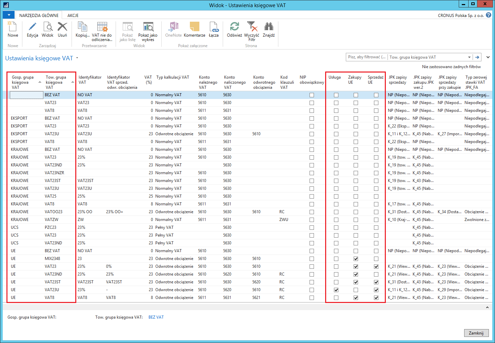
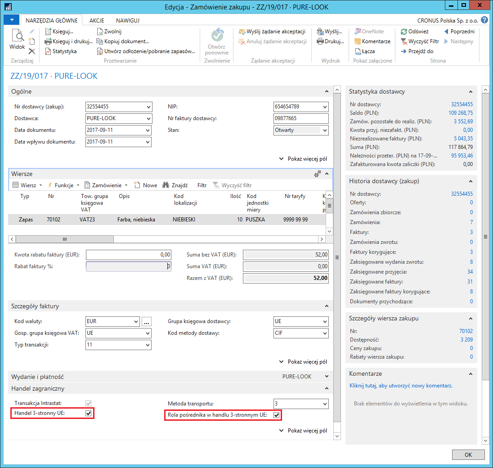
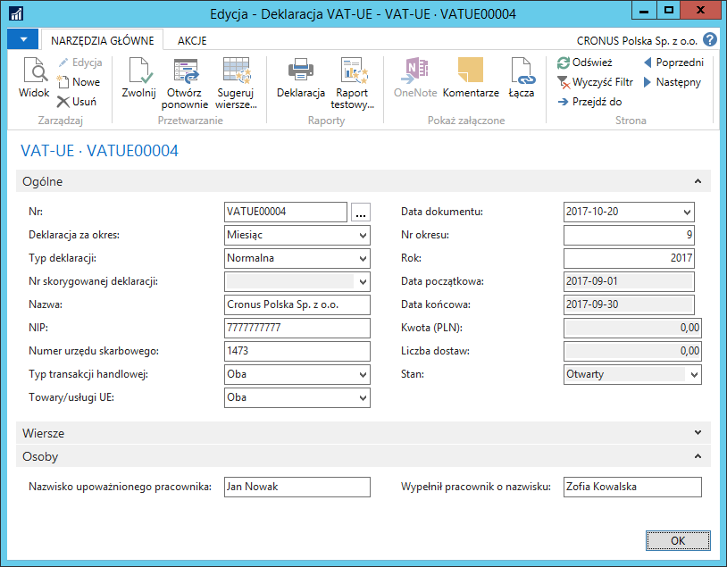
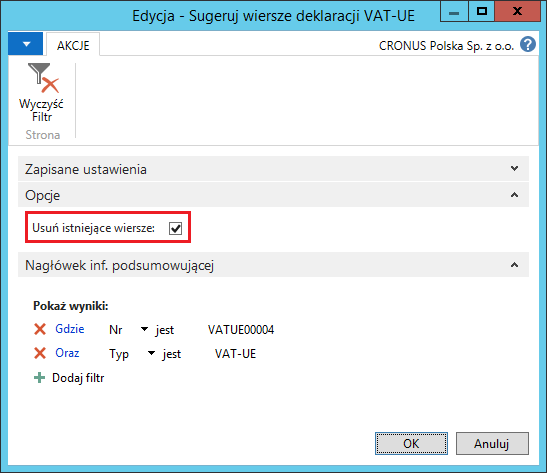
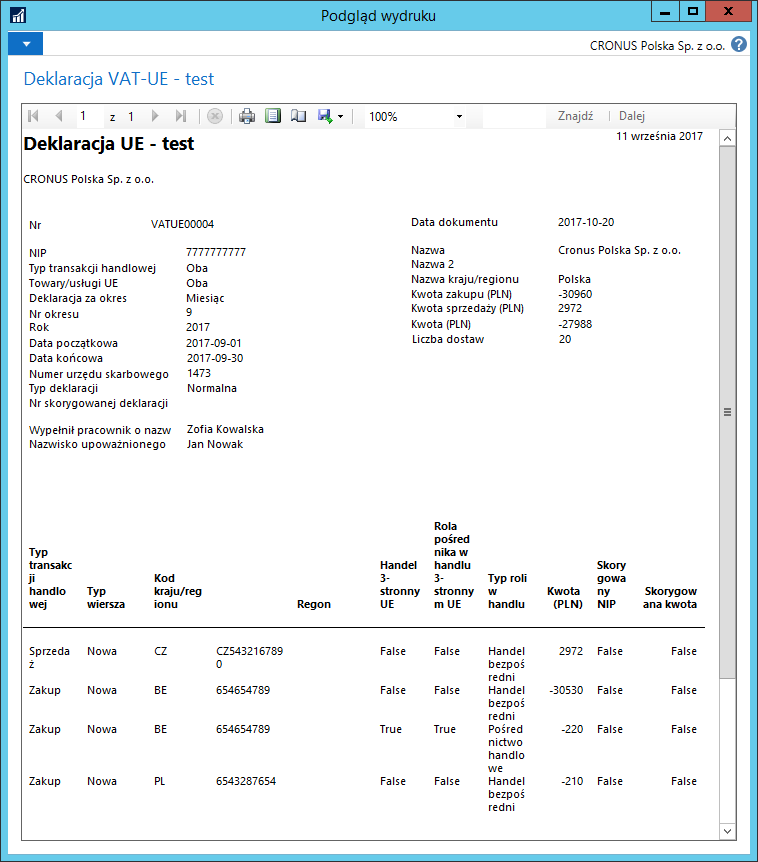
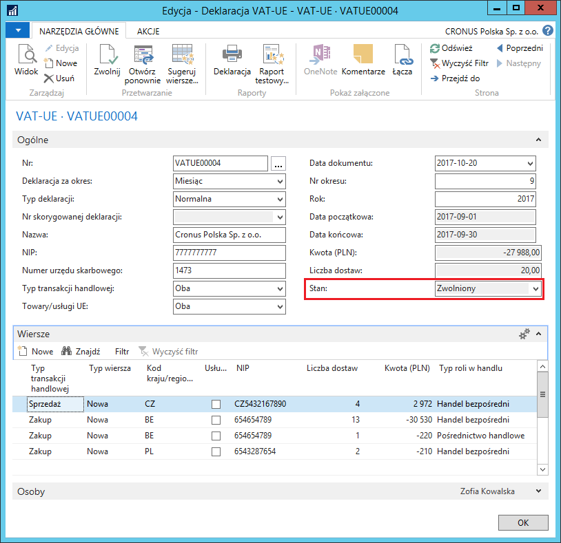
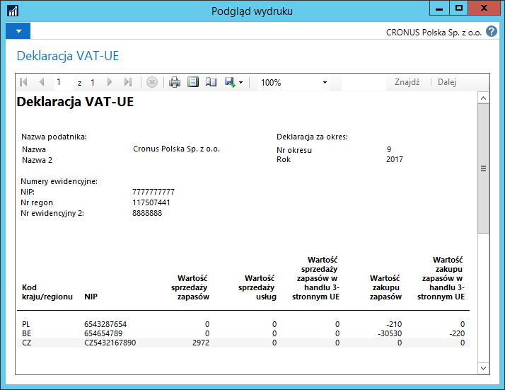
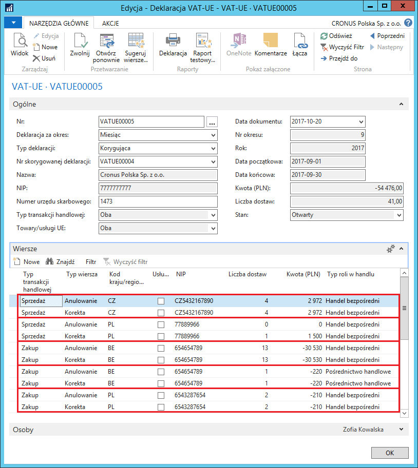

# Deklaracja VAT-UE 

## Informacje ogólne

**Deklaracja VAT-UE** to informacja podsumowująca o dokonanych
wewnątrzwspólnotowych transakcjach w danym okresie. Konieczność
składania tego sprawozdania wynika z przepisów Ustawy o VAT. Polska
Lokalizacja wyposażona została w narzędzie ułatwiające i automatyzujące
przygotowanie danych do deklaracji VAT-UE.

## Ustawienia

Żeby móc automatycznie tworzyć deklarację VAT-UE, muszą być zdefiniowane
odpowiednie ustawienia. W tym celu, należy postępować
według następujących kroków:

1.  Należy wybrać **Działy \> Zarządzanie Finansami \> Administracja \>
    Ustawienia raportowania stat.**

2.  W oknie **Ustawienia raportowania stat.**, które się otworzy, należy
    odpowiednio wypełnić pola na karcie skróconej **VAT-UE**:

    -   **Numer urzędu skarbowego** – należy wpisać numer (kod) urzędu
        skarbowego, do którego należy dostarczyć deklaracje VAT-UE
    
    -   **Nazwisko upoważnionego pracownika (dekl. VAT-UE)** – należy
        wpisać imię i nazwisko przedstawiciela firmy upoważnionego
        do podpisywania deklaracji VAT-UE
    
    -   **Wypełnił pracownik o nazwisku (dekl. VAT-UE)** – należy wpisać
        imię i nazwisko przedstawiciela firmy wypełniającego deklarację
        VAT-UE
    
    -   **Seria numeracji deklaracji VAT-UE** – z listy rozwijanej w tym
        polu należy wybrać kod serii numeracji, według której system
        będzie nadawał numery kolejnym deklaracjom VAT-UE

  

3.  Należy wybrać **Działy \> Zarządzanie Finansami \> Administracja \>
    Ustawienia księgowe VAT**.

4.  W oknie **Ustawienia Księgowe VAT**, które się otworzy, należy
    odnaleźć wiersze z takimi kombinacjami kodów w polach **Gosp.
    grupa księgowa VAT i Tow. grupa księgowa VAT**,
    które są zdefiniowane dla zakupów i sprzedaży wewnątrzunijnej.
    W tych wierszach należy zaznaczyć odpowiednio pola **Zakupy UE
    i Sprzedaż UE** (jedno lub obydwa, w zależności od przeznaczenia)
    oraz **Usługa**, jeśli kombinacja grup księgowania VAT w danym
    wierszu odnosi się do zakupu/sprzedaży wewnątrzunijnej usług.

  

W **Deklaracji VAT-UE** można wykazywać wewnątrzwspólnotowe transakcje
trójstronne oraz rolę firmy w każdej takiej transakcji.
Wewnątrzwspólnotowa transakcja trójstronna zachodzi pomiędzy trzema
podatnikami VAT zidentyfikowanymi na potrzeby transakcji
wewnątrzwspólnotowych w trzech różnych państwach członkowskich.
Uczestniczą oni w dostawie towaru w ten sposób, że pierwszy z nich
wydaje towar bezpośrednio ostatniemu w kolejności, przy czym dostawa
tego towaru jest dokonana między pierwszym i drugim oraz drugim
i ostatnim w kolejności.

W celu oznaczenia poszczególnych transakcji zakupu/sprzedaży jako
trójstronne oraz określenia roli firmy w tych transakcjach, należy
postępować według następujących kroków:

1.  Należy wybrać Działy **\> Zakup \> Przetwarzanie zamówień \>
     Zamówienia zakupu.**

2.  Należy otworzyć kartotekę nowego zamówienia zakupu i wypełnić ją
     standardowo.

3.  W kartotece zamówienia zakupu, na karcie skróconej **Handel
     zagraniczny**, należy odpowiednio zaznaczyć (lub nie) pola:
     **Handel 3-stronny UE** i **Rola pośrednika w handlu 3-stronnym
     UE**.

  

4.  Zaksięgowanie dokumentu powoduje skopiowanie informacji z ww. pól\
    do odpowiednich **Zapisów VAT**, na podstawie których tworzona jest
    **Deklaracja VAT-UE**.

 >[!NOTE]
 >Pola: **Handel 3-stronny UE** i **Rola pośrednika w handlu
 3‑stronnym UE** są dostępne w następujących dokumentach zakupu:
 **Oferta**, **Zamówienie zbiorcze**, **Zamówienie**, **Faktura**,
 **Faktura korygująca**, **Zamówienie zwrotu**, **Zaksięgowana
 faktura**, **Zaksięgowana faktura korygująca**, **Zaksięgowane wydanie
 zwrotu**, **Archiwum ofert**, **Archiwum zamówień**, **Archiwum
 zamówień zwrotu** oraz w dokumentach sprzedaży: **Oferta**,
 **Zamówienie zbiorcze**, **Zamówienie**, **Faktura**, **Faktura
 korygująca**, **Zamówienie zwrotu**, **Zaksięgowana faktura**,
 **Zaksięgowana faktura korygująca**, **Zaksięgowane przyjęcie
 zwrotu**, **Archiwum ofert**, **Archiwum zamówień**, **Archiwum
 zamówień zwrotu**.

## Obsługa

W celu przygotowania deklaracji VAT-UE za wybrany okres, należy
postępować według następujących kroków:

1.  Należy wybrać **Działy \> Zarządzanie Finansami \> Działania
    okresowe \> VAT \> Deklaracje VAT-UE**.

2.  W oknie **Deklaracje VAT-UE** należy wybrać **Nowe**.

3.  W kartotece nowej deklaracji, na karcie skróconej **Ogólne**, należy
    wypełnić pola:

    -   **Nr** – w tym polu system wstawia numer kolejny deklaracji VAT-UE,
         zgodny z serią numeracji wybraną w ustawieniach.
    
    -   **Deklaracja za okres** – z listy opcji dostępnych w tym polu
         należy wybrać, za jaki okres przygotowywana jest deklaracja.
         Możliwe opcje do wyboru, to **Kwartał** i **Miesiąc**.
    
    -   **Typ deklaracji** – od typu deklaracji wybranego w tym polu zależą
         dalsze czynności podczas tworzenia deklaracji VAT-UE. Możliwe
         opcje do wyboru, to: **Normalna**, **Korygująca**,
         **Korygująco-uzupełniająca**.
    
    -   **Nr skorygowanej deklaracji** – dostępność tego pola do edycji
         zależy od wybranego **Typu deklaracji**:
    
        -   dla typu **Normalna** – pole jest nieedytowalne.
        
        -   dla typu **Korygująca** – pole jest edytowalne, z listy w nim
             rozwijanej należy wybrać wcześniej utworzoną deklarację, która ma
             zostać skorygowana.
        
        -   dla typu **Korygująco-uzupełniająca** – pole jest edytowalne,
             z listy w nim rozwijanej należy wybrać wcześniej utworzoną
             deklarację, która ma zostać skorygowana lub uzupełniona.
    
    -   **Nazwa** – pole wypełniane automatycznie przez system – wstawiana
         jest nazwa firmy skopiowana z okna **Dane Firmy.**
    
    -   **NIP** – pole wypełniane automatycznie przez system – wstawiany
         jest NIP skopiowany z okna **Dane Firmy.**
    
    -   **Numer urzędu skarbowego** – pole wypełniane automatycznie
         przez system – wstawiany jest numer urzędu skarbowego skopiowany
         z okna **Ustawienia raportowania statystycznego.**
    
    -   **Typ transakcji handlowej** – z listy opcji dostępnych w tym polu
         należy wybrać typ transakcji, jakie mają być zestawione
         w deklaracji. Możliwe opcje do wyboru, to: **Zakupy**,
         **Sprzedaż**, **Oba**. System analizuje **Ustawienia księgowe
         VAT**, dla których zaznaczone są pola **Zakup UE** i **Sprzedaż
         UE**.
    
    -   **Towary/usługi UE** – z listy opcji dostępnych w tym polu należy
         wybrać rodzaj transakcji, jakie mają być zestawione w deklaracji.
         Możliwe opcje do wyboru, to: **Oba**, **Towary**, **Usługi**.
         System analizuje **Ustawienia księgowe VAT**,
         dla których zaznaczone są pola **Zakup UE** i **Sprzedaż UE**, dla
         których zaznaczone jest (lub nie) pole **Usługa**.
    
    -   **Data dokumentu** – w tym polu system automatycznie wstawia datę
         roboczą jako datę utworzenia deklaracji VAT. Datę ta można zmienić
         ręcznie.
    
    -   **Nr okresu** – w zależności od wybranej opcji w polu **Deklaracja
         za okres**, należy podać numer kolejny miesiąca lub kwartału
         w roku, którego dotyczy tworzona deklaracja VAT-UE.
    
    -   **Rok** – w tym polu należy wpisać rok, z którego pochodzi okres
         (miesiąc lub kwartał), którego dotyczy tworzona deklaracja VAT-UE.
    
    -   **Data początkowa** – pole nieedytowalne, system wstawia w nim datę
         początkową okresu, jakim objęta jest deklaracja, na podstawie
         wcześniej wprowadzonych parametrów w polach **Deklaracja
         za okres**, **Nr okresu**, **Rok**.
    
    -   **Data końcowa** – pole nieedytowalne, system wstawia w nim datę
         końcową okresu, jakim objęta jest deklaracja, na podstawie
         wcześniej wprowadzonych parametrów w polach **Deklaracja
         za okres**, **Nr okresu**, **Rok**.
    
    -   **Kwota (PLN)** – pole nieedytowalne, system wstawia sumę kwot
         z wierszy deklaracji VAT-UE.
    
    -   **Liczba dostaw** – pole nieedytowalne, system wstawia sumę ilości
         dostaw z wierszy deklaracji VAT-UE.
    
    -   **Stan** – pole nieedytowalne, którego bieżąca opcja wskazuje
         na stan edycji deklaracji. Zmiana stanu następuje poprzez wybranie
         akcji **Zwolnij** lub **Otwórz ponownie**.

4.  Do pól w karcie skróconej **Osoby** system kopiuje dane z wcześniej
    zdefiniowanych ustawień. W razie potrzeby, zawartość tych pól może
    zostać ręcznie zmieniona.

  

5.  Po prawidłowym wypełnieniu pól nagłówka deklaracji, należy wypełnić
    wiersze. W tym celu, w kartotece deklaracji należy wybrać **Sugeruj
    wiersze**.

6.  W oknie **Sugeruj wiersze deklaracji VAT-UE**, które się otworzy,
    należy zaznaczyć pole **Usuń istniejące wiersze**, aby skrypt
    nadpisał istniejące wiersze deklaracji.

  

7.  Następnie należy wybrać **OK** w celu wykonania skryptu.

    W wyniku użycia skryptu **Sugeruj wiersze deklaracji VAT-UE** system
    wypełnia automatycznie wiersze deklaracji według poniższej logiki:

    -  Skrypt przetwarza **Zapisy VAT** mające datę obowiązku VAT (jeżeli
         pole **Użyj daty obowiązku VAT** jest zaznaczone, w przeciwnym
         wypadku system analizuje datę księgowania) przypadającą w okresie
         wyznaczonym datami w polach **Data początkowa** i **Data końcowa**
         w nagłówku deklaracji VAT-UE.
    
    -  Dodatkowe filtrowanie **Zapisów VAT** zależy od wybranego w nagłówku
         deklaracji **Typu transakcji handlowej**. System wybiera właściwe
         **Zapisy VAT** pod względem grup księgowych VAT,
         których kombinacje zostały oznaczone jako **Zakupy UE**
         lub **Sprzedaż UE**. Następnym etapem filtrowania jest wybranie
         przez system **Zapisów VAT** zgodnych z opcją wybraną w polu
         **Towary/usługi UE**. W tym celu analizowane jest zaznaczenie pola
         **Usługa** w oknie **Ustawienia księgowe VAT dla **kombinacji grup
         księgowych VAT w **Zapisach VAT**.
    
    -  System wstawia wiersze deklaracji VAT-UE pogrupowane kolejno według:
         **NIP**, **Handel 3-stronny UE**, **Rola pośrednika w handlu
         3-stronnym UE**.
    
    -  Podczas wstawiania wierszy, system automatycznie uzupełnia m.in.
        pola:
    
        -   **Kod kraju/regionu** – w tym polu wstawiany jest kod kraju
             z kartoteki nabywcy lub dostawcy, którego NIP jest wprowadzony
             w danym wierszu.
        
        -   **Kwota (PLN)** – suma wartości typu transakcji
             zakupu/sprzedaży/obu dla danego wiersza, skalkulowana z pola
             **Podstawa VAT** w **Zapisach VAT**.
        
        -   **Liczba dostaw** – zawiera liczbę zapisów VAT z unikalnym
             **Numerem transakcji**.

  

8.  Przygotowana deklaracja VAT-UE może być testowo wydrukowana jeszcze
    przed zatwierdzeniem. W tym celu należy wybrać **Raport testowy**,
    a następnie **Podgląd** lub **Drukuj**:

  

>[!NOTE]
>Raport testowy sprawdza wprowadzone dane pod kątem
wymagalności i wyświetla błędy/ostrzeżenia, które mogłyby uniemożliwić
zatwierdzenie **Deklaracji VAT-UE.**

9.  W kartotece deklaracji VAT-UE należy poprawić/uzupełnić dane tak,
    aby na raporcie testowym nie pojawiały się ostrzeżenia.

10. Deklarację VAT-UE należy zatwierdzić, zmieniając jej stan
    na **Zwolniony**. W tym celu należy wybrać **Zwolnij.**

  

11. Zatwierdzoną deklarację (ze stanem **Zwolniona**) można wydrukować,
    wybierając **Deklaracja**, a następnie **Drukuj lub Podgląd
    wydruku**:

  

Aby poprawić błąd, który wystąpił w jednej z wcześniej złożonych
deklaracji VAT‑UE, należy utworzyć deklarację korygującą. Przepisy
polskiego prawa wymagają, aby na deklaracji korygującej wykazane były
wiersze przed i po korekcie. Jeśli na pierwotnej deklaracji jakiś wiersz
nie był wykazany, w deklaracji korygującej powinien mieć wykazaną
wartość zero przed korektą. Jeśli na pierwotnej deklaracji został
wykazany wiersz, którego nie powinno być, w deklaracji korygującej
powinien mieć wykazana wartość zero po korekcie. Zwykle, wiersz przed
korektą powinien mieć wartość identyczną, jak w wierszu deklaracji
pierwotnej, a wiersz po korekcie powinien mieć nową, prawidłowo
skalkulowaną wartość dla danego okresu.

W celu przygotowanie korygującej deklaracji VAT-UE, należy postępować
według następujących kroków:

1.  Należy utworzyć nowy nagłówek deklaracji VAT-UE w ten sam sposób,
     jak dla zwykłej deklaracji.

2.  W polu **Typ deklaracji** należy wybrać **Korygująca**
     lub **Korygująco-uzupełniająca**.

3.  Z listy rozwijanej w polu **Nr skorygowanej deklaracji** należy
     wybrać zatwierdzona deklaracje, podlegającą korygowaniu.

4.  Pozostałe pola w nagłówku deklaracji korygującej zostaną uzupełnione
     automatycznie przez system.

5.  Należy wybrać **Sugeruj wiersze**, a następnie **OK**.

6.  System automatycznie wstawi wiersze korygujące – po 2 dla każdego
     korygowanego wiersza. Wiersz z typem **Anulowanie** (przed
     korektą) jest utworzony na podstawie wiersza w pierwotnej
     deklaracji, a wiersz z typem **Korekta** (po korekcie) jest
     utworzony na podstawie nowej kalkulacji:

  

7.  Należy sprawdzić w **Raporcie testowym**, czy wszystkie wymagane
     dane są poprawnie uzupełnione.

8.  W celu zatwierdzenia korygującej deklaracji VAT-UE, należy zmienić
     jej stan na **Zwolniony**, wybierając **Zwolnij**.

9.  Zatwierdzoną korygującą deklarację VAT-UE można wydrukować
     wybierając **Deklaracja**.