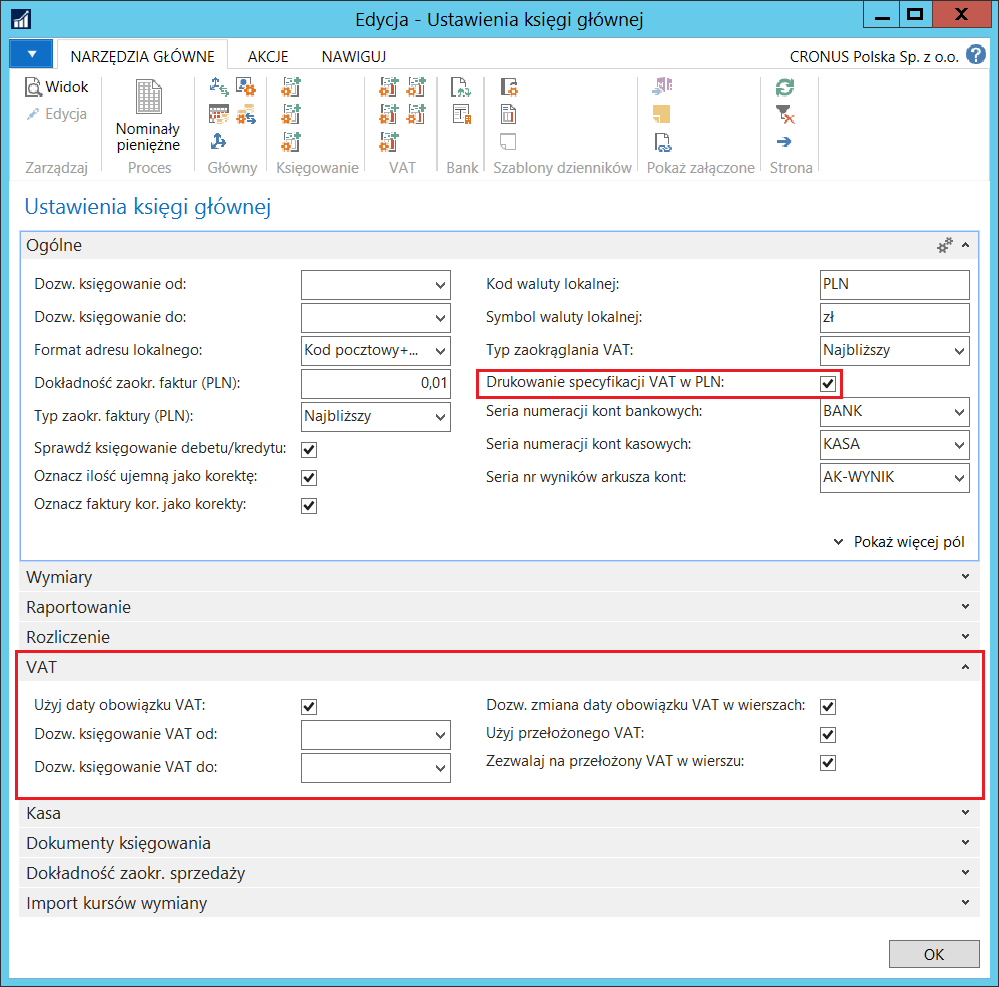
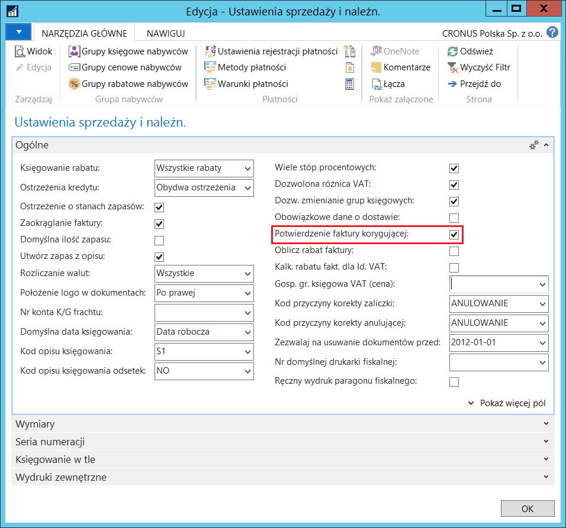
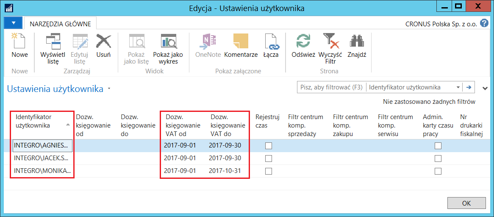
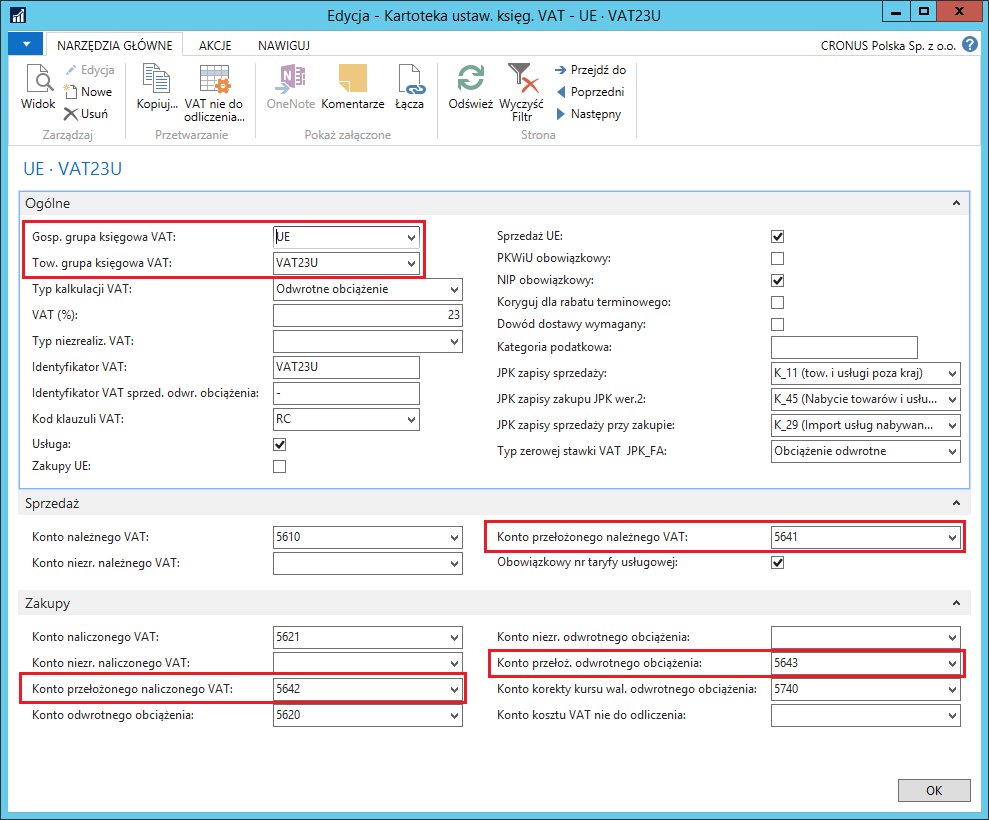
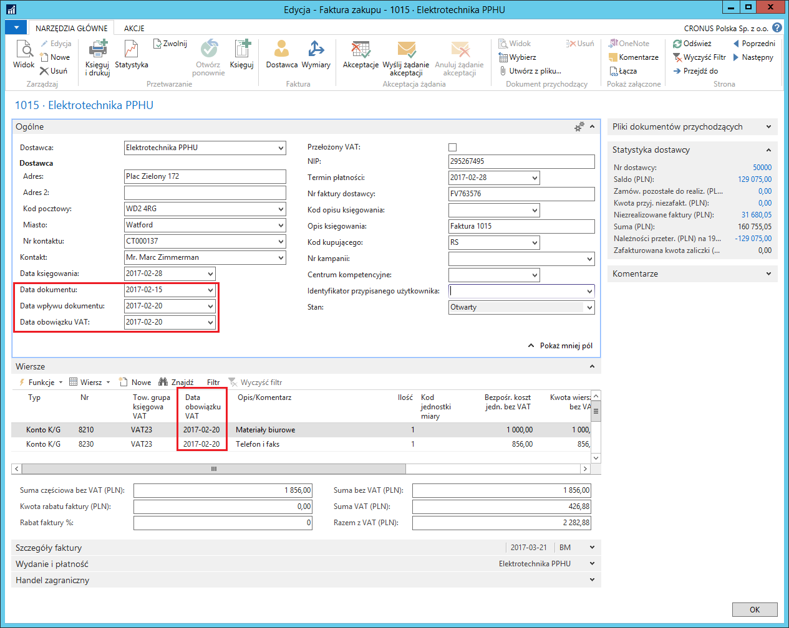

# Podstawowe ustawienia i transakcje z VAT 

## Informacje ogólne

Funkcjonalność **Data obowiązku VAT** została wprowadzona ze względu
na wymagania przepisów polskiego prawa, zgodnie z którymi podatek VAT
może być rozliczony w innym okresie niż dokument został zaksięgowany.

Funkcjonalność **Data obowiązku VAT** ma wpływ na sposób obsługi
poniższych elementów systemu:

-   Ustawienie funkcji **Daty obowiązku VAT**.

-   Księgowanie transakcji sprzedaży, zakupu i serwisu z **Datą
    obowiązku VAT**.

-   Przekładanie podatku VAT w fakturach korygujących sprzedaży.

-   Przygotowanie deklaracji VAT.

-   Kalkulowanie i księgowanie podatku VAT.

-   Uzgadnianie podatku VAT z zapisami księgi głównej.

## Ustawienia

W celu ustawienia możliwości i sposobu obsługi **Daty obowiązku VAT**,
należy postępować według następujących kroków:

1.  Należy wybrać **Działy \> Zarządzanie Finansami \> Administracja \>
    Ustawienia księgi głównej.**

2.  W oknie **Ustawienia księgi głównej**, na karcie skróconej **VAT**
    należy wypełnić pola zgodnie z potrzebami:

    -   **Użyj daty obowiązku VAT** – zaznaczenie tego pola umożliwia
         korzystanie z funkcjonalności **Data obowiązku VAT**, a system
         kontroluje, czy pole **Data obowiązku VAT** nie jest puste
         w transakcjach sprzedaży, zakupu i serwisu. Niezaznaczenie tego
         pola powoduje, że w całym systemie, we wszystkich dokumentach
         do pola **Data obowiązku VAT** kopiowana jest **Data
         księgowania**, a system uniemożliwia ręczną zmianę daty obowiązku
         VAT na inną.
    
    -   **Dozw. księgowanie VAT od **– w tym polu należy wprowadzić datę
         początkową okresu, w jakim dozwolone jest rozliczanie podatku VAT
         z księgowanych transakcji. Pozostawienie pola pustego powoduje,
         że system nie kontroluje początku okresu rozliczenia VAT
         i istnieje ryzyko, że podatek VAT z księgowanej transakcji może
         zostać przypisany do okresu już rozliczonego.
    
    -   **Dozw. księgowanie VAT do **– w tym polu należy wprowadzić datę
         końcową okresu, w jakim dozwolone jest rozliczanie podatku VAT
         z księgowanych transakcji. Pozostawienie pola pustego powoduje,
         że system nie kontroluje końca okresu rozliczenia VAT i istnieje
         ryzyko, że podatek VAT z księgowanej transakcji może zostać
         przypisany do okresu, który będzie rozliczany w dalekiej
         przyszłości.
    
    -   **Dozw. zmiana daty obowiązku VAT w wierszach** – zaznaczenie tego
         pola spowoduje umożliwienie wprowadzenia innej daty obowiązku VAT
         w wierszach dokumentu, a to oznacza, że możliwe jest w takiej
         sytuacji rozliczenie podatku VAT z każdego wiersza jednego
         dokumentu w innym okresie. Domyślnie w każdym wierszu system
         wstawi datę obowiązku VAT taką samą, jak w nagłówku, ale pozwoli
         ją zmienić na inną.
    
         Pozostawienie pustego pola spowoduje, że system będzie kontrolował,
         czy data obowiązku VAT w nagłówku dokumentu jest taka sama,
         jak w wierszach.
    
    -   **Użyj przełożonego VAT** – zaznaczenie tego pola oznacza
         pozwolenie na używanie funkcji **Przełożony VAT**.

    >[!NOTE]
    **Uwaga:** Funkcja **Przełożony VAT** wykorzystana jest do oznaczania
    faktur korygujących sprzedaży jako podpisane przez odbiorcę.
    >
    > Zaznaczenie pola **Użyj przełożonego VAT** możliwe jest tylko
    w sytuacji, gdy zaznaczone jest pole **Użyj daty obowiązku VAT.**

    -   **Zezwalaj na przełożony VAT w wierszu –** zaznaczenie tego pola
         spowoduje, że możliwe będzie zaznaczanie lub odznaczanie pola
         **Przełożony VAT w **wierszach dokumentu, niezależnie od tego, czy
         pole **Przełożony VAT** w nagłówku jest zaznaczone. Domyślnie
         w każdym wierszu system wstawi znacznik w polu **Przełożony VAT**,
         jeśli pole to jest zaznaczone w nagłówku, ale pozwoli na zmianę
         w wierszach.

3.  Na karcie skróconej **Ogólne** jest pole **Drukowanie specyfikacji
     VAT w PLN** – zaznaczenie tego pola powoduje, że specyfikacja VAT
     na dokumentach sprzedaży wystawionych w walucie obcej drukowana
     jest w PLN.

4.  Należy wybrać **Działy \> Zarządzanie Finansami \> Administracja \>
    Ustawienia sprzedaży i należności**.

5.  W oknie **Ustawienia sprzedaży i należn.**, na karcie skróconej
    **Ogólne** należy zaznaczyć pole **Potwierdzenie faktury
    korygującej**, jeśli podatek VAT z faktur korygujących sprzedaży ma
    być automatycznie traktowany jako **Przełożony VAT** do chwili, aż
    dokument zostanie podpisany przez odbiorcę.

Po zdefiniowaniu podstawowych ustawień dla **Daty obowiązku VAT** można,
na wzór standardowej funkcjonalności dla dozwolonych okresów
księgowania, ustawić dozwolone okresy VAT, czyli, oprócz ogólnego
ustawienia w oknie **Ustawienia księgi głównej**, można definiować
ustawienia dla poszczególnych użytkowników. W tym celu należy postępować
według następujących kroków:

1.  Należy wybrać **Działy \> Administracja \> Użytkownicy \> Ustawienia
    użytkownika**.

2.  W oknie **Ustawienia użytkownika**, które się otworzy, w wierszu
    z ustawieniami wybranego użytkownika, należy uzupełnić pola:

    -   **Dozw. księgowanie VAT od **– w tym polu należy wprowadzić datę
         początkową okresu, w jakim dozwolone dla wybranego użytkownika
         jest rozliczanie podatku VAT z księgowanych transakcji.
         Pozostawienie pola pustego powoduje, że system nie kontroluje
         początku okresu rozliczenia VAT i istnieje ryzyko, że podatek VAT
         z księgowanej transakcji może zostać przypisany do okresu już
         rozliczonego.
    
    -   **Dozw. księgowanie VAT do **– w tym polu należy wprowadzić datę
         końcową okresu, w jakim dozwolone jest rozliczanie podatku VAT
         z księgowanych transakcji. Pozostawienie pola pustego powoduje,
         że system nie kontroluje końca okresu rozliczenia VAT i istnieje
         ryzyko, że podatek VAT z księgowanej transakcji może zostać
         przypisany do okresu, który będzie rozliczany w dalekiej
         przyszłości.

    >[!NOTE]
    >Jeśli obydwa pola: **Dozw. księgowanie VAT od i Dozw.
    księgowanie VAT do są** puste w wierszu z ustawieniami wybranego
    użytkownika w oknie **Ustawienia użytkownika**, system traktuje
    to jako brak ustawienia szczególnego okresu VAT dla tego użytkownika
    i stosuje dla niego dozwolony okres ustawiony w oknie **Ustawienia
    księgi głównej.**
    >
    >Ustawienia zdefiniowane w oknie **Ustawienia użytkownika** mają wyższy
    priorytet niż ustawienia zdefiniowane w oknie **Ustawienia księgi
    głównej.** Oznacza to, że dla wybranych użytkowników można ustawić
    inne dozwolone okresy VAT (w oknie **Ustawienia użytkownika**),
    niż obowiązujące dla pozostałych użytkowników (w oknie **Ustawienia
    księgi głównej**), nie mających specjalnych ustawień w oknie
    **Ustawienia użytkownika**.

Zdarza się, iż okresy sprawozdawcze VAT i okresy obrachunkowe się nie
pokrywają. Aby ułatwić raportowanie i księgowanie VAT zgodne z okresami
VAT oraz tworzenie wewnętrznych i ustawowych raportów zgodnych
z okresami obrachunkowymi, w ramach funkcji **Data obowiązku VAT**
zostały dodane **Okresy VAT**.

W celu ich zdefiniowania należy postępować według następujących kroków:

1.  Należy wybrać **Działy \> Zarządzanie Finansami \> Administracja \>
    Okresy VAT**.

2.  W oknie **Okresy VAT**, które się otworzy, należy wybrać **Utwórz
    okresy**.

3.  W oknie **Utwórz okres VAT**, które się otworzy, należy wypełnić
    pola:

    -   **Data początkowa** – w tym polu należy wprowadzić datę początkową
         roku rozliczeniowego dla podatku VAT
    
    -   **Liczba okresów** – w tym polu należy wprowadzić ilość okresów,
         które składają się na rok rozliczenia podatku VAT
    
    -   **Długość okresu** – w tym polu należy wprowadzić formułę,
         na podstawie której zostanie obliczona długość jednego okresu roku
         rozliczenia podatku VAT, np. 1M = 1 miesiąc, 3M = 3 miesiące itp.

4.  Zatwierdzenie przyciskiem **OK** w poprzednim oknie, powoduje
    automatyczne dodanie kolejnych wierszy w oknie **Okresy VAT**,
    zgodnie z wprowadzonymi parametrami podczas tworzenia okresów:

 Dla podatku VAT zaksięgowanego z transakcji oznaczonych jako
 **Przełożony VAT**, konieczne jest wskazanie kont księgi głównej,
 które mogą być inne niż te przeznaczone do księgowania zwykłego
 podatku VAT należnego i naliczonego. W tym celu należy postępować
 według następujących kroków:

1.  Należy wybrać **Działy \> Zarządzanie Finansami \> Administracja \>
     Ustawienia księgowe VAT**.

2.  W oknie **Ustawienia księgowe VAT**, które się otworzy, należy
     zaznaczyć wiersz z wybraną kombinacją kodów w polach **Gosp. grupa
     księgowa VAT** i **Tow. grupa księgowa VAT**, a następnie wybrać
     **Edycja**.

3.  W oknie **Kartoteka ustaw. księg. VAT**, które się otworzy,
     na karcie skróconej **Sprzedaż** należy uzupełnić pole **Konto
     przełoż. należnego VAT**, a na karcie skróconej **Zakupy** należy
     uzupełnić pola: **Konto przełoż. naliczonego VAT i Konto przełoż.
     odwrotnego obciążenia**. W wymienionych polach można rozwinąć
     listę kont księgi głównej i wybrać spośród nich właściwe.

## Obsługa

Aby księgować transakcje zakupu, sprzedaży i serwisu z wykorzystaniem
funkcjonalności **Data obowiązku VAT**, użytkownik musi mieć możliwość
wprowadzania daty obowiązku VAT we wszystkich właściwych oknach
w systemie: nagłówkach i wierszach dokumentów, wierszach dzienników itp.
W celu zaksięgowania np. transakcji zakupu z użyciem funkcjonalności
**Data obowiązku VAT**, należy postępować według następujących kroków:

1.  Należy wybrać **Działy \> Zarządzanie Finansami \> Zobowiązania \>
     Faktury zakupu.**

2.  W oknie, które się otworzy, należy wybrać **Nowe** i standardowo
     wprowadzić dane o fakturze zakupu.

3.  Na karcie skróconej **Ogólne** pole **Data obowiązku VAT** jest
     wypełniane automatycznie przez system. Przyjmowana jest wartość
     z pola **Data dokumentu** lub z pola **Data wpływu dokumentu**,
     w zależności od tego, która z nich jest późniejsza. Należy zmienić
     datę w polu **Data obowiązku VAT na **inną niż domyślna.

4.  Na karcie skróconej **Wiersze**, należy zwrócić uwagę na pole **Data
     obowiązku VAT** – powinno przyjąć wartość taką samą, jak w polu
     **Data obowiązku VAT** na karcie skróconej **Ogólne**. Jeśli
     w ustawieniach dozwolona jest zmiana daty obowiązku VAT
     w wierszach, należy zmienić datę w polu **Data obowiązku VAT**
     na inną niż domyślna.

5.  Należy zaksięgować fakturę zakupu.

6.  Należy sprawdzić daty obowiązku VAT w zaksięgowanej fakturze zakupu.
     W tym celu należy wybrać **Działy \> Zarządzanie Finansami \>
     Archiwum \> Zaksięgowane faktury zakupu.**

7.  Wybraną zaksięgowaną fakturę zakupu należy wyświetlić w formie
     kartoteki:

8.  Można też sprawdzić, jak daty obowiązku VAT zostały zapisane w oknie
    **Zapisy VAT**. W tym celu, w zaksięgowanej fakturze zakupu należy
    wybrać **Nawiguj**, następnie należy zaznaczyć wiersz **Zapis VAT**
    i wybrać **Pokaż powiązane zapisy**:

>[!NOTE]
>Pole **Data obowiązku VAT** jest dostępne
do edycji w następujących dokumentach: Zamówienie **zakupu, Faktura
zakupu, Zamówienie zwrotu zakupu, Faktura korygująca zakupu,
Zamówienie sprzedaży, Faktura sprzedaży, Zamówienie zwrotu sprzedaży,
Faktura korygująca sprzedaży.** Datę obowiązku VAT można też edytować
w wierszach dzienników głównych oraz w oknie **VAT-dodatkowe
informacje**.
>
>Po zaksięgowaniu transakcji z VAT, data obowiązku VAT zapisywana jest
w zaksięgowanych dokumentach: **Zaksięgowana faktura zakupu,
Zaksięgowana faktura korygująca zakupu, Zaksięgowana faktura
sprzedaży, Zaksięgowana faktura korygująca sprzedaży**. Data obowiązku
VAT zapamiętana jest również w tabelach: **Zapis VAT**
oraz **Szczegółowy zapis VAT.**

VAT pochodzący z różnych transakcji może być rozliczany w okresie innym
niż księgowana jest transakcja podlegająca opodatkowaniu. Okres
rozliczenia zależy od różnych czynników i może być ustalany w różny
sposób. W sytuacji, gdy okres rozliczenia podatku VAT zależy od terminu
zapłaty, zastosowanie mają ustawienia związane z VAT niezrealizowanym,
a kwota podatku może być księgowana na odrębnych kontach. W sytuacji,
gdy okres rozliczenia VAT jest znany w momencie księgowania transakcji,
można od razu wybrać okres rozliczenia wprowadzając właściwą datę
obowiązku VAT, która może różnić się od daty księgowania. W sytuacji,
gdy z jakichś przyczyn okres rozliczenia VAT nie jest znany w momencie
księgowania transakcji podlegającej opodatkowaniu, można użyć
funkcjonalności przełożonego VAT, a podatek może być zaksięgowany
na odrębnym koncie KG. Zasady te dotyczą zarówno normalnego VAT,
jak i odwrotnego obciążenia. W oknie **Kartoteka ustaw. księg. VAT**
dla każdej kombinacji grup **Gosp. grupa księgowa VAT** i **Tow. grupa
księgowa VAT** można przypisać oddzielne konta KG do księgowania kwoty
podatku VAT przełożonego i niezrealizowanego, dotyczy to również
odwrotnego obciążenia, która też może być przełożona
lub niezrealizowana.

W sytuacji, gdy podatek VAT jest jednocześnie przełożony
i niezrealizowany, konieczne jest zachowanie właściwej kolejności w jego
realizacji: najpierw realizacja przełożonego VAT (funkcją **Realizuj
przełożony VAT** uruchamianą w oknie **Arkusz rozliczania VAT**),
a później realizacja niezrealizowanego VAT (poprzez rozliczenie
należności lub zobowiązania z płatnością). Polska Lokalizacja w ramach
obsługi podatku VAT została wyposażona w zabezpieczenia, które nie
dopuszczają innej kolejności realizacji podatku VAT.

W sytuacji, gdy kwota odwrotnego obciążenia jest jednocześnie przełożona
i niezrealizowana, obowiązują zasady opisane powyżej. Jeżeli w odwrotnym
obciążeniu wystąpiła różnica w kursie wymiany, może ona zostać
zaksięgowana po realizacji przełożonego i niezrealizowanego VAT.