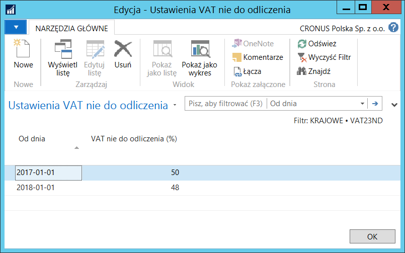
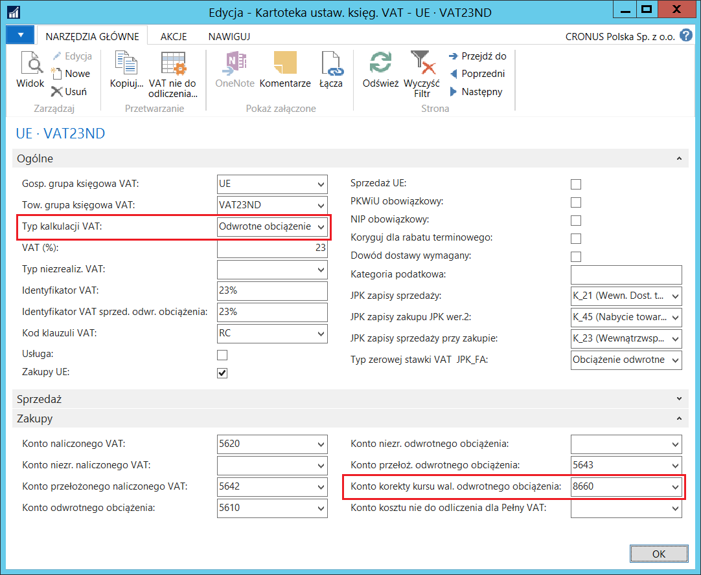
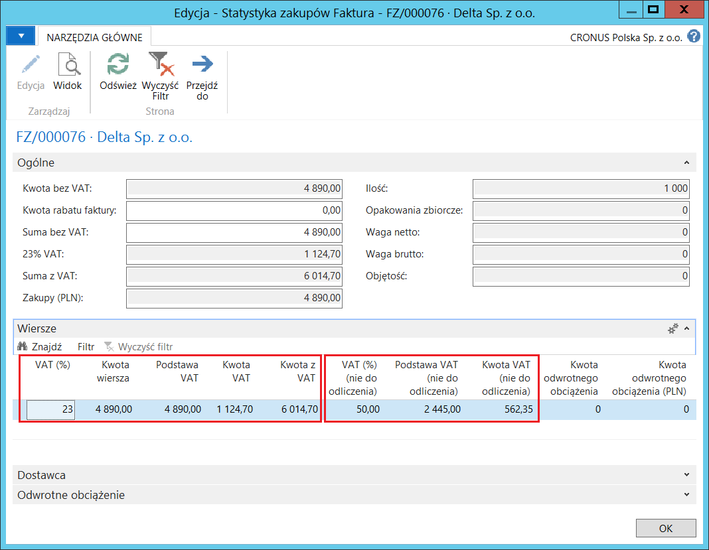
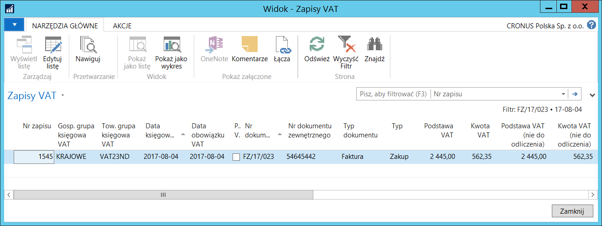
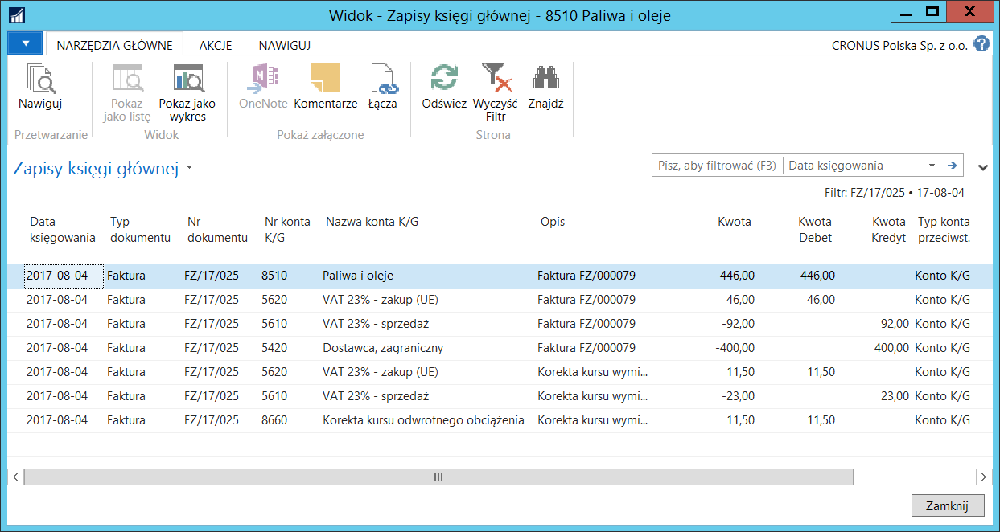
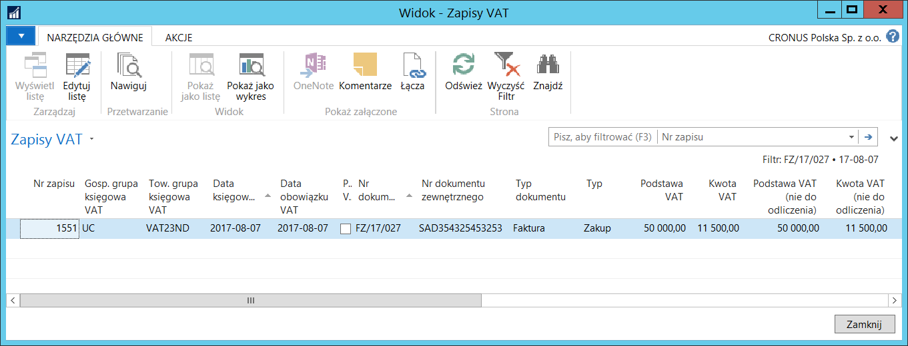

# VAT nie do odliczenia 

## Informacje ogólne

W niektórych przypadkach VAT naliczony nie może być w 100% odliczony,
to znaczy, że tylko część kwoty podatku VAT może być wykazana
w rejestrze VAT, a pozostała część powinna zostać doliczona do kwoty
zakupu i zaksięgowana w koszty. W przypadku zakupu zapasu lub środka
trwałego, nieodliczalna część kwoty podatku VAT jest doliczana
do wartości zakupu zapasu lub środka trwałego i zaksięgowana jako część
kosztu nabycia.

Celem wdrożenia tego elementu Polskiej Lokalizacji systemu Microsoft
Dynamics 365 Business Central on‑premises jest umożliwienie:

    -   Ustawienia częściowego odliczania podatku VAT naliczonego.
    
    -   Księgowania transakcji zakupu z podatkiem naliczonym VAT częściowo
        odliczanym.
    
    -   Zwiększania kosztu nabycia zapasów i środków trwałych
        o nieodliczalną część podatku naliczonego VAT.

## Ustawienia

Żeby system automatycznie wyliczał kwotę podatku VAT, która nie podlega
odliczeniu, muszą by zdefiniowane właściwe ustawienia kalkulacji podatku
VAT. W celu zdefiniowania niezbędnych ustawień, należy postępować
według następujących kroków:

1.  Należy wybrać **Działy \> Zarządzanie Finansami \> Administracja \>
    Ustawienia księgowe VAT.**

2.  W oknie **Ustawienia księgowe VAT**, które się otworzy, należy
    zaznaczyć wiersz z wybraną kombinacją kodów w polach: **Gosp.
    grupa księgowa** **VAT** i **Tow. grupa księgowa VAT**,
    a następnie wybrać **VAT nie do odliczenia**.

3.  W oknie **Ustawienia VAT nie do odliczenia**, które się otworzy,
    należy wypełnić pola:

    -   **Od dnia** – należy wprowadzić datę początkową okresu, w którym
        kwota podatku VAT nie będzie podlegać odliczeniu w części
        wprowadzonej w polu **VAT nie do odliczenia (%)**.
    
    -   **VAT nie do odliczenia (%)** – należy wprowadzić wartość kwoty
        podatku VAT wyrażoną w procentach, jaka nie będzie podlegać
        odliczeniu w okresie rozpoczynającym się datą wprowadzoną w polu
        Od **dnia**.

  

Funkcjonalność VAT nie do odliczenia wymaga dodatkowych ustawień
w transakcjach zakupu, gdzie **Typ kalkulacji VAT** jest **Odwrotne
obciążenie** lub **Pełny VAT**. Aby je zdefiniować, należy postępować
według następujących kroków:

1.  Należy zamknąć okno **Ustawienia VAT nie do odliczenia** wybierając
    **OK**.

2.  W oknie **Ustawienia księgowe VAT** należy zaznaczyć wiersz
    z kombinacją grup dedykowanych do ewidencji zakupu z odwrotnym
    obciążeniem, a następnie należy wybrać **Edycja**.

3.  W oknie **Kartoteka ustaw. księg. VAT** na karcie skróconej
    **Zakupy** należy uzupełnić pole **Konto korekty kurs wal.
    odwrotnego obciążenia**. Konto to będzie używane tylko wtedy,
    gdy w ustawieniach dla wybranej kombinacji grup księgowych VAT
    wybrany jest **Typ kalkulacji VAT** = **Odwrotne obciążenie**.

    Na konto wybrane w tym polu system zaksięguje kwotę VAT naliczonego
    nie do odliczenia, ale tylko w części wynikającej z różnicy pomiędzy
    kursami waluty zastosowanymi do przeliczenia kwoty netto i kwoty VAT.
    Część kwoty VAT naliczonego nie do odliczenia wynikająca
    z przeliczenia kwoty VAT po kursie dla kwoty netto zostanie
    zaksięgowana standardowo, czyli dodana do wartości netto.

4.  W oknie **Ustawienia księgowe VAT** należy zaznaczyć wiersz
    z kombinacją grup dedykowanych do ewidencji zakupu z samym VAT (np.
    dokumentów SAD), a następnie należy wybrać **Edycja**.

5.  W oknie **Kartoteka ustaw. księg. VAT** na karcie skróconej
    **Zakupy** należy uzupełnić pole **Konto kosztu nie do odliczenia
    dla Pełny VAT**. Konto to będzie używane tylko wtedy,
    gdy w ustawieniach dla wybranej kombinacji grup księgowych VAT
    wybrany jest **Typ kalkulacji VAT** = **Pełny VAT**.

    Na konto wybrane w tym polu system zaksięguje kwotę VAT naliczonego
    nie do odliczenia. W tego typu transakcji kwota VAT nie do odliczenia
    nie może być dodana do wartości netto, gdyż w dokumentach z pełnym VAT
    koszt nie jest w ogóle księgowany (tylko VAT i zobowiązanie).

  

  

## Obsługa

Żeby zaksięgować dokument zakupu z podatkiem VAT częściowo odliczalnym,
należy w sposób standardowy wprowadzić zamówienie lub fakturę zakupu,
wykorzystując grupy księgowe VAT, dla kombinacji których zostały
zdefiniowane ustawienia VAT nie do odliczenia. System, bazując
na zdefiniowanych wcześniej ustawieniach, podzieli odpowiednio obliczoną
kwotę podatku VAT i wykaże w oknie **Statystyki dokumentu zakupu**.

> [!NOTE]
> **Uwaga:** Na podstawie **Daty obowiązku VAT** w wierszu
faktury/zamówienia zakupu system ustala, czy kwota VAT z danego
wiersza ma podlegać nieodliczeniu zgodnie z ustawieniami, tzn., czy
mieści się ona w okresie wyznaczonym datami w polu Od **dnia** w oknie
**Ustawienia VAT nie do odliczenia**. W sytuacji, gdy pole **Data
obowiązku VAT** w wierszu faktury/zamówienia nie jest wypełnione
lub data ta wykracza poza okres, o którym mowa powyżej, kwota VAT
zostanie policzona zgodnie z **Ustawieniami księgowymi VAT**, bez
uwzględnienia **Ustawień VAT nie do odliczenia**.

W celu przygotowania i zaksięgowania faktury zakupu z wykorzystaniem tej
funkcjonalności, należy postępować według następujących kroków:

1.  Należy standardowo wprowadzić fakturę zakupu zwracając uwagę,
    aby użyta w niej była właściwa kombinacja kodów w polach **Gosp.
    grupa księgowa** **VAT** i **Tow. grupa księgowa VAT**, a data
    obowiązku VAT przypadała w okresie zaczynającym się od daty
    wprowadzonej w polu Od **dnia** w oknie **Ustawienia VAT
    nie do odliczenia** dla wybranej kombinacji grup księgowych VAT.

2.  W kartotece wprowadzonej faktury zakupu należy wybrać
    **Statystyka.**

3.  W oknie **Statystyka zakupów**, które się otworzy, na karcie
    skróconej **Wiersze** system wyświetla szczegóły obliczonych kwot.

    W polach: **VAT%**, **Kwota wiersza**, **Podstawa VAT**, **Kwota
    VAT**, **Kwota z VAT** pokazane są kwoty ogólne dla całej faktury
    zakupu, obejmują zarówno część kwoty podatku VAT podlegającą
    odliczeniu, jak i nie podlegającą odliczeniu.
    
    W polach: **VAT% (nie do odliczenia)**, **Podstawa VAT (nie
    do odliczenia)**, **Kwota VAT (nie do odliczenia)** pokazane
    są wartości dotyczące kalkulacji podatku VAT w części nie
    do odliczenia.

  

Z kalkulacji wyświetlonej w przykładowym oknie statystyk wynika, że system zaksięguje kwotę zakupu netto w wysokości 5 452,35 zł, kwotę podatku VAT w wysokości 562,35 zł i kwotę brutto w wysokości 6 014,70 zł. Żeby ją sprawdzić, trzeba wykonać kolejne kroki:

1.  Należy w sposób standardowy zaksięgować wprowadzoną fakturę zakupu.
    W oknie z komunikatem o treści *„Fakturę zaksięgowano i przeniesiono
    do okna Zaksięgowana faktura zakupu. Czy chcesz otworzyć
    zaksięgowaną fakturę?"* należy wybrać **Tak**.

2.  W oknie **Zaksięgowana faktura zakupu**, które się otworzy, należy
    wybrać **Nawiguj**.

4.  W oknie **Nawigacja**, które się otworzy, należy zaznaczyć wiersz
    **Zapis K/G** i wybrać **Pokaż powiązane zapisy**.

  

5.  Należy wybrać **Zamknij**, aby zamknąć okno **Zapisy księgi
    głównej**.

6.  W oknie **Nawigacja** należy zaznaczyć wiersz **Zapis VAT** i wybrać
    **Pokaż powiązane zapisy**.

  

Kwota VAT nie do odliczenia przy zakupie z odwrotnym obciążeniem
księgowana jest zwykle standardowo, a wyjątek stanowi sytuacja, w której
kurs wymiany waluty do przeliczenia wartości netto zakupu jest inny
niż kurs wymiany waluty do przeliczenia VAT. W tej sytuacji system
wykorzystuje konto K/G podane w polu **Konto korekty kursu wal.
odwrotnego obciążenia** w oknie **Ustawienia księgowe VAT**
do zaksięgowania nieodliczalnej kwoty VAT w koszty, ale tylko różnicy
wynikającej z zastosowania różnych kursów waluty, o czym mowa powyżej.

***Przykład:***

Zakup o wartości 100 EUR.

VAT 23% (odwrotne obciążenie) nieodliczalny w 50%

**Wartość netto** 100 EUR \* kurs wymiany waluty 4,00 = **400 PLN**

**VAT należny** 23% \* wartość netto 100 EUR = **23 EUR** \* kurs
wymiany waluty 4,00 = **92 PLN**

**VAT naliczony** 50% \* (23% \* wartość netto 100 EUR = **23 EUR**) \*
kurs wymiany waluty 4,00 = **46 PLN**

**Kwota kosztu** = wartość netto PLN + nieodliczalna część wartości VAT
naliczonego = **446 PLN**

Przeliczenie VAT po innym kursie wymiany waluty (1 EUR = 5
PLN)

**Różnica w kwocie VAT należnego** = (23 EUR \* 5,00) – (23 EUR \*
4,00) = **23 PLN**

**Różnica w kwocie VAT naliczonego nie do odliczenia** = 50% \* ((23 EUR
\* 5,00) – (23 EUR \* 4,00)) = **11,50 PLN**

**Różnica w kwocie VAT naliczonego do odliczenia =** ((23 EUR \* 5,00)
– (23 EUR \* 4,00)) – VAT naliczony nie do odliczenia = **11,50 PLN**

  

  

Kwota VAT nie do odliczenia przy ewidencji samego podatku VAT (np.
z dokumentu PZC) jest księgowana na konto kosztowe wybrane
w ustawieniach. W tego typu transakcji kwota VAT nie do odliczenia nie
może być dodana do wartości netto, gdyż w dokumentach z pełnym VAT koszt
nie jest w ogóle księgowany (tylko VAT i zobowiązanie).

W celu przygotowania i zaksięgowania faktury zakupu tylko z VAT,
którego częściowo nie można odliczyć, należy postępować
według następujących kroków:

1.  Fakturę zakupu należy wprowadzić w sposób typowy dla ewidencji
    dokumentów z pełnym VAT, zwracając uwagę, aby użyta w niej była
    właściwa kombinacja kodów w polach **Gosp. grupa księgowa** **VAT**
    i **Tow. grupa księgowa VAT**, a data obowiązku VAT przypadała
    w okresie zaczynającym się od daty wprowadzonej w polu Od **dnia**
    w oknie **Ustawienia VAT nie do odliczenia** dla wybranej kombinacji
    grup księgowych VAT.

>[!NOTE]
>**Uwaga:** Księgowanie dokumentów tylko z VAT opisane jest w rozdziale
**2.7. Księgowanie pełnego VAT**.

2.  W kartotece wprowadzonej faktury zakupu należy wybrać
    **Statystyka.**

  

3.  Należy w sposób standardowy zaksięgować wprowadzoną fakturę zakupu.
    W oknie z komunikatem o treści *„Fakturę zaksięgowano
    i przeniesiono do okna Zaksięgowana faktura zakupu. Czy chcesz
    otworzyć zaksięgowaną fakturę?"* należy wybrać **Tak**.

4.  W oknie **Zaksięgowana faktura zakupu**, które się otworzy, należy
    wybrać **Nawiguj**.

5.  W oknie **Nawigacja**, które się otworzy, należy zaznaczyć wiersz
    **Zapis K/G** i wybrać **Pokaż powiązane zapisy**. Można zauważyć,
    że kwota VAT w części nie do odliczenia została zaksięgowana
    na konto kosztowe, które zostało wybrane w polu **Konto kosztu nie
    do odliczenia dla Pełny VAT** w **Ustawieniach księgowych VAT**
    dla kombinacji grup księgowych VAT użytych w tej fakturze zakupu:

  

6.  Należy wybrać **Zamknij**, aby zamknąć okno **Zapisy księgi
    głównej**.

7.  W oknie **Nawigacja** należy zaznaczyć wiersz **Zapis VAT** i wybrać
    **Pokaż powiązane zapisy**.

  