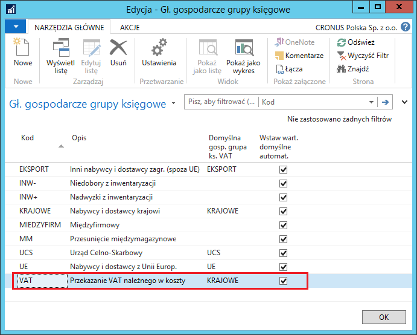
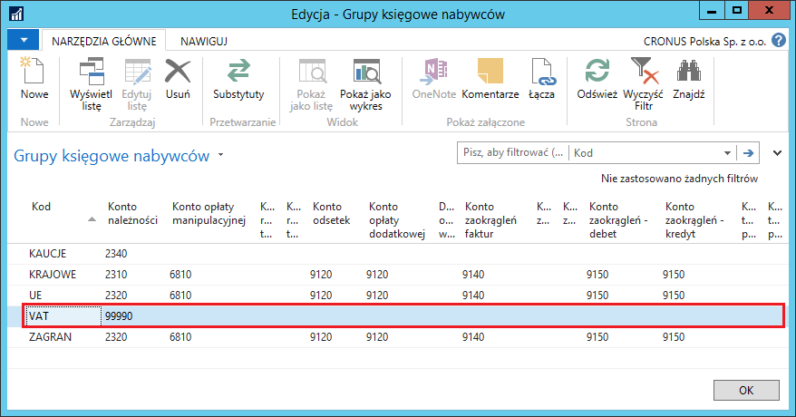
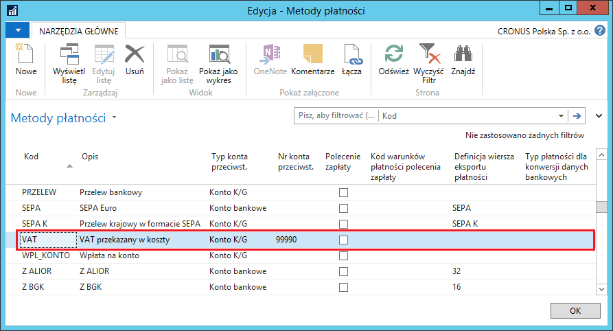
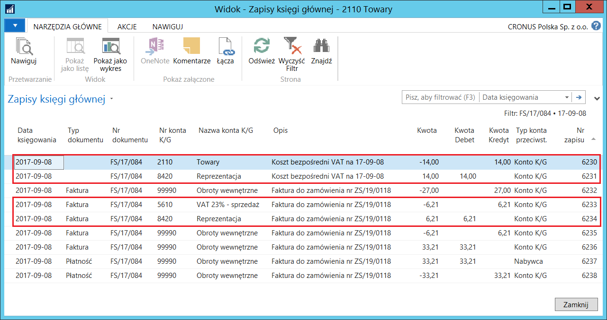
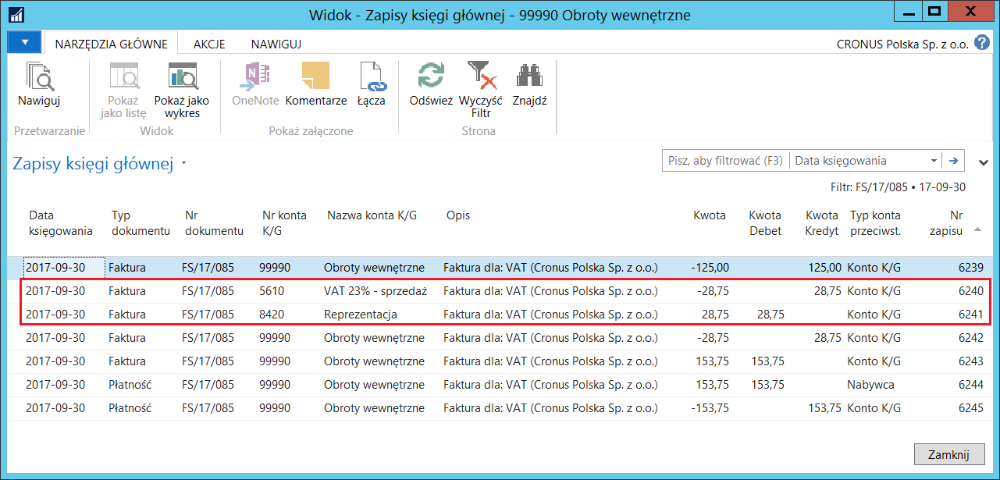

# Zamówienia i faktury wewnętrzne sprzedaży 

## Informacje ogólne

Zgodnie z polskim prawem w przypadku nieodpłatnego przekazania towarów
i usług, w pewnych przypadkach, transakcję taką należy potraktować
z punktu widzenia podatku VAT jako sprzedaż i naliczyć VAT należny. Tak
naliczona kwota podatku VAT jest traktowana jako koszt. Polska
Lokalizacja została wyposażona w narzędzie upraszczające proces
dodatkowej ewidencji podatku VAT dla tego rodzaju transakcji

## Ustawienia

Żeby móc tworzyć i księgować wewnętrzne zamówienia i faktury sprzedaży,
konieczne jest zdefiniowanie kartoteki nabywcy wewnętrznego z właściwymi
parametrami. W tym celu, należy postępować według następujących kroków:

1.  Należy wybrać **Działy \> Zarządzanie Finansami \> Administracja \>
    Gł. gospodarcze grupy księgowe**.

2.  W oknie **Gł. gospodarcze grupy księgowe**, które się otworzy,
    należy zdefiniować kod nowej grupy, która będzie wykorzystana
    do dokonania technicznych księgowań wewnętrznych faktur sprzedaży.

  

3.  W tym samym oknie należy zaznaczyć wiersz z nową grupą i wybrać
    **Ustawienia**.

4.  W oknie **Główne ustawienia księgowania**, które się otworzy, należy
    wybrać **Nowe** (czynność z tego i następnego kroku należy
    powtórzyć dla każdej wybranej kombinacji kodów **Głównej
    gospodarczej grupy księgowej** i **Głównej towarowej grupy
    księgowej**).

5.  W oknie **Kartoteka gł. ustawień księg.**, które się otworzy, należy
    zdefiniować właściwe ustawienia, wprowadzając to samo konto
    pozabilansowe K/G przeznaczone do technicznych księgowań w polach
    umieszczonych na karcie skróconej **Sprzedaż**: **Konto
    sprzedaży**, **Konto faktury kor. sprzedaży**, **Konto rabatu
    wiersza sprzedaży**, **Konto rabatu faktury sprzedaży**. Na karcie
    skróconej **Zapasy** należy uzupełnić pole **Konto KWS**
    wybierając w nim konto K/G przeznaczone do zaksięgowania w koszty
    wartości towaru wydanego bezpłatnie.

  

6.  Należy wybrać **Działy \> Zarządzanie Finansami \> Administracja \>
     Grupy księgowe nabywców**.

7.  W oknie **Grupy księgowe nabywców**, które się otworzy, w pierwszym
     wolnym wierszu należy wprowadzić unikalny kod grupy księgowej
     nabywców przeznaczonej do księgowań technicznych i w polu **Konto
     należności** wybrać to samo konto pozabilansowe K/G przeznaczone
     do technicznych księgowań, które zostało użyte w oknie **Główne
     ustawienia księgowania**:

  

8.  Należy wybrać **Działy \> Zarządzanie Finansami \> Administracja \>
     Metody płatności**.

9.  W oknie **Metody płatności**, które się otworzy, w pierwszym wolnym
     wierszu należy wprowadzić unikalny kod i opis metody płatności
     przeznaczonej do rozliczenia księgowań technicznych, w polu **Typ
     konta przeciwst.** należy wybrać **Konto K/G**, a w polu **Nr
     konta przeciwst.** wybrać to samo konto pozabilansowe K/G
     przeznaczone do technicznych księgowań, które zostało użyte
     we wcześniej zdefiniowanych ustawieniach.

  

10. Należy zdefiniować kartotekę nabywcy technicznego do księgowania
     faktur wewnętrznych sprzedaży. W tym celu należy w sposób
     standardowy założyć nową kartotekę nabywcy, wprowadzając
     specyficzne parametry: zalecane jest, żeby nazwa, dane adresowe
     i NIP nabywcy technicznego były identyczne z danymi firmy,
     lecz nie jest to wymóg obligatoryjny. Niżej wymienione pola należy
     wypełnić zgodnie z opisem:

    -   Na karcie skróconej **Fakturowanie**:
    
    
        -   **Gł. gosp. grupa księgowa** – z listy rozwijanej w tym polu należy
            wybrać kod wcześniej zdefiniowanej grupy.
        
        -   **Gosp. grupa księgowa VAT** – z listy rozwijanej w tym polu należy
            wybrać kod grupy, której ustawienia będą obowiązywały w kalkulacji
            podatku VAT należnego do przekazania w koszty.
        
        -   **Grupa księgowa nabywcy** – z listy rozwijanej w tym polu należy
            wybrać kod wcześniej zdefiniowanej grupy.
        
    -   Na karcie skróconej **Płatności**:
        
        -   **Kod metody płatności** – z listy rozwijanej w tym polu należy
            wybrać kod wcześniej zdefiniowanej metody.
    
  

11. Należy zdefiniować kody dla podatku VAT przekazywanego w koszty,
    wraz z przypisanymi do nich właściwymi kontami K/G. W tym celu
    należy wybrać **Działy \> Zarządzanie Finansami \>
    Administracja \> Kody VAT'u przekazanego**.

12. W oknie **Kody VAT'u przekazanego**, które się otworzy, w pierwszym
    wolnym wierszu należy wprowadzić ustawienia:

    -   **Kod –** w tym polu należy wprowadzić unikalny kod dla danego typu
        podatku VAT do przekazania w koszty
    
    -   **Opis –** w tym polu należy wprowadzić opis danego typu podatku
        VAT do przekazania w koszty
    
    -   **Konto kosztu VAT** – z listy rozwijanej w tym polu należy wybrać
        konto K/G kosztowe, na którym ma być zaksięgowana kwota podatku
        VAT
    
    -   **Konto rozliczenia VAT** – z listy rozwijanej w tym polu należy
        wybrać to samo konto pozabilansowe K/G przeznaczone
        do technicznych księgowań, które zostało użyte we wcześniej
        zdefiniowanych ustawieniach.

  

## Obsługa

W celu obliczenia i zaksięgowania podatku VAT należnego od wartości
bezpłatnie przekazanych towarów lub produktów, należy postępować
według następujących kroków:

1.  Należy otworzyć nową kartotekę zamówienia sprzedaży i z listy
    rozwijanej w polu **Nr nabywcy (sprzedaż)** należy wybrać
    wcześniej zdefiniowanego nabywcę technicznego lub nabywcę, któremu
    przekazywany jest towar – w tym drugim przypadku konieczne jest
    wybranie nabywcy technicznego w polu **Nr odbiorcy faktury**
    na karcie skróconej **Fakturowanie**. System automatycznie
    uzupełnił część pól w nagłówku faktury sprzedaży na podstawie
    danych przypisanych domyślnie do kartoteki wybranego nabywcy
    (odbiorcy faktury), m.in. nazwa i adres nabywcy, **Gł. gosp. grupa
    księgowa**, **Gosp. grupa księgowa VAT**, **Grupa księgowa
    nabywcy**, **Kod metody płatności**.

    Konieczne jest wybranie właściwego, wcześniej zdefiniowanego typu
    podatku VAT do przekazania z listy rozwijanej w polu **Kod VAT'u
    przekazanego**.

  

2.  Na karcie skróconej **Wiersze**, w polu **Typ** należy wybrać
    **Zapas**, a w polu **Nr** należy wybrać zapas, który zostanie
    przekazany bezpłatnie. Pola: **Ilość i Kod lokalizacji** należy
    wypełnić standardowo. W polu **Cena jednostkowa bez VAT** należy
    wprowadzić cenę sprzedaży, na podstawie której zostanie ustalona
    kwota stanowiąca podstawę do obliczenia podatku VAT należnego
    do przekazania w koszty.

  

3.  Pozostałe dane w zamówieniu sprzedaży należy wprowadzić standardowo
    i zaksięgować wydanie i fakturę sprzedaży.

W wyniku zaksięgowania faktury sprzedaży z zamówienia wewnętrznego
powstaną zapisy księgi głównej, zgodne z ustawieniami. Kwota podatku VAT
zostanie zaksięgowana na kontach K/G: podatku VAT należnego i kosztowym,
wartość wydanego towaru zostanie zaksięgowana na kontach K/G:
magazynowym i kosztowym, a pozostałe kwoty netto i brutto, będące
wynikiem technicznych automatycznych księgowań, zostaną zaksięgowane
na pozabilansowym koncie technicznym K/G użytym w ustawieniach.

Efekty zaksięgowania wewnętrznej faktury sprzedaży można zobaczyć
postępując według kroków:

1.  Należy otworzyć kartotekę zaksięgowanej faktury sprzedaży i wybrać
    akcję **Nawiguj**.

2.  W oknie **Nawigacja**, które się otworzy, należy zaznaczyć tabelę
    **Zapis K/G i **wybrać akcję **Pokaż powiązane zapisy**.

  

W celu wystawienia wewnętrznej faktury sprzedaży do zakupów kosztowych
związanych z reklamą i reprezentacją, należy postępować
według następujących kroków:

1.  Należy otworzyć nową kartotekę faktury sprzedaży i z listy
    rozwijanej w polu **Nr nabywcy (sprzedaż)** należy wybrać
    wcześniej zdefiniowanego nabywcę technicznego. System
    automatycznie uzupełnił część pól w nagłówku faktury sprzedaży
    na podstawie danych przypisanych domyślnie do kartoteki wybranego
    nabywcy, m.in. nazwa i adres nabywcy, **Gł. gosp. grupa
    księgowa**, **Gosp. grupa księgowa VAT**, **Grupa księgowa
    nabywcy**, **Kod metody płatności**.

    Konieczne jest wybranie właściwego, wcześniej zdefiniowanego typu
    podatku VAT do przekazania z listy rozwijanej w polu **Kod VAT'u
    przekazanego**.

  

2.  Na karcie skróconej **Wiersze**, w polu **Typ** należy wybrać
    **Konto K/G**, a w polu **Nr** należy wybrać to samo konto
    pozabilansowe K/G przeznaczone do technicznych księgowań,
    które zostało użyte we wcześniej zdefiniowanych ustawieniach. W polu
    **Ilość** należy wprowadzić cyfrę **1**, a w polu **Cena jednostkowa
    bez VAT** należy wprowadzić kwotę stanowiąca podstawę do obliczenia
    podatku VAT należnego do przekazania w koszty.

  

3.  Pozostałe dane w fakturze sprzedaży należy wprowadzić standardowo
    i ją zaksięgować.

W wyniku zaksięgowania wewnętrznej faktury sprzedaży powstaną zapisy
księgi głównej, zgodne z ustawieniami. Kwota podatku VAT zostanie
zaksięgowana na kontach K/G: podatku VAT należnego i konto kosztowe,
a pozostałe kwoty netto i brutto, będące wynikiem technicznych
automatycznych księgowań, zostaną zaksięgowane na pozabilansowym koncie
technicznym K/G użytym w ustawieniach.

Efekty zaksięgowania wewnętrznej faktury sprzedaży można zobaczyć
postępując według kroków:

1.  Należy otworzyć kartotekę zaksięgowanej faktury sprzedaży i wybrać
     **Nawiguj**.

2.  W oknie **Nawigacja**, które się otworzy, należy zaznaczyć tabelę
     **Zapis K/G** i wybrać **Pokaż**.

  

> [!NOTE]
> Proces przekazania podatku VAT w koszty może być
obsługiwany w dokumentach: **Faktura sprzedaży**, **Zamówienie
sprzedaży**, **Faktura korygująca sprzedaży**, **Zamówienie zwrotu
sprzedaży**.