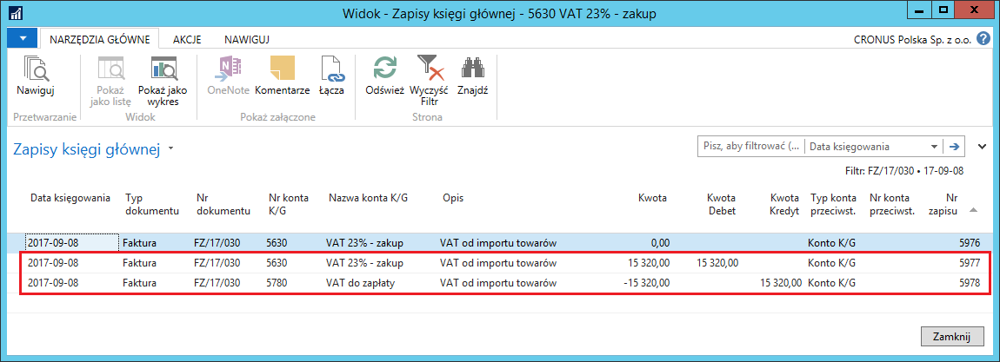
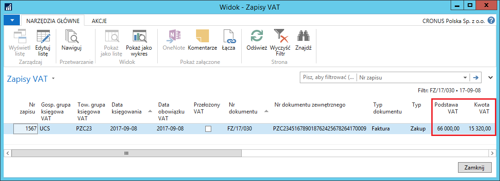

# Księgowanie pełnego VAT 

## Informacje ogólne

Zgodnie z wymogami polskiego prawa, dla wszystkich transakcji
w rejestrze VAT powinna być widoczna kwota netto. Aby spełnić ten wymóg,
Polska Lokalizacja umożliwia ręczne wprowadzanie kwoty podstawy VAT
dla księgowań obejmujących wyłącznie kwotę podatku VAT.

Ta funkcjonalność ma szczególne znaczenie dla ewidencji zakupów spoza
UE. W takich transakcjach muszą być zaksięgowane 2 dokumenty:

-   Faktura zakupu, aby ująć wartość netto zakupów i zobowiązanie
    na podstawie faktury od dostawcy

-   Dokument PZC (Poświadczone Zgłoszenie Celne), aby ująć podatek VAT
    i inne dodatkowe koszty celne obciążające dostawę spoza terytorium
    UE.

Ponieważ wartość netto stanowiąca podstawę kalkulacji podatku VAT jest
zaksięgowana na podstawie faktury zakupu, nie może być zaksięgowana
ponownie na podstawie dokumentu PZC przy okazji księgowania podatku
VAT. Dlatego podczas księgowania dokumentu PZC, podstawa kalkulacji
podatku VAT podawana jest wyłącznie informacyjnie, co zapewnia
poprawność wydruku transakcji zakupu w rejestrze VAT.

## Ustawienia

Żeby księgowanie wyłącznie podatku VAT na podstawie dokumentu zakupu
było możliwe, należy zdefiniować właściwe ustawienia. W tym celu należy
postępować według następujących kroków:

1.  Należy wybrać: **Działy \> Zarządzanie Finansami \> Administracja \>
    Ustawienia Księgowe VAT**

2.  W oknie **Ustawienia Księgowe VAT**, które się otworzy, należy
    zaznaczyć wiersz z właściwą kombinacją **Gospodarczej grupy
    księgowej VAT** (właściwej dla Urzędu Celno-Skarbowego lub Agencji
    Celnej – dostawcy PZC, wobec którego podmiot jest zobowiązany
    do uiszczenia zobowiązania z tytułu VAT i innych kosztów związanych
    z odprawą celną) oraz **Towarowej grupy księgowej VAT** (właściwej
    dla stawki podatku VAT w transakcji zakupu, zdefiniowanej specjalnie
    na potrzeby dokumentów PZC), a następnie wybrać akcję **Edycja**.

3.  W oknie **Kartoteka ustaw. Księg. VAT** wybranej kombinacji grup
    VAT, które się otworzy, należy zwrócić uwagę na 2 pola:

    -  W polu **Typ kalkulacji VAT** musi być wybrana opcja **Pełny VAT**
    
    -  Konto KG wybrane w polu **Konto naliczonego VAT** musi mieć
        domyślnie przypisaną towarową grupę księgową VAT zgodną z tą,
        która użyta jest w definiowanych właśnie ustawieniach.

  

## Obsługa

Dokument PZC wprowadzany jest analogicznie, jak zwykła faktura zakupu.
W celu jego zaewidencjonowania należy postępować według następujących
kroków:

1.  Należy wybrać **Działy \> Zarządzanie Finansami \> Zobowiązania \>
    Faktury zakupu**

2.  Należy wybrać **Nowe.**

3.  Z listy rozwijanej w polu **Nr dostawcy (zakup)** należy wybrać
    kartotekę urzędu celno-skarbowego.

4.  Wiersz należy wypełnić w sposób następujący:

    - W polu **Typ** należy wybrać **Konto K/G**
    
    - W polu **Nr** należy wybrać konto KG, które zostało wybrane jako
        konto VAT-u naliczonego w ustawieniach księgowania VAT
    
    - W polu **Ilość** należy wprowadzić cyfrę 1
    
    - W polu **Bezpośr. koszt jedn. bez VAT** należy wprowadzić kwotę
        podatku VAT wykazaną na dokumencie PZC
    
    - W polu **Kwota podstawy VAT** należy wprowadzić kwotę stanowiąca
        podstawę do obliczenia podatku VAT, wykazaną na dokumencie PZC

5.  Pozostałe wymagane pola należy uzupełnić w sposób standardowy.

  

6.  Dokument należy zaksięgować wybierając **Księguj**.

Zaksięgowanie dokumentu powoduje zarejestrowanie w księgach firmowych
kwoty podatku VAT na wskazanym koncie VAT-u naliczonego
oraz zobowiązania wobec urzędu celno-skarbowego w tej samej wysokości,
na koncie zobowiązań zgodnym z ustawieniami grupy księgowej dostawcy
przypisanej do dokumentu. Ręcznie wprowadzona kwota podstawy VAT
kopiowana jest do zapisów VAT powiązanych z zaksięgowaną fakturą zakupu
(dokumentem PZC) i drukowana w rejestrze VAT zakupu.

  

  

  