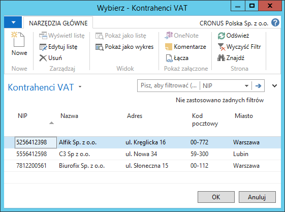
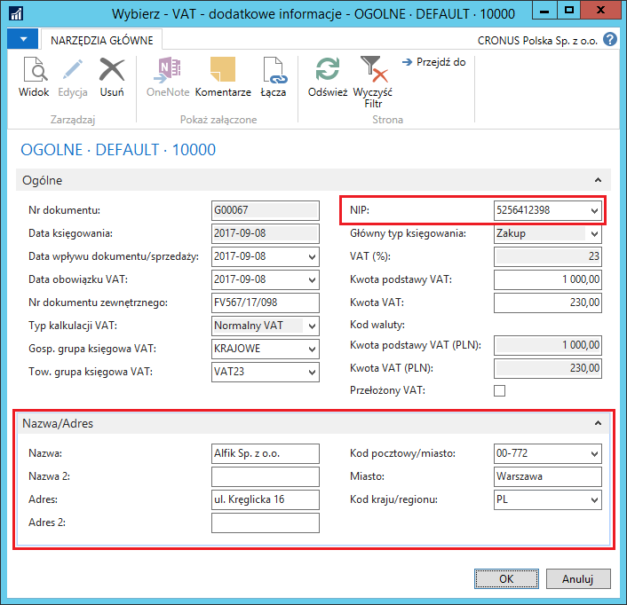
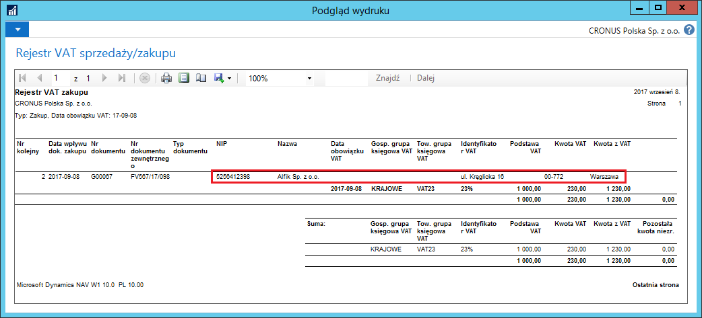

# Księgowanie dokumentów z VAT w dziennikach głównych 

## Informacje ogólne

W związku z wymaganiami przepisów polskiego prawa, istnieje obowiązek
umieszczania danych kontrahentów w rejestrze VAT zakupu i sprzedaży.
W przypadku ewidencji faktur zakupu od dostawców jednorazowych można
uniknąć konieczności zakładania dla nich kartotek rozrachunkowych.
Polska Lokalizacja umożliwia to dzięki rozszerzeniu funkcji dzienników
głównych w zakresie księgowania transakcji z podatkiem VAT poprzez
dodanie możliwości podania danych kontrahenta.

## Obsługa

W celu zarejestrowania dokumentu z podatkiem VAT przez dzienniki główne,
należy postępować według następujących kroków:

1.  Należy wybrać **Działy \> Zarządzanie Finansami \> Księga główna \>
    Dzienniki główne.**

2.  Jeśli są zdefiniowane szablony dzienników głównych, należy wybrać
    jeden z nich i w oknie **Dziennik główny**, które się otworzy,
    należy w sposób standardowy wprowadzić dane z księgowanego
    dokumentu, pamiętając o właściwym wypełnieniu pól:

    -   **Główny typ księgowania**
    
    -   **Gł. gosp. grupa księgowa**
    
    -   **Gł. tow. grupa księgowa**
    
    -   **Gosp. grupa księgowa VAT**
    
    -   **Tow. grupa księgowa VAT.**
    
3.  W polu **Kwota VAT** należy kliknąć przycisk asysty.

4.  W oknie **VAT -- dodatkowe informacje**, na karcie skróconej
    **Ogólne** należy uzupełnić ważne pola, m.in.:

    -   **Data wpływu dokumentu/sprzedaży**
    
    -   **Data obowiązku VAT**
    
    -   **Nr dokumentu zewnętrznego**

5.  W tym samym oknie, w tej samej karcie skróconej, w polu **NIP**
    należy rozwinąć listę. Lista ta zawiera dane kontrahentów,
    które mogą zostać użyte do wyświetlenia w rejestrze VAT, bez
    konieczności zakładania dla nich kartoteki rozrachunkowej.

Jeśli konieczne jest dodanie nowego kontrahenta VAT do listy, należy
wybrać **Nowe** i w oknie **kontrahenci VAT**, które się otworzy,
wprowadzić niezbędne dane.

  

6.  Wybranie kontrahenta z listy rozwijanej w polu **NIP** powoduje
    automatyczne uzupełnienie pól z nazwą i danymi adresowymi
    kontrahenta na karcie skróconej **Nazwa/Adres** w oknie **VAT --
    dodatkowe informacje.**

7.  W oknie **VAT -- dodatkowe informacje**, na karcie skróconej
    **Nazwa/Adres** należy uzupełnić pole **Kod kraju/regionu**,
    zgodnie z miejscem transakcji.

  

8.  Zaksięgowanie dokumentu z danymi kontrahenta VAT wprowadzonymi
    w oknie **VAT -- dodatkowe informacje** ma odzwierciedlenie
    w raporcie **Rejestr VAT sprzedaży/zakupu**.

  

>[!NOTE]
>Ta funkcjonalność dostępna jest również w dziennikach
zleceń.

