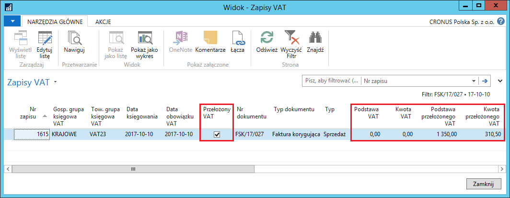
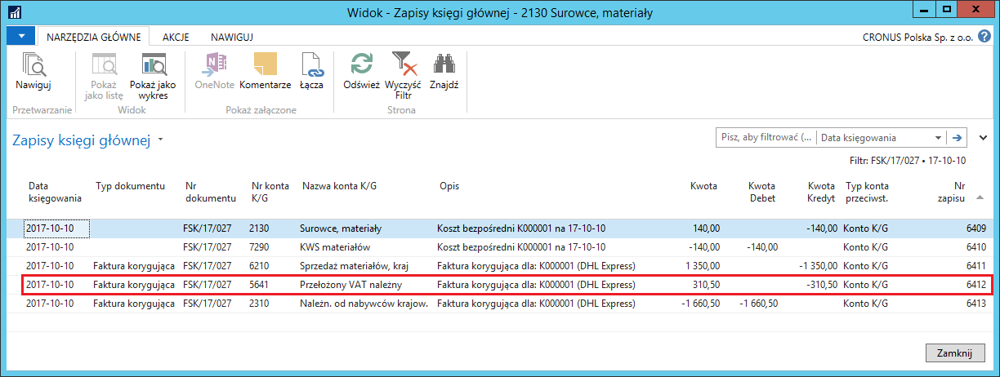
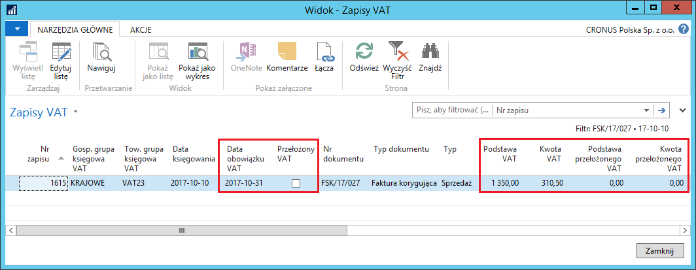

# Przełożony VAT (oznaczanie podpisanych faktur korygujących sprzedaży) 

**Przełożony VAT** to funkcjonalność wykorzystywana, gdy kwota podatku
VAT musi zostać zawieszona, ze względu na brak możliwości jej
rozliczenia w danym momencie.

**Przełożony VAT** ma szczególne znaczenie w obsłudze faktur
korygujących sprzedaży. Zgodnie z przepisami polskiego prawa, podatek
VAT z tytułu faktury korygującej sprzedaży może być obniżony dopiero
po otrzymaniu potwierdzenia, iż odbiorca otrzymał fakturę korygującą
sprzedaży. Stąd wynika potrzeba przełożenia zmniejszenia kwoty podatku
VAT na okres pomiędzy wystawieniem faktury korygującej sprzedaży
a otrzymaniem potwierdzenia.

Funkcjonalność **Przełożonego VAT** zostanie opisana na przykładzie
faktur korygujących sprzedaży, ale może być wykorzystana w następujących
dokumentach: **Zamówienie zakupu, Faktura zakupu, Zamówienie zwrotu
zakupu, Faktura korygująca zakupu, Zamówienie sprzedaży, Faktura
sprzedaży, Zamówienie zwrotu sprzedaży, Faktura korygująca sprzedaży.**
Pole **Przełożony VAT** można też edytować w wierszach dzienników
głównych oraz w oknie **VAT-dodatkowe informacje**. Po zaksięgowaniu
transakcji z VAT, informacja o przełożonym podatku VAT zapisywana jest
w zaksięgowanych dokumentach: **Zaksięgowana faktura zakupu,
Zaksięgowana faktura korygująca zakupu, Zaksięgowana faktura sprzedaży,
Zaksięgowana faktura korygująca sprzedaży**. **Przełożony VAT**
zapamiętany jest również w tabelach: **Zapis VAT** oraz **Szczegółowy
zapis VAT.**

>[!NOTE]
>Pole **Przełożony VAT** może być automatycznie zaznaczane
w dokumentach **Faktura korygująca sprzedaży i Zamówienie zwrotu
sprzedaż**, jeśli pole **Potwierdzenie faktury korygującej** w oknie
**Ustawienia sprzedaży i należn.** jest zaznaczone, w przeciwnym
wypadku, pole **Przełożony VAT**, w razie potrzeby, musi być
zaznaczane ręcznie w ww. dokumentach.
>
>W pozostałych dokumentach pole **Przełożony VAT** musi być zawsze
zaznaczane ręcznie, jeśli użycie przełożonego VAT jest wymagane.

Warunkiem do rozpoczęcia korzystania z funkcjonalności **Przełożony
VAT** jest zdefiniowanie właściwych ustawień, opisanych na początku tego
rozdziału.

W celu wystawienia faktury korygującej sprzedaży, należy postępować
według następujących kroków:

1.  Należy wybrać **Działy \> Zarządzanie Finansami \> Należności \>
     Faktury korygujące sprzedaży.**

2.  W oknie, które się otworzy, należy wybrać **Nowe** i standardowo
     wprowadzić dane faktury korygującej sprzedaży.

3.  Na karcie skróconej **Ogólne**, należy zwrócić uwagę na pole
     **Przełożony VAT** – powinno przyjąć wartość zgodną z wcześniej
     zdefiniowanymi ustawieniami.

4.  Na karcie skróconej **Wiersze**, należy zwrócić uwagę,
     że **Przełożony VAT** – przyjęło wartość taką samą, jak w polu
     **Przełożony VAT** na karcie skróconej **Ogólne**.

    
    
>[!NOTE]  
>Jeśli podatek VAT z faktury korygującej sprzedaży powinien
być zaksięgowany i rozliczony jak zwykły (nie przełożony), należy
zdjąć znacznik z pola **Przełożony VAT** na karcie skróconej
**Ogólne** – system zaktualizuje tę informację we wszystkich
wierszach dokumentu.
    
5.  Należy zaksięgować fakturę korygującą sprzedaży.

6.  Należy sprawdzić pole **Przełożony** **VAT** w zaksięgowanej
     fakturze korygującej sprzedaży. W tym celu należy wybrać
     **Działy \> Zarządzanie Finansami \> Archiwum \> Zaks. faktury
     koryg. sprzed.**.

7.  Wybraną zaksięgowaną fakturę korygującą sprzedaży należy wyświetlić
     w formie kartoteki:

    

8.  Można też sprawdzić, jak przełożony VAT został zapisany w oknie
    **Zapisy VAT**. W tym celu, w zaksięgowanej fakturze zakupu należy
    wybrać **Nawiguj**, następnie należy zaznaczyć wiersz **Zapis VAT**
    i wybrać **Pokaż powiązane zapisy**:
    
    

9.  Na uwagę zasługują też zapisy utworzone w oknie **Zapisy księgi
    głównej**. Kwota przełożonego należnego podatku VAT została
    zaksięgowana na inne konto KG niż zwykły należny podatek VAT
    (zgodnie z wcześniej zdefiniowanymi ustawieniami). W celu
    sprawdzenia zapisów księgi głównej, w zaksięgowanej fakturze zakupu
    należy wybrać **Nawiguj**, następnie należy zaznaczyć wiersz **Zapis
    K/G** i wybrać **Pokaż powiązane zapisy**:

    

Po otrzymaniu od odbiorcy potwierdzenia faktury korygującej sprzedaży,
należy postępować według następujących kroków:

1.  Należy wybrać **Działy \> Zarządzanie Finansami \> Archiwum \> Zaks.
    faktury koryg. sprzed.**

2.  Wybraną zaksięgowaną fakturę korygującą sprzedaży należy wyświetlić
    w formie kartoteki i wybrać **Księguj lub skoryguj przełożony VAT**.

3.  W oknie **Księguj lub skoryguj przełożony VAT** należy uzupełnić
    pola:

-   **Nowa data obowiązku VAT** – w polu należy wpisać datę, z jaką
     **ma** być rozliczony podatek VAT z podpisanej faktury korygującej
     sprzedaży.

-   **Korekta** – pole należy pozostawić puste.

4.  Należy wybrać **OK** w celu wykonania skryptu.

    

5.  Efekty czynności wykonanej w poprzednim punkcie można zobaczyć:

    -   W kartotece zaksięgowanej faktury korygującej sprzedaży:
    
    
    
    -   W oknie **Zapisy VAT**:
    
    

    -   W oknie **Szczegółowe zapisy VAT**:
    
    
    
    -   W oknie **Zapisy księgi głównej:**

    

W sytuacji, gdy przełożony podatek VAT z faktury korygującej sprzedaży
został zrealizowany przez pomyłkę, można ten proces odwrócić, postępując
według kroków:

1.  W kartotece zaksięgowanej faktury korygującej sprzedaży, z której
    przez pomyłkę został zrealizowany przełożony VAT, należy wybrać
    **Księguj lub koryguj przełożony VAT**.

2.  W oknie **Księguj lub koryguj przełożony VAT** należy uzupełnić
    pola:

    -   **Nowa data obowiązku VAT** – w polu należy wpisać datę, z jaką
         przełożony podatek VAT został pomyłkowo zrealizowany (jest to data
         aktualnie wyświetlona w polu **Data obowiązku VAT** na karcie
         skróconej **Ogólne** w zaksięgowanej fakturze korygującej
         sprzedaży).
    
    -   **Korekta** – pole należy zaznaczyć.

    

3.  Należy wybrać **OK** w celu wykonania skryptu.

Rezultatem powyższego księgowania będzie odwrócenie realizacji
przełożonego VAT z tą samą datą księgowania, z jaką zostało dokonane
pomyłkowe księgowanie. Dzięki temu, raporty nie będą wykazywały
rozbieżności w danych. Teraz zaksięgowana faktura korygująca sprzedaży
ponownie została oznaczona jako **Przełożony VAT i **będzie można
ponownie uruchomić skrypt do realizacji przełożonego VAT:  
    

>[!NOTE]
>Pole **Przełożony VAT** musi mieć taką samą wartość
(zaznaczenie) w nagłówku oraz wszystkich wierszach faktury korygującej
sprzedaży oraz zamówienia zwrotu sprzedaży. W pozostałych dokumentach,
w których pole **Przełożony VAT** jest obsługiwane, jego zaznaczenie
może być różne w nagłówku i wierszach (na wzór wartości pola **Data
obowiązku VAT**).

Sposób, w jaki należy realizować przełożony VAT z dokumentów innych
niż zaksięgowana faktura korygująca sprzedaży, opisany jest
w rozdziale **Arkusz rozliczania VAT.**

