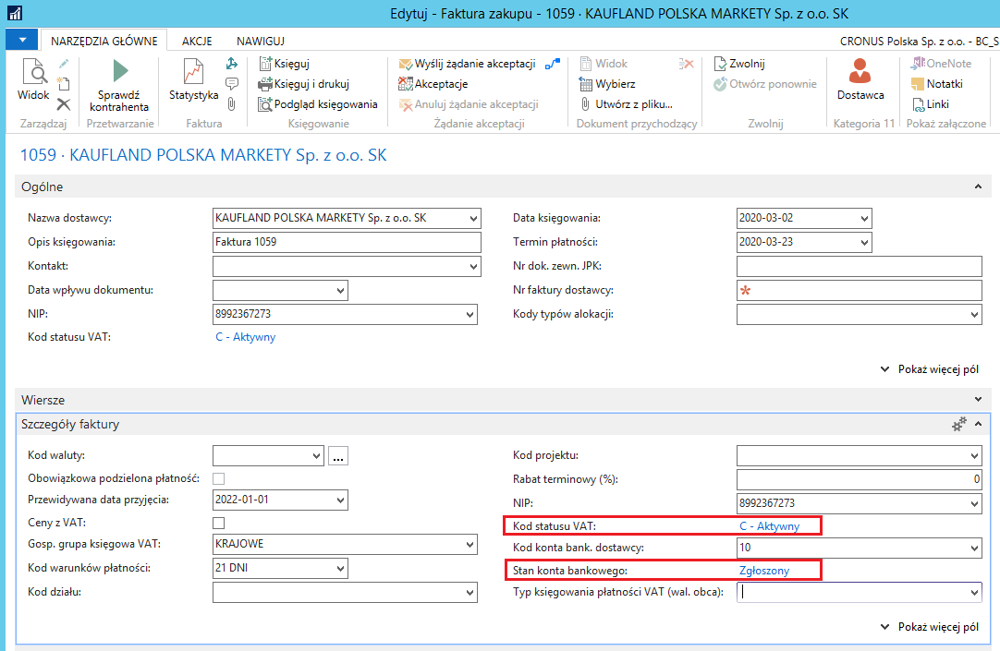

# Dokumenty zakupu

## Informacje ogólne

W niezaksięgowanych dokumentach zakupu (fakturach i zamówieniach)
funkcja sprawdzająca status podatnika VAT, opisana w rozdziale *2.16.
Sprawdzenie statusu podmiotu w VAT*, rozbudowana jest o mechanizm
weryfikujący rachunki bankowe przypisane do kartoteki dostawcy.

>[!NOTE]
>Opis sprawdzania kontrahenta zamieszczony w tym rozdziale
bazuje na przykładzie faktury zakupu. W zamówieniach zakupu mechanizm
jest identyczny, więc należy wzorować się na opisie dotyczącym faktury
zakupu.

## Obsługa

W celu sprawdzenia podczas ewidencji dokumentu zakupu, czy rachunki
bankowe przypisane do wybranego dostawcy są zarejestrowane w wykazie
podatników VAT, należy wykonać następujące kroki:

1.  Należy wybrać **Działy \> Zakup \> Przetwarzanie zamówień \> Faktury
    zakupu.**

2.  W oknie **Faktury zakupu, które się otworzy, należy na wstążce
    kliknąć Nowy.**

3.  **W nagłówku nowej faktury zakupu należy wybrać dostawcę.**

4.  Na karcie skróconej **Szczegóły faktury**, z listy rozwijanej w polu
    **Kod konta bank. dostawcy** należy wybrać rachunek bankowy
    widniejący na wprowadzanej fakturze zakupu.

5.  Na wstążce należy kliknąć **Sprawdź kontrahenta**.

System sprawdzi status podatnika VAT i zweryfikuje jego konta bankowe na
dzień wprowadzony w polu **Data księgowania** w nagłówku dokumentu.
Zostanie wyświetlony stosowny komunikat:

  

Na karcie skróconej **Szczegóły faktury** system zaktualizuje status
podatnika i jego rachunku bankowego w polach:  

-   **Kod statusu VAT** – opcje w tym polu i ich znaczenie opisane są w
rozdziale *2.16. Sprawdzenie statusu podmiotu w VAT*

-   **Stan konta bankowego** – pole przyjmuje jedną z opcji:

    -   **Niezweryfikowane –** w sytuacji, gdy nie została dokonana
        weryfikacja wybranego rachunku bankowego,
    
    -   **Zgłoszone** – w sytuacji, gdy wybrany rachunek bankowy znajduje
        się w wykazie podatników VAT,
    
    -   **Niezgłoszone** – w sytuacji, gdy wybrany rachunek bankowy
        nie znajduje się w wykazie podatników VAT,
    
    -   **Nie dotyczy** – jest to opcja wyświetlana dla kontrahentów
        zagranicznych.

Aby sprawdzić szczegóły dotyczące weryfikacji konta bankowego, należy
kliknąć link statusu konta bankowego lub akcję **Otwórz dziennik zapytań
wyk. podat. VAT** na wstążce.

