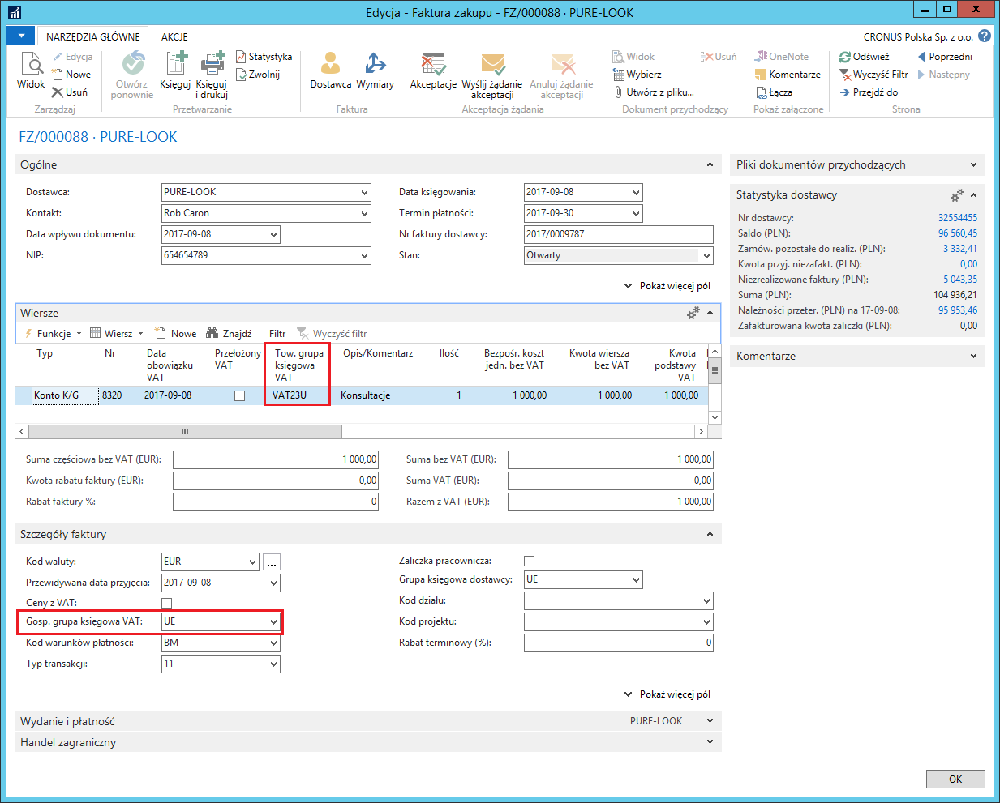
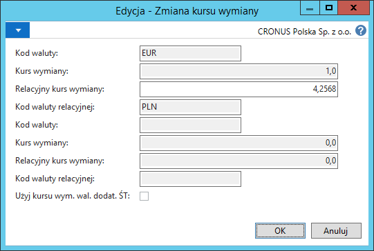
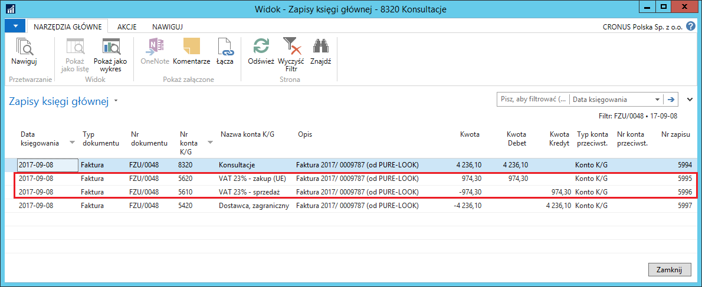
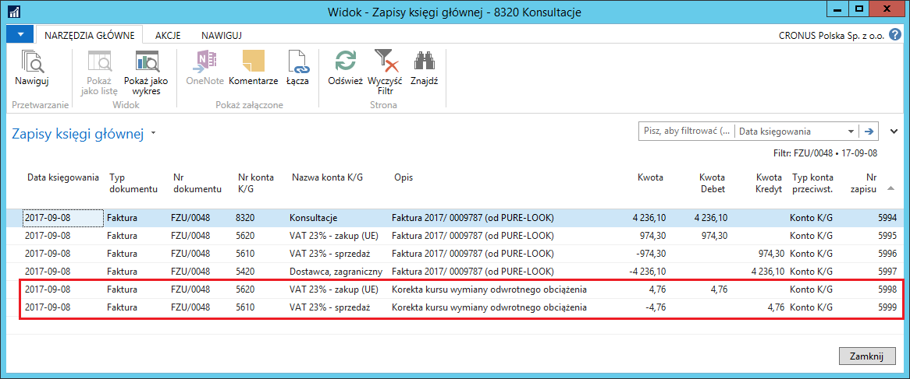
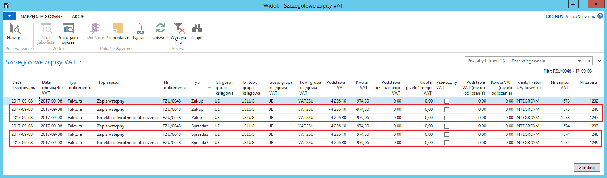
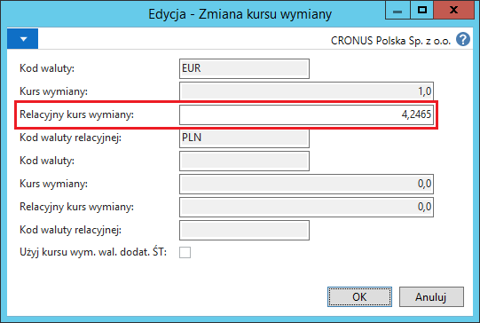

# Odwrotne obciążenie w transakcjach zakupu 

## Informacje ogólne

Zgodnie z wymaganiami przepisów polskiego prawa, wewnątrzwspólnotowe
nabycie towarów (WNT) i usług oraz import usług podlegają opodatkowaniu
VAT, co jest jednoznaczne z koniecznością wykazania transakcji
z obliczonym podatkiem VAT w rejestrze VAT. Do obliczania naliczonego
i należnego podatku VAT z tytułu tego typu transakcji wykorzystywana
jest standardowa funkcjonalność **Odwrotne obciążenie**.
Aby przystosować tą funkcjonalność do wymagań polskiego prawa, zostały
do niej dodane następujące elementy:

-   Funkcjonalność **Odwrotne obciążenie** została rozszerzona
    o tworzenie zapisu VAT dla sprzedaży. Dzięki temu transakcja WNT
    i zakupu usług z kwotą podatku VAT należnego wykazywane są zarówno
    w rejestrze VAT sprzedaży, jak i zakupu.

-   Polska Lokalizacja dla Microsoft Dynamics 365 Business Central
    on‑premises umożliwia również kalkulację podatku VAT w walucie
    lokalnej według kursu wymiany z innego dnia niż data przeliczenia
    wartości zakupu i zobowiązań na potrzeby ksiąg rachunkowych.

## Ustawienia

Do kalkulacji i księgowania podatku VAT w ramach odwrotnego obciążenia
konieczne jest zdefiniowanie właściwych ustawień. W tym celu, należy
postępować według następujących kroków:

1.  Należy wybrać **Działy \> Zarządzanie Finansami \> Administracja \>
    Ustawienia Księgowe VAT**.

2.  W oknie **Ustawienia księgowe VAT**, które się otworzy, należy
    zaznaczyć wiersz z kombinacją kodów w polach **Gosp. grupa księgowa
    VAT** i **Tow. grupa księgowa VAT**, która odnosi się do transakcji
    wewnątrzwspólnotowego nabycia towarów i usług oraz importu usług,
    a następnie należy wybrać **Edycja**.

3.  W oknie **Kartoteka ustaw. księg. VAT** należy zwrócić uwagę
    na kilka pól:

    -   **Typ kalkulacji VAT na** karcie skróconej **Ogólne** – w tym polu
         musi być wybrana opcja **Odwrotne obciążenie**.
    
    -   **Konto odwrotnego obciążenia na** karcie skróconej **Zakupy** –
         z listy rozwijanej w tym polu należy wybrać konto K/G, na
         które zostanie zaksięgowana kwota podatku VAT należnego obliczona
         dla transakcji wewnątrzwspólnotowego nabycia towarów i usług
         oraz importu usług.
    
    -   **Konto niezr. odwrotnego obciążenia** na karcie skróconej
         **Zakupy** – z listy rozwijanej w tym polu należy wybrać konto
         K/G, na które zostanie zaksięgowana niezrealizowana kwota podatku
         VAT należnego obliczona dla transakcji wewnątrzwspólnotowego
         nabycia towarów i usług oraz importu usług.
    
    -   **Konto przełoż. odwrotnego obciążenia** na karcie skróconej
         **Zakupy** – z listy rozwijanej w tym polu należy wybrać konto
         K/G, na które zostanie zaksięgowana przełożona kwota podatku VAT
         należnego obliczona dla transakcji wewnątrzwspólnotowego nabycia
         towarów i usług oraz importu usług.
    
    -   **Konto korekty kursu wal. odwrotnego obciążenia** na karcie
         skróconej **Zakupy** – z listy rozwijanej w tym polu należy
         wybrać konto K/G, na które zostanie zaksięgowana różnica
         wynikająca z przeliczenia VAT według innego kursu
         niż zobowiązanie, ale dotyczy to tylko kwoty VAT nie podlegającej
         odliczeniu.

  

W sytuacji, gdy kurs wymiany waluty do obliczenia podatku VAT jest inny
niż kurs wymiany waluty zastosowany do całości zaksięgowanej faktury
zakupu, musi zostać doksięgowana kwota różnicy w podatku VAT.
Księgowanie tej różnicy może być dokonywane ręcznie, po zaksięgowaniu
faktury zakupu (opcja zalecana) lub automatycznie (opcja niezalecana
z powodu wpływu na obniżenie wydajności systemu). W celu zdefiniowania
tego ustawienia, należy postępować według następujących kroków:

1.  Należy wybrać **Działy \> Zakup \> Administracja \> Ustawienia
     zakupów i zobowiązań.**

2.  W oknie **Ustawienia zakupów i zobowiązań**, które się otworzy,
     na karcie skróconej **Ogólne**, należy zaznaczyć pole
     **Automatyczne księgow. różnicy kurs. odwrotnego obciążenia**,
     jeśli kwota różnicy w kalkulacji podatku VAT wynikająca
     z zastosowania różnych kursów wymiany ma być księgowana
     automatycznie. Pozostawienie pola pustego oznacza, że różnica ta
     musi być zaksięgowana ręcznie po zaksięgowania faktury zakupu
     (sposób ręcznego księgowania opisany jest w dalszej części tego
     rozdziału).

  

>[!NOTE]
>Ze względu na możliwość zablokowania tabel podczas operacji
księgowania, pole **Automatyczne księgow. różnicy kurs. odwrotnego
obciążenia** nie powinno zawierać ustawienia **Tak**, jeśli w polu
**Użyj poprzednich zasad blokowania tabeli Zapis K/G** w tabeli
**Ustawienia księgi głównej** wybrano ustawienie **Nie**.

## Obsługa

Zaksięgowanie faktury zakupu za towary i usługi nabyte na terenie Unii
Europejskiej lub za usługi nabyte poza Unią Europejską spowoduje
obliczenie i zaksięgowanie podatku VAT, bez wpływu na wartość zakupów
oraz wysokość zobowiązań wobec dostawcy. W tym celu, należy postępować
według następujących kroków:

1.  Należy w standardowy sposób utworzyć nową fakturę zakupu, w której
    należy zwrócić uwagę na to, żeby wybrane były: **Gosp. grupa
    księgowa VAT** i **Tow. grupa księgowa VAT**, dla kombinacji
    których są zdefiniowane właściwe ustawienia (opisane powyżej).

  

>[!NOTE]
>Kurs wymiany waluty do przeliczenia na walutę lokalną
wartości zakupu i zobowiązań z faktury zakupu pobierany jest z tabeli
kursów według daty w polu **Data księgowania**, a kurs wymiany waluty
do przeliczenia na walutę lokalną kwoty podatku VAT pobierany jest
z tabeli kursów według daty w polu **Data obowiązku VAT**.

2.  Należy sprawdzić podsumowanie wartości w fakturze zakupu, w tym
    celu, należy w oknie kartoteki faktury zakupu wybrać **Statystyka**.

3.  W oknie **Statystyka zakupów Faktura**, które się otworzy, należy
    zwrócić uwagę na pola na karcie skróconej **Odwrotne obciążenie**:

    -   **Kod waluty odwrotnego obciążenia** – kod waluty pobrany
         z parametrów faktury zakupu.
    
    -   **Data obowiązku VAT** – data obowiązku VAT pobrana z parametrów
         faktury zakupu; jednocześnie jest to data, według której ustalany
         jest kurs wymiany waluty dla kwoty podatku VAT.
    
    -   **Kwota odwrotnego obciążenia** – kwota obliczonego podatku VAT
         naliczonego i należnego wyrażona w walucie faktury.
    
    -   **Kwota odwrotnego obciążenia (PLN)** – równowartość w walucie
         lokalnej kwoty obliczonego podatku VAT naliczonego i należnego.

  

4.  W przypadku wystąpienia na jednej fakturze zakupu wierszy z kilkoma
     różnymi stawkami VAT, podsumowanie kalkulacji kwoty odwrotnego
     obciążenia dla każdej stawki oddzielnie można zobaczyć na karcie
     skróconej **Wiersze** w oknie **Statystyka faktury zakupu**, gdzie
     zostały dodane 2 nowe pola:

    -   **Kwota odwrotnego obciążenia** – kwota obliczonego podatku VAT
         naliczonego i należnego wyrażona w walucie faktury.
    
    -   **Kwota odwrotnego obciążenia (PLN)** – równowartość w walucie
         lokalnej kwoty obliczonego podatku VAT naliczonego i należnego.

  

5.  W przypadku, gdy kurs wymiany waluty do kalkulacji kwoty odwrotnego
    obciążenia pobrany z tabeli kursów wymiany według **Daty obowiązku
    VAT** z jakiegoś powodu jest niewłaściwy, należy go zmienić. W tym
    celu, w oknie **Statystyka zakupów Faktura**, na karcie skróconej
    **Odwrotne obciążenie**, w polu **Kod waluty odwrotnego obciążenia**
    należy kliknąć przycisk asysty. Otworzy się okno **Zmiana kursu
    wymiany**, w którym, w polu **Relacyjny kurs wymiany** należy
    zmienić ręcznie wartość wstawioną domyślnie na właściwą.

  

6.  Należy w standardowy sposób zaksięgować fakturę zakupu.

Efekty księgowania w postaci **Zapisów K/G** i **Zapisów VAT** można
zobaczyć nawigując zaksięgowaną fakturę zakupu:

  

  

W sytuacji, gdy w zaksięgowanej fakturze zakupu zostały użyte różne
kursy wymiany: inny dla wartości zakupu i zobowiązań, a inny dla kwoty
odwrotnego obciążenia (niezależnie od tego, czy zostały one pobrane
z tabeli na podstawie **Daty księgowania** i **Daty obowiązku VAT**, czy
zostały ręcznie zmienione przed zaksięgowaniem), po zaksięgowaniu
faktury zakupu, jeżeli pole **Automatyczne księgow. różnicy kurs.
odwrotnego obciążenia w Ustawieniach zakupów i zobowiązań** nie jest
zaznaczone, konieczne jest dokonanie dodatkowego księgowania korekty
kwoty VAT. W tym celu, należy postępować według następujących kroków:

1.  Należy wybrać **Działy \> Zarządzanie Finansami \> Działania
     okresowe \> VAT \> Arkusz rozliczania VAT**.

2.  W oknie **Arkusz rozliczania VAT**, które się otworzy, należy
     ustawić odpowiednie filtry, aby na ekranie wyświetlić wybrane
     zapisy VAT. W wierszach **Arkusza rozliczenia VAT**, w
     których występuje różnica kwoty VAT, zaznaczone jest pole **Inny
     kurs dla odwrotnego obciążenia**:

  

3.  Należy zaznaczyć wiersz typu **Zakup** z kwotą odwrotnego obciążenia
     do skorygowania.

4.  Należy wybrać **Koryguj kurs wymiany odwrotnego obciążenia**.

5.  Otworzy się okno z podsumowaniem informacji o odwrotnym obciążeniu
     obliczonym w danym wierszu. Jeśli kursy wymiany waluty są różne
     (inny dla wartości zakupu i zobowiązań, a inny dla kwoty
     odwrotnego obciążenia), wartość w polu **Różnica kwot** jest różna
     od 0:

  

6.  W tym samym oknie należy zwrócić uwagę na pola dat:

    -   **Data księgowania** – data, z jaką zostanie zaksięgowana korekta
         kursu wymiany. Domyślnie wstawiana jest data robocza, w razie
         potrzeby można ją zmienić ręcznie.
    
    -   **Data obowiązku VAT** – data, z jaką zostanie zakwalifikowana
         korekta kwoty VAT do okresu rozliczenia podatku VAT. Domyślnie
         wstawiana jest data z korygowanego zapisu VAT, w razie potrzeby
         można ją zmienić ręcznie.

7.  Należy wybrać **Księguj**.

8.  Efektem zaksięgowania korekty kursu wymiany będą **Zapisy K/G**
     i **Szczegółowe zapisy VAT**.

  

  

W sytuacji, gdy w zaksięgowanej fakturze zakupu kursy wymiany waluty
są identyczne dla wartości zakupu i zobowiązań oraz kwoty odwrotnego
obciążenia, może okazać się, że powinny być one różne. W celu zmiany
kursu wymiany waluty dla zaksięgowanej kwoty odwrotnego obciążenia,
należy postępować według następujących kroków:

1.  Należy wybrać **Działy \> Zarządzanie Finansami \> Działania
     okresowe \> VAT \> Arkusz rozliczania VAT**.

2.  W oknie **Arkusz rozliczania VAT**, które się otworzy, należy
     ustawić odpowiednie filtry, aby na ekranie wyświetlić wybrane
     zapisy VAT, a następnie zaznaczyć wiersz z odwrotnym obciążeniem
     do skorygowania.

3.  Należy wybrać **Koryguj kurs wymiany odwrotnego obciążenia**.

4.  Otworzy się okno z podsumowaniem informacji o odwrotnym obciążeniu
     obliczonym w danym wierszu. W polu **Kod waluty odwrotnego
     obciążenia** należy kliknąć przycisk asysty. Otworzy się okno
     **Zmiana kursu wymiany**, w którym, w polu **Relacyjny kurs
     wymiany** należy ręcznie wprowadzić nowy kurs wymiany:

  

5.  Zmieniony kurs wymiany należy zatwierdzić wybierając **OK**.

6.  W oknie **Koryguj kurs wym. Odwrotnego** obciążenia można zauważyć,
     że w polu **Różnica kwot** jest kwota różna od zera. Skorygowaną
     kwotę odwrotnego obciążenia należy zaksięgować wybierając
     **Księguj**.

Zaksięgowana kwota odwrotnego obciążenia jest wykazywana, w wybranym
okresie VAT, w rejestrze VAT zakupu i w rejestrze VAT sprzedaży:

  

  

 >[!NOTE]
 >Obsługa odwrotnego obciążenia została dodana również
 do dokumentu **Zamówienie zakupu**.