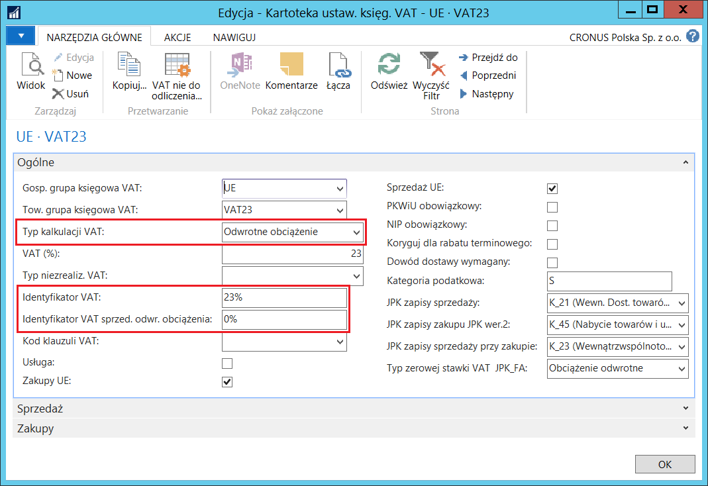
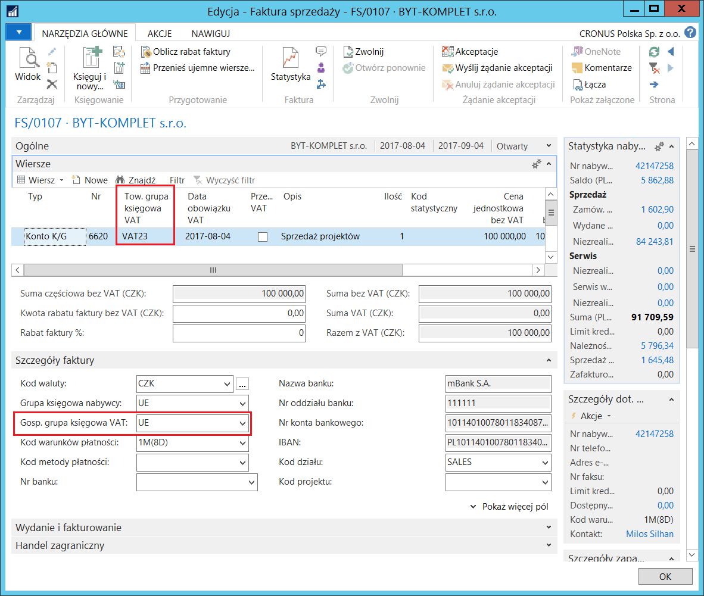
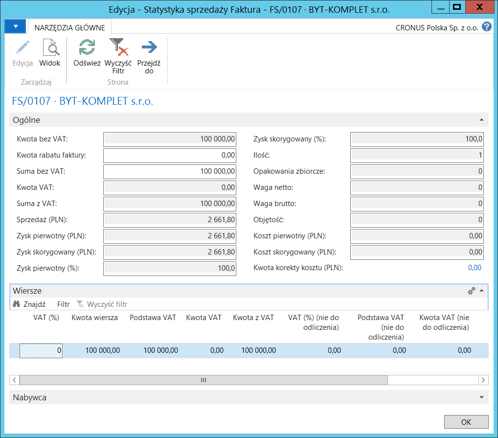
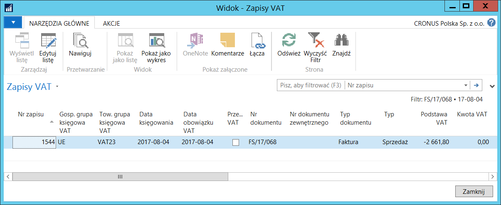
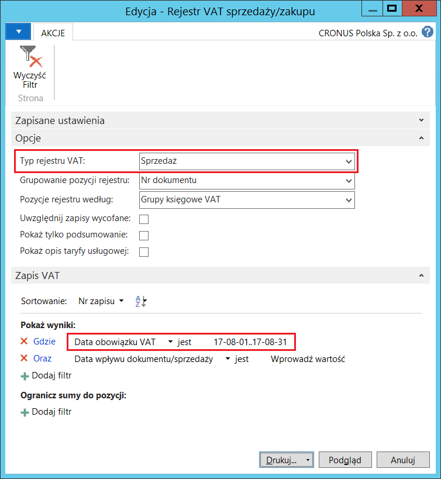
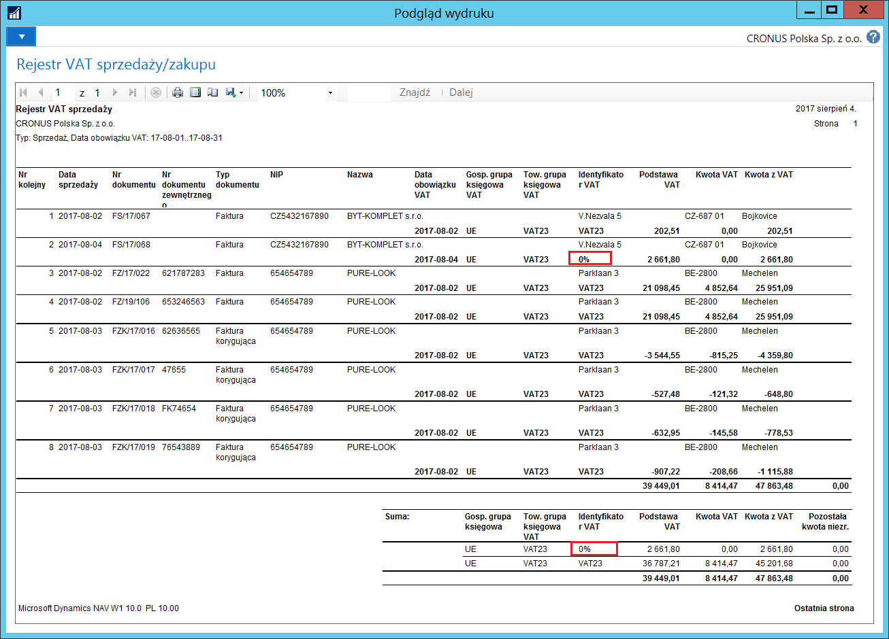

# Odwrotne obciążenie w transakcjach sprzedaży 

## Informacje ogólne

W transakcjach sprzedaży z odwrotnym obciążeniem mają zastosowanie inne
stawki VAT niż w transakcjach zakupu. W Rejestrze VAT sprzedaży
wykazywane są pozycje związane z VAT należnym dotyczącym zakupu
z odwrotnym obciążeniem, jak i VAT należnym od sprzedaży z odwrotnym
obciążeniem, dlatego Polska Lokalizacja zawiera rozwiązanie
umożliwiające odróżnienie tych transakcji.

## Ustawienia

Aby zdefiniować identyfikator rozróżniający pochodzenie VAT należnego,
należy postępować według następujących kroków:

1.  Należy wybrać **Działy \> Zarządzanie Finansami \> Administracja \>
    Ustawienia Księgowe VAT**.

2.  W oknie **Ustawienia księgowe VAT**, które się otworzy, należy
    zaznaczyć wiersz z kombinacją kodów w polach **Gosp. grupa księgowa
    VAT** i **Tow. grupa księgowa VAT**, która odnosi się do transakcji
    wewnątrzwspólnotowych, a następnie należy wybrać **Edycja**.

3.  W oknie **Kartoteka ustaw. księg. VAT** należy zwrócić uwagę na 3
    pola:

    -   **Typ kalkulacji VAT na** karcie skróconej **Ogólne** – w tym polu
         musi być wybrana opcja **Odwrotne obciążenie**.
    
    -   **Identyfikator VAT** – w tym polu należy wprowadzić identyfikator,
         który będzie wyświetlany w Rejestrze VAT sprzedaży i w Rejestrze
         VAT zakupu w pozycjach związanych z transakcją zakupu z odwrotnym
         obciążeniem.
    
    -   **Identyfikator VAT sprzed. odwr. obciążenia** – w tym polu należy
         wprowadzić identyfikator, który będzie wyświetlany w Rejestrze VAT
         sprzedaży w pozycjach związanych z transakcją sprzedaży
         z odwrotnym obciążeniem. Identyfikator ten może być też
         prezentowany na wydrukach dokumentów sprzedaży w pozycji **Stawka
         VAT**.

  

## Obsługa

Aby sprawdzić zastosowanie identyfikatora VAT sprzedaży odwrotnego
obciążenia, należy postępować według następujących kroków:

1.  Należy wybrać **Działy \> Zarządzanie Finansami \> Należności \>
    Faktury sprzedaży**.

2.  Należy wprowadzić nową fakturę sprzedaży dla nabywcy **Gospodarczą
    grupą księgową VAT** oraz w wierszu faktury wybrać **Towarową grupę
    księgową VAT**, dla których zdefiniowane zostały ustawienia księgowe
    VAT sprzedaży z odwrotnym obciążeniem. Pozostałe dane należy
    wprowadzić standardowo.

  

3.  Należy wybrać **Statystyka**.

    W oknie **Statystyka sprzedaży** można zauważyć, że w tej fakturze VAT
    nie został policzony. Stało się tak dlatego, że w **Ustawieniach
    księgowych VAT** dla kombinacji **Gospodarczej grupy księgowej VAT**
    i **Towarowej grupy księgowej VAT** użytych w fakturze sprzedaży,
    **Typ kalkulacji** = **Odwrotne obciążenie**.

  

4.  Należy wybrać **Księguj**, aby zaksięgować fakturę.

5.  W oknie z komunikatem o treści *„Fakturę zaksięgowano i przeniesiono
    do okna Zaksięgowana faktura sprzedaży. Czy chcesz otworzyć
    zaksięgowaną fakturę?"* należy wybrać **Tak**.

6.  W oknie **Zaksięgowana faktura sprzedaży**, które się otworzy,
    należy wybrać **Nawiguj**.

7.  W oknie **Nawigacja**, które się otworzy, należy zaznaczyć wiersz
    **Zapis VAT** i wybrać **Pokaż powiązane zapisy**.

8.  W oknie **Zapisy VAT**, które się otworzy można zauważyć, że w polu
    **Kwota VAT** jest 0.

  

9.  Należy wybrać **Zamknij**, aby zamknąć okno **Zapisy VAT**.

10. Należy wybrać **OK**, aby zamknąć okno **Nawigacja**.

11. Należy wybrać **Zamknij**, aby zamknąć okno **Zaksięgowana faktura
    sprzedaży**.

12. Należy wybrać **Działy \> Zarządzanie Finansami \> Działania
    okresowe \> VAT \> Rejestr VAT sprzedaży/zakupu**.

13. W oknie z parametrami wstępnymi raportu należy wypełnić pola:

    -   **Typ rejestru VAT** – w tym polu należy wybrać opcję **Sprzedaż**.
    
    -   **Data obowiązku VAT** – w tym polu należy wprowadzić okres,
         w którym do rozliczenia została zakwalifikowana zaksięgowana
         wcześniej faktura sprzedaży.
    
  

14. Należy wybrać **Podgląd**, aby wyświetlić raport na ekranie.

    W jednej z pozycji oraz w podsumowaniu raportu można zauważyć,
    że dla zaksięgowanej wcześniej faktury sprzedaży został zastosowany
    **Identyfikator VAT sprz. odwr. obciążenia** z **Ustawień księgowych
    VAT** dla grup księgowych VAT użytych w fakturze.
    
  

