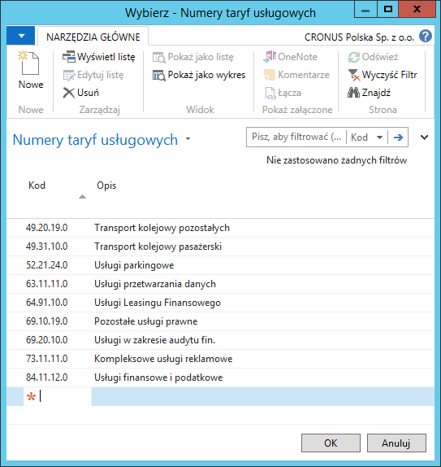
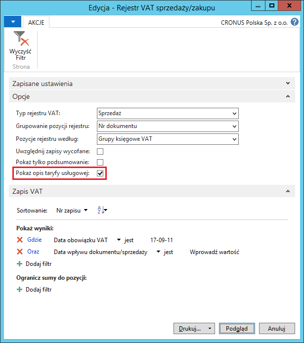

# Nr taryfy usługowej 

## Informacje ogólne

Dla niektórych transakcji sprzedaży usług poza granice Polski,
w rejestrze VAT należy podać krótki opis świadczonej usługi dla celów
badania poprawności kalkulacji VAT. Celem funkcjonalności numeru taryfy
usługowej jest udostępnienie użytkownikom listy takich opisów
i możliwości ich przypisania do wybranych transakcji.

## Ustawienia

Numery taryf usługowych mogą być przypisywane w wierszach dokumentów
sprzedaży wyłącznie dla wybranych ustawień VAT, w tym celu należy
postępować według następujących kroków:

1.  Należy wybrać **Działy \> Zarządzanie Finansami \> Administracja \>
    Ustawienia księgowe VAT**.

2.  W oknie **Ustawienia księgowe VAT**, które się otworzy, należy
    zaznaczyć wiersz z wybraną kombinacją kodów w polach **Gosp. grupa
    księgowa VAT** i **Tow. grupa księgowa VAT**, a następnie wybrać
    **Edycja**.

3.  W oknie **Kartoteka ustaw. księg. VAT**, które się otworzy,
    na karcie skróconej **Ogólne** należy zaznaczyć pole **Usługa**,
    pole **Obowiązkowy numer taryfy usługowej** zostanie automatycznie
    zaznaczone.

  

## Obsługa

Przypisanie numeru taryfy usługowej możliwe jest w dokumentach
sprzedaży. W tym celu należy postępować według następujących kroków:

1.  Należy wybrać **Działy \> Zarządzanie Finansami \> Należności \>
    Faktury sprzedaży**.

2.  Należy w sposób standardowy wprowadzić dane do faktury sprzedaży.
    Konieczne jest użycie właściwej kombinacji grup księgowych VAT,
    dzięki czemu możliwe jest wybranie jednej z taryf z listy
    rozwijanej w polu **Nr taryfy usługowej** w wierszach faktury
    sprzedaży:

  

3.  W przypadku, gdy na liście rozwijanej w polu **Nr taryfy usługowej**
    nie ma pożądanej taryfy, można ją wprowadzić wybierając **Nowe**.
    Otworzy się wtedy okno **Numery taryf usługowych**, w którym,
    w nowym wierszu, należy wprowadzić unikalny kod oraz pełny opis
    nowej taryfy usługowej:

  

4.  Pozostałe dane do faktury sprzedaży należy wprowadzić standardowo.

5.  Należy zaksięgować fakturę sprzedaży.

6.  **Nr taryfy usługowej** zostanie skopiowany do zaksięgowanej faktury
    sprzedaży:

  

>[!NOTE]
>Pole **Nr taryfy usługowej** jest dostępne w następujących
dokumentach: **Zamówienie sprzedaży**, **Faktura sprzedaży**,
**Zamówienie zwrotu sprzedaży**, **Faktura korygująca sprzedaży**.

W raporcie **Rejestr VAT sprzedaży/zakupu** możliwe jest wydrukowanie
nazwy usługi zgodnej z numerem taryfy usługowej przypisanym do wiersza
zaksięgowanego dokumentu sprzedaży. W tym celu należy postępować
według następujących kroków:

1.  Należy wybrać **Działy \> Zarządzanie Finansami \> Raporty
    i analizy \> Rejestr VAT sprzedaży/zakupu**.

2.  W oknie wstępnym raportu należy zaznaczyć pole **Pokaż opis taryfy
    usługowej**:

  

3.  W pozycjach rejestru VAT sprzedaży pochodzących z transakcji
    z przypisanym numerem taryfy usługowej, wydrukowany jest dodatkowy
    wiersz z nazwą usługi przypisaną do wybranego numeru taryfy:

  