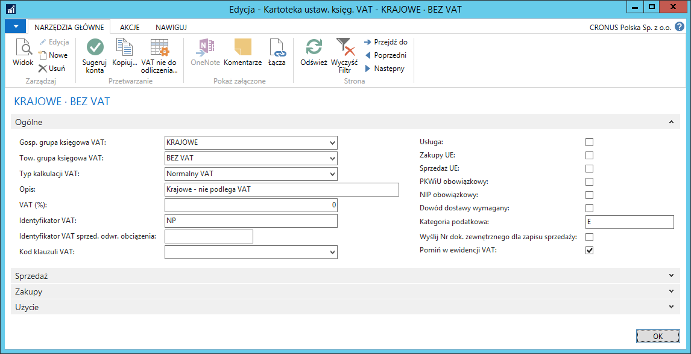

# Pomijanie transakcji w ewidencji VAT 

## Informacje ogólne

Księgowanie dokumentów zakupu i dokumentów sprzedaży w Microsoft
Dynamics 365 Business Central on‑premises skutkuje powstaniem zapisów
VAT, które są bazą do rozliczenia VAT za dany okres. Jednak są takie
transakcje, które nie podlegają opodatkowaniu VAT, dlatego w ramach
Polskiej Lokalizacji zostało dodane narzędzie, które umożliwia
wykluczanie wybranych zapisów VAT z rozliczenia VAT.

## Ustawienia

W przypadku, gdy transakcje z wybraną kombinacją grup księgowych VAT
nigdy nie podlegają opodatkowaniu VAT, możliwe jest ich domyślne
oznaczenie jako pomijane w ewidencji VAT. W tym celu, należy postępować
według następujących kroków:

1.  Należy wybrać **Działy \> Zarządzanie Finansami \> Administracja \>
    Ustawienia księgowe VAT**.

2.  W oknie **Ustawienia księgowe VAT**, które się otworzy, należy
    ustawić kursor w wierszu z wybraną kombinacją grup księgowych VAT,
    a następnie wybrać **Edycja**.

3.  W oknie **Kartoteka ustaw. księg. VAT**, które się otworzy, należy
    zaznaczyć pole **Pomiń w ewidencji VAT**.

  

## Obsługa

Funkcjonalność **Pomiń w ewidencji VAT** opisana jest na przykładzie
faktur zakupu, ale może być wykorzystana w wierszach następujących
dokumentów: **Zamówienie zakupu**, **Faktura zakupu**, **Zamówienie
zwrotu zakupu**, **Faktura korygująca zakupu**, **Zamówienie
sprzedaży**, **Faktura sprzedaży**, **Zamówienie zwrotu sprzedaży**,
**Faktura korygująca sprzedaży**. Pole **Pomiń w ewidencji VAT** można
też edytować w wierszach dzienników głównych oraz w oknie
**VAT‑dodatkowe informacje**. Po zaksięgowaniu transakcji z VAT,
informacja o pominięciu w ewidencji VAT zapisywana jest w wierszach
zaksięgowanych dokumentów: **Zaksięgowana faktura zakupu**,
**Zaksięgowana faktura korygująca zakupu**, **Zaksięgowana faktura
sprzedaży**, **Zaksięgowana faktura korygująca sprzedaży**. **Pomiń w
ewidencji VAT** zapamiętane jest również w tabelach: **Zapis VAT**
oraz **Szczegółowy zapis VAT**.

>[!NOTE]
>Zarządzanie pomijaniem i pokazywaniem poszczególnych
zapisów VAT w ewidencji VAT po zaksięgowaniu dokumentów możliwe jest w
oknie **Arkusz rozliczania VAT**. Więcej informacji na ten temat
znajduje się w rozdziale **Arkusz rozliczania VAT**.

Aby zaksięgować fakturę zakupu z pominięciem w ewidencji VAT, należy
postępować według następujących kroków:

1.  Fakturę zakupu należy wprowadzić w standardowy sposób.

2.  W wybranym wierszu faktury należy zaznaczyć pole **Pomiń w ewidencji
    VAT**.

    >[!NOTE]
    >W przypadku wprowadzenia wiersza dokumentu z kombinacją
    grup księgowych VAT, dla której w oknie **Ustawienia księgowe VAT**
    zaznaczone jest pole **Pomiń w ewidencji VAT**, spowoduje automatyczne
    zaznaczenie tego pola w wierszu dokumentu.

  

Po zaksięgowaniu dokumentu utworzone zostaną m.in. zapisy w tabelach
**Zapisy VAT** i **Szczegółowe zapisy VAT**, w których pole **Pomiń w
ewidencji VAT** będzie zaznaczone.

  

