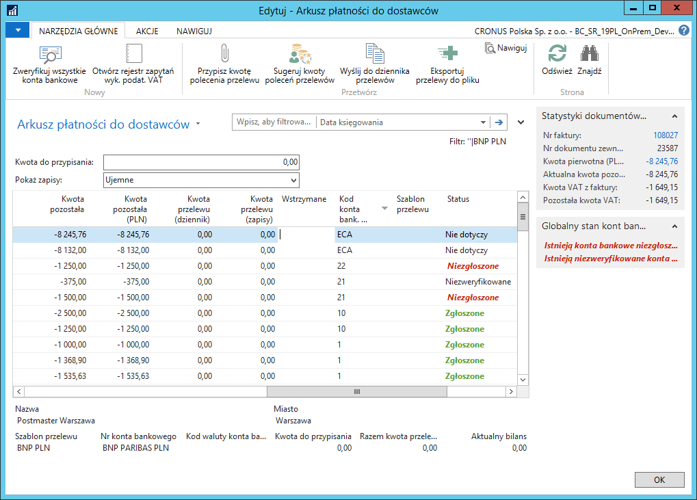

# Bankowość elektroniczna – Arkusz płatności do dostawców/nabywców 
## Informacje ogólne

Podatnik zobowiązany jest do zapłaty zobowiązania na zarejestrowany
rachunek dostawcy, dlatego weryfikację konta bankowego najlepiej
przeprowadzić tuż przed zleceniem przelewu. W ramach modułu Bankowość
elektroniczna zostały dodane funkcje umożliwiające sprawdzenie, czy
rachunek bankowy, na który ma być złożony przelew, widnieje w Wykazie
podatników VAT.

>[!NOTE]
>Opis weryfikacji rachunku bankowego do przelewu zamieszczony
w tym rozdziale bazuje na przykładzie Arkusza płatności do dostawców.
W Arkuszu płatności do nabywców mechanizm jest identyczny, więc należy
wzorować się na opisie dotyczącym Arkusza płatności do dostawców.

## Obsługa

W celu sprawdzenia statusu konta bankowego podczas przygotowywania
przelewów bankowych dla dostawców w **Arkuszu płatności do dostawców**,
należy wykonać następujące kroki:

1.  Należy wybrać **Działy \> Zarządzanie Finansami \> Bankowość
    elektroniczna \> Arkusz płatności do dostawców.**

2.  W oknie **Szablony poleceń przelewu, które się otworzy, należy
    zaznaczyć wybrany wiersz i kliknąć OK.**

W oknie **Arkusz płatności do dostawców**, które się otworzy, w wierszach
z wypełnionym polem **Kod konta bank. dostawcy**, w polu **Status** jest
informacja o statusie danego konta bankowego dostawcy.

Ponadto, w polu informacji **Globalny stan kont bankowych dostawców**
prezentowana jest informacja, czy są jakieś konta niezweryfikowane
lub niezgłoszone.

3.  W wierszach arkusza, do których mają być wygenerowane przelewy,
    należy przypisać konta bankowe odbiorców płatności, wybierając je
    w polu **Kod konta bank. dostawcy**.

4.  Na wstążce należy kliknąć **Zweryfikuj wszystkie konta bankowe**.

System weryfikuje wszystkie konta bankowe dostawców występujących
w arkuszu płatności, którzy w kartotece mają przypisany kod **PL** w
polu **Kod kraju/regionu** oraz poprawnie zdefiniowany polski **IBAN**
dla konta bankowego dostawcy wybranego w **Arkuszu płatności do
dostawców**. Weryfikacja konta dokonywana jest na datę dokumentu. W
wyniku weryfikacji system aktualizuje informację w polu **Status.**

>[!NOTE]
>Niezbędna jest weryfikacja wszystkich kont bankowych
powiązanych z generowanymi przelewami eksportowanymi do pliku lub
przenoszonymi do dziennika płatności. Próba wygenerowania przelewów z
niezweryfikowanymi kontami bankowymi zakończy się błędem. W przypadku
kont niezgłoszonych – zostanie wyświetlony stosowny komunikat, w którym
należy potwierdzić tę operację.

Aby sprawdzić historię weryfikacji danego konta bankowego, należy
ustawić kursor w wybranym wierszu arkusza płatności do dostawców,
następnie należy na wstążce kliknąć **Otwórz rejestr zapytań wyk. podat.
VAT**.