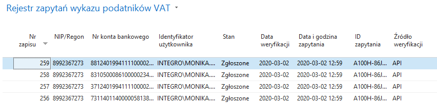

# Rejestr zapytań wykazu podatników VAT 

## Informacje ogólne

Każda weryfikacja numeru konta bankowego kontrahenta w wykazie
podatników VAT zostaje zapisana w oknie **Rejestr zapytań wykazu
podatników VAT**, gdzie istnieje możliwość sprawdzenia m.in.
identyfikatora zapytania, który został zwrócony podczas weryfikacji w
wykazie podatników VAT.

## Obsługa

W celu sprawdzenia historii weryfikacji kont bankowych kontrahentów w
wykazie podatników VAT, należy wykonać następujące kroki:

1.  Należy wybrać **Działy \> Zarządzanie Finansami \> Bankowość
    elektroniczna \> Rejestr zapytań wykazu podatników VAT.**

2.  W oknie **Rejestr zapytań wykazu podatników VAT**, które się otworzy,
    w niżej opisanych polach prezentowane są informacje o dokonanej
    weryfikacji:

    -   **Nr zapisu** – w tym polu prezentowany jest numer kolejny
        uruchomienia weryfikacji,
    
    -   **NIP/Regon** – w tym polu prezentowany jest numer będący podstawą
        zapytania,
    
    -   **Nr konta bankowego** – w tym polu prezentowany jest numer rachunku
        bankowego, który był weryfikowany,
    
    -   **Identyfikator użytkownika** – w tym polu prezentowany jest
        identyfikator użytkownika, który dokonał weryfikacji,
    
    -   **Stan** – w tym polu prezentowana jest odpowiedź zwrócona przez API
        Ministerstwa Finansów,
    
    -   **Data weryfikacji** – w tym polu prezentowana jest data, w której
        weryfikowany rachunek bankowy widnieje w wykazie podatników VAT jako
        zgłoszony,
    
    -   **Data i godzina zapytania** – w tym polu prezentowana jest data i
        godzina dokonania weryfikacji,
    
    -   **ID zapytania** – w tym polu prezentowany jest identyfikator
        zwrócony podczas składania zapytania, będący dowodem że zapytanie
        zostało złożone. W przypadku weryfikacji w pliku, **ID zapytania**
        to nazwa pliku w którym konto bankowe było weryfikowane,
    
    -   **Źródło weryfikacji** – w tym polu prezentowane jest miejsce, w
        którym konto bankowe zostało zweryfikowane: **API** lub **Plik**, w
        zależności od zdefiniowanych ustawień.

>[!NOTE]
>W przypadku, gdy podczas konfiguracji **Metody
sprawdzania** została wybrana opcja **Plik i API**, w **Rejestrze
zapytań wykazu podatników VAT** mogą utworzyć się dwa zapisy
weryfikacji dla jednego konta bankowego.

