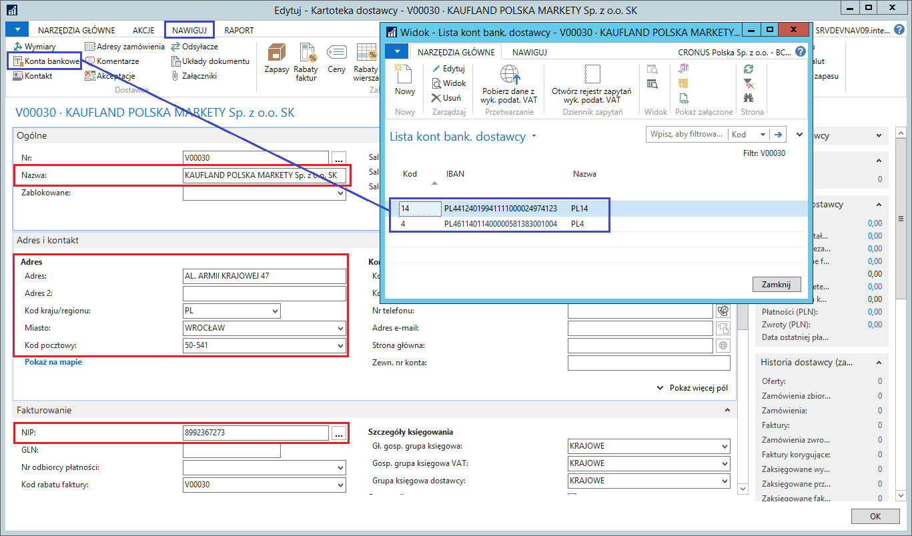

### Wykaz podatników VAT {#wykaz-podatników-vat .Poziom-2}

> **Informacje ogólne**

Zgodnie z przepisami przy transakcjach powyżej 15 tys. zł płatności na
rzecz kontrahenta należy dokonać przelewem na jego rachunek bankowy. Od
stycznia 2020 r. taka płatność powinna trafić na rachunek kontrahenta
znajdujący się w wykazie podatników VAT. Wówczas płatność jest
bezpieczna, a płatnik nie ponosi negatywnych konsekwencji podatkowych.

Jeśli płatność dokonywana jest na inny rachunek niż wskazany w wykazie,
wówczas nie można zaliczyć tego wydatku do kosztów uzyskania przychodów.
Nabywca będzie również solidarnie odpowiadać ze sprzedawcą, który jest
czynnym podatnikiem VAT, za jego zaległości podatkowe w tej części
podatku VAT, która przypada na płatność za transakcję potwierdzoną
fakturą, a dokonaną przelewem na rachunek inny, niż zawarty w wykazie
podatników VAT, na dzień zlecenia przelewu.

> {width="0.19in" height="0.19in"}
> **Uwaga:** Istotne będzie, czy rachunek znajdował się w wykazie w dniu
> zlecenia przelewu. Decyduje przy tym dzień zlecenia przelewu, a nie
> obciążenia rachunku nabywcy czy uznania rachunku sprzedawcy.

Jeżeli w ciągu 3 dni od dnia zlecenia przelewu płatnik poinformuje
naczelnika urzędu skarbowego właściwego dla wystawcy faktury o numerze
rachunku, na który został zlecony przelew, to będzie mógł zaliczyć
wydatek do kosztów uzyskania przychodów. Nie poniesie on również
odpowiedzialności solidarnej, mimo że wpłata trafiła na inny rachunek,
niż wskazany w wykazie podatników VAT. Dodatkowo płatnik nie będzie
odpowiadał solidarnie, jeśli zapłaci przy użyciu mechanizmu podzielonej
płatności.

> **Ustawienia**

Status kont bankowych kontrahentów zdefiniowanych w systemie Microsoft
Dynamics 365 Business Central on‑premises sprawdzany jest w wykazie
podatników VAT dla tych nabywców/dostawców, w których kartotekach
wybrany jest kod **PL** w polu **Kod kraju/regionu**. Wynika to z faktu,
że w wykazie podatników VAT widnieją tylko przedsiębiorstwa
zarejestrowane w Polsce. W przypadku innego kodu kraju/regionu, status
konta bankowego wykaże wartość **Nie dotyczy**. Dodatkowo została
przygotowana strona ustawień dla wykazu podatników VAT.

Przed rozpoczęciem korzystania z funkcjonalności weryfikowania kont
bankowych nabywców/dostawców konieczne jest zdefiniowanie podstawowych
ustawień. W tym celu należy wykonać następujące kroki:

1.  Należy wybrać **Działy \> Zarządzanie Finansami \> Ustawienia wykazu
    podatników VAT \> Ustawienia wykazu podatników VAT**.

2.  W oknie **Kartoteka ustawień wykazu podatników VAT**, które się
    otworzy, należy wypełnić pola zgodnie z poniższym opisem:

-   **Metoda sprawdzania** -- określa miejsce, w którym będą sprawdzane
    konta bankowe kontrahentów. Opcje dostępne w tym polu:

```{=html}
<!-- -->
```
-   **Plik** -- konta będą weryfikowane tylko w pliku płaskim,

-   **API** -- konta będą weryfikowane tylko w API,

-   **Plik i API** -- konta będą weryfikowane w pierwszej kolejności w
    pliku płaskim. Jeśli ta weryfikacja wykaże, że dane konto nie
    zostało zgłoszone, zostanie wykonana dodatkowa weryfikacja w API.

> {width="0.19in" height="0.19in"}
> **Uwaga:** W przypadku wybrania opcji **Plik i API**, system będzie
> dokonywać weryfikacji zarówno w pliku, jak i w API. Wystarczy
> potwierdzenie weryfikacji tylko w jednym ze źródeł, aby system uznał,
> że konto zostało zgłoszone.

-   **Użyj API, jeśli plik jest niedostępny** -- zaznaczenie tego pola
    spowoduje, że konta bankowe będą weryfikowane w API w sytuacji, gdy
    aktualny plik płaski nie będzie dostępny,

-   **Użyj API dla zamówienia zakupu** -- zaznaczenie tego pola
    spowoduje, że konto bankowe wybrane w zamówieniu zakupu będzie
    weryfikowane w API. Domyślnie konta bankowe wprowadzane w
    zamówieniach zakupu nie są weryfikowane w API, niezależnie od
    pozostałych ustawień.

-   **Maks. rozmiar żądania API** -- określa maksymalny rozmiar paczki
    wysyłanej do API. Wartość ta nie powinna być większa, niż wartość
    podana przez Ministerstwo Finansów; w przypadku wprowadzenia zbyt
    dużej wartości, zapytanie może zwrócić błąd.

> {width="0.19in" height="0.19in"}
> **Uwaga:** Według specyfikacji Ministerstwa Finansów, dostęp do API
> jest limitowany. Zalecane jest więc korzystanie z pliku i ograniczenie
> wykorzystania API do minimum.
>
> {width="0.19in" height="0.19in"}
> **Uwaga:** W związku z techniczną naturą ustawień, dostęp do nich
> powinni mieć wyłącznie administratorzy systemu.

  ---------------------------------------------------------
  Rysunek 2.148: Kartoteka ustawień wykazu podatnikóW VAT
  ---------------------------------------------------------

> **Obsługa**

W przypadku gdy weryfikacja odbywa się za pomocą pliku płaskiego,
konieczne jest wgranie pliku do systemu. Proces wgrywania pliku zakłada,
że raz dziennie -- najlepiej przed rozpoczęciem pracy -- administrator
pobierze plik płaski, rozpakuje go, a następnie zaimportuje do systemu.
Do tego celu służy **Rejestr plików wykazu podatników VAT.**

W celu zaimportowania pliku do systemu Microsoft Dynamics 365 Business
Central on‑premises, należy wykonać następujące kroki:

1.  Należy wybrać **Działy \> Administracja \> Ustawienia aplikacji \>
    Ogólne \> Rejestr plików wykazu podatników VAT**.

2.  W oknie **Rejestr plików wykazu podatników VAT**, które się otworzy,
    należy na wstążce kliknąć **Pobierz plik wykazu podatników VAT**:

  -----------------------------------------------------
  Rysunek 2.149: Rejestr plików wykazu podatnikóW VAT
  -----------------------------------------------------

3.  Pojawi się komunikat, w którym należy kliknąć **Tak**, aby
    kontynuować proces.

  {width="3.0520833333333335in" height="1.375in"}
  -------------------------------------------------------------------------
  Rysunek 2.150: Komunikat

4.  W oknie zapisu pliku pobranego z zasobów Ministerstwa Finansów,
    które się pojawi, należy kliknąć **Zapisz** i wskazać lokalną
    ścieżkę dostępu.

  {width="4.208333333333333in" height="2.1458333333333335in"}
  -------------------------------------------------------------------------------------
  Rysunek 2.151: Okno zapisu pliku

5.  Należy rozpakować zapisany plik.

6.  W oknie **Rejestr plików wykazu podatników VAT** należy na wstążce
    kliknąć **Wstaw dane z pliku**.

  -----------------------------------------------------
  Rysunek 2.152: Rejestr plików wykazu podatnikóW VAT
  -----------------------------------------------------

7.  Pojawi się komunikat, w którym należy kliknąć **Tak**, aby
    kontynuować proces.

  {width="3.0520833333333335in" height="1.375in"}
  -------------------------------------------------------------------------
  Rysunek 2.153: Komunikat

8.  W oknie, które się otworzy, należy wskazać rozpakowany wcześniej
    plik w formacie .json i kliknąć **Otwórz**.

  {width="6.375in" height="3.644511154855643in"}
  ------------------------------------------------------------------------
  Rysunek 2.154: Okno wyboru pliku wykazu podatnikóW VAT

9.  System przeprowadza walidację. W sytuacji, gdy wgrywany plik jest
    nieaktualny, system wyświetli stosowną informację, następnie
    nieaktualne dane zastąpi aktualnymi.

> Szacowany czas wstawiania danych z pliku to 10 minut.

10. Po zakończeniu procesu pobierania i wstawiania danych z pliku w
    oknie **Rejestr plików wykazu podatników VAT** zostaną utworzone dwa
    wiersze jako efekt wykonanych operacji, z odpowiednimi informacjami
    w poszczególnych polach.

  -----------------------------------------------------
  Rysunek 2.155: Rejestr plików wykazu podatnikóW VAT
  -----------------------------------------------------

> **Obsługa**

Wprowadzając dane dostawcy do systemu Microsoft Dynamics 365 Business
Central on‑premises, należy wykonać następujące kroki:

1.  Należy wybrać **Działy \> Zakup \> Przetwarzanie zamówień \>
    Dostawcy**.

2.  W oknie **Dostawcy**, które się otworzy, na wstążce należy kliknąć
    **Nowy**.

3.  W nowej kartotece dostawcy, która się otworzy, na wstążce należy
    kliknąć **Pobierz dane z serwisów rządowych**.

4.  W oknie **Kartoteka danych serwisów rządowych**, które się otworzy,
    w polu **Wyszukaj nr VAT/NIP** należy wprowadzić NIP (10 cyfr)
    kontrahenta, którego wprowadzamy do bazy. Jest też możliwość
    wyszukiwania kontrahenta wg numeru regon, w tym celu należy wypełnić
    pole **Wyszukaj regon**.

5.  Na wstążce należy kliknąć **Pobierz dane wykazu podatników VAT**.

  ----------------------------------------------------
  Rysunek 2.156: Kartoteka danych serwisów rządowych
  ----------------------------------------------------

W wyniku działania tej akcji, w oknie **Kartoteka danych serwisów
rządowych** pojawi się nowa karta skrócona **Dane rejestru podatników
VAT**, w której prezentowane są dane kontrahenta zarejestrowane w
Wykazie podatników VAT. Pola tej karty skróconej są nieedytowalne.

W polach na karcie skróconej **Dane aktualizujące** jest kopia danych
z Wykazu podatników VAT. Wszystkie pola są edytowalne -- użytkownik może
zmienić ich zawartość. Dane z tych pól zostaną skopiowane do kartoteki
dostawcy po wybraniu akcji **Aktualizuj kartotekę dostawcy**.

{width="0.19in" height="0.19in"}
**Uwaga:** Jeśli wcześniej pobrane były dane kontrahenta z BIR lub pola
na karcie skróconej **Dane aktualizujące** były wypełnione ręcznie,
pojawi się komunikat z pytaniem, czy zastąpić dane aktualizujące danymi
z Wykazu podatników VAT .

  {width="6.333333333333333in" height="3.646403105861767in"}
  ------------------------------------------------------------------------------------
  Rysunek 2.157: Dane kontrahenta z Wykazu podatników VAT

W polu **Liczba kont bankowych** na karcie skróconej **Dane rejestru
podatników VAT** wyświetlona jest ilość zarejestrowanych rachunków
bankowych kontrahenta. Jeśli jest ona większa od 0, należy wykonać
następujące kroki:

1.  Na wstążce należy kliknąć **Otwórz listę kont bankowych**.

2.  Otworzy się okno **Lista kont bankowych wykazu podatników VAT**,
    które należy wypełnić zgodnie z poniższym opisem:

-   **Istniejący kod konta** -- w tym polu wyświetlony jest kod konta
    bankowego zdefiniowanego już w systemie dla danego kontrahenta,
    które rozpoznawane jest na podstawie numeru IBAN,

-   **Nr konta bankowego (wykaz podatników VAT)** -- w tym polu znajduje
    się numer rachunku bankowego pobrany z wykazu podatników VAT,

-   **Akcja** -- w wierszu z wybranym numerem rachunku bankowego, który
    ma być przypisany do kontrahenta w systemie, należy wybrać jedną z
    opcji:

```{=html}
<!-- -->
```
-   **Puste** -- dany rachunek bankowy nie zostanie przypisany do
    kartoteki kontrahenta w systemie,

-   **Utwórz nowe** -- dany rachunek bankowy zostanie przypisany
    do kartoteki kontrahenta w systemie (zostanie założone nowe konto
    bankowe dostawcy) -- tę opcję można wybrać, jeśli pole **Istniejący
    kod konta** jest puste,

-   **Zaktualizuj istniejące** -- informacje o danym rachunku bankowym
    zastąpią informacje w istniejącym w systemie koncie bankowym
    kontrahenta -- tę opcję można wybrać, jeśli pole **Istniejący kod
    konta** nie jest puste.

  {width="6.391403105861767in" height="5.885416666666667in"}
  ------------------------------------------------------------------------------------
  Rysunek 2.158: Lista kont bankowych Wykazu podatników VAT

3.  Należy zaznaczyć wiersz z wybranym rachunkiem bankowym, dla którego
    > zostało wypełnione pole **Akcja**, następnie na wstążce należy
    > kliknąć **Edycja**.

4.  W oknie **Kartoteka konta bankowego -- wykaz podatników VAT** na
    > karcie skróconej **Dane aktualizujące** wyświetlone są domyślne
    > informacje o rachunku bankowym. W razie potrzeby należy ręcznie
    > wprowadzić zmiany, a następnie kliknąć **OK**, aby zamknąć okno.

W razie potrzeby, czynności opisane w krokach 3. i 4. należy powtórzyć
dla wszystkich rachunków z wypełnionym polem **Akcja**.

  {width="6.375in" height="4.1573720472440945in"}
  -------------------------------------------------------------------------
  Rysunek 2.159: Kartoteka konta bankowego - Wykaz podatników VAT

5.  W oknie **Lista kont bankowych wykazu podatników VAT** na wstążce
    należy kliknąć **Zaktualizuj konta bankowe dostawców**.

6.  W oknie komunikatu, które się wyświetli, należy kliknąć **Tak**.

  {width="4.59375in" height="1.3645833333333333in"}
  ---------------------------------------------------------------------------
  Rysunek 2.160: Komunikat

7.  W komunikacie potwierdzającym utworzenie i/lub zaktualizowanie
    informacji o kontach bankowych dostawcy należy kliknąć **OK**.

8.  W oknie **Lista kont bankowych wykazu podatników VAT** należy
    kliknąć **OK**, aby je zamknąć.

9.  W oknie **Kartoteka danych serwisów rządowych** na wstążce należy
    kliknąć **Aktualizuj kartotekę dostawcy**, a następnie **OK**.

{width="0.19in" height="0.19in"}
**Uwaga:** Jeśli akcja **Aktualizuj kartotekę dostawcy** zostanie
uruchomiona dla kartoteki dostawcy, w której wprowadzone są już jakieś
dane, zostanie wyświetlony komunikat z pytaniem, czy aktualne dane mają
zostać zastąpione danymi znajdującymi się na karcie skróconej **Dane
aktualizujące**. Należy kliknąć **Tak** lub **Nie**.

{width="0.19in" height="0.19in"}
**Uwaga:** Jeśli krok 5. zostanie pominięty, czyli w oknie **Lista kont
bankowych wykazu podatników VAT** nie będzie uruchomiona akcja
**Zaktualizuj konta bankowe dostawców**, to przy wykonywaniu kroku 9.,
czyli aktualizacji kartoteki dostawcy, system sprawdzi, czy w oknie
**Lista kont bankowych wykazu podatników VAT** w co najmniej jednym
wierszu jest wybrana akcja **Utwórz nowe** lub **Zaktualizuj
istniejące** i wykona wybraną akcję, tzn. utworzy nowe lub zaktualizuje
istniejące konta bankowe dostawcy.

W wyniku akcji uruchomionych w krokach 5. i/lub 9. system uzupełnił
kartotekę dostawcy jego danymi pobranymi z serwisów rządowych oraz
wstawił i/lub zaktualizował informacje o jego kontach bankowych

  