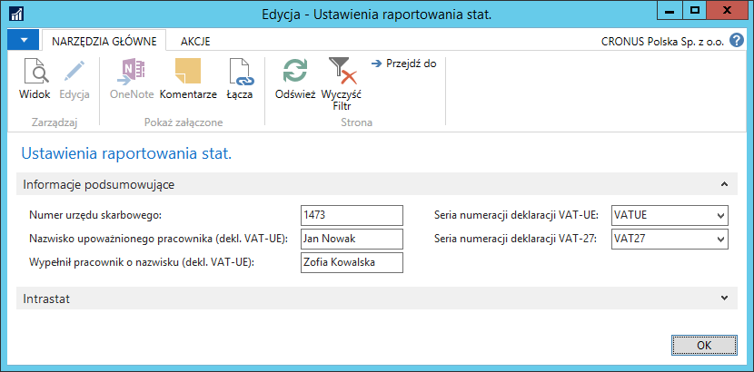
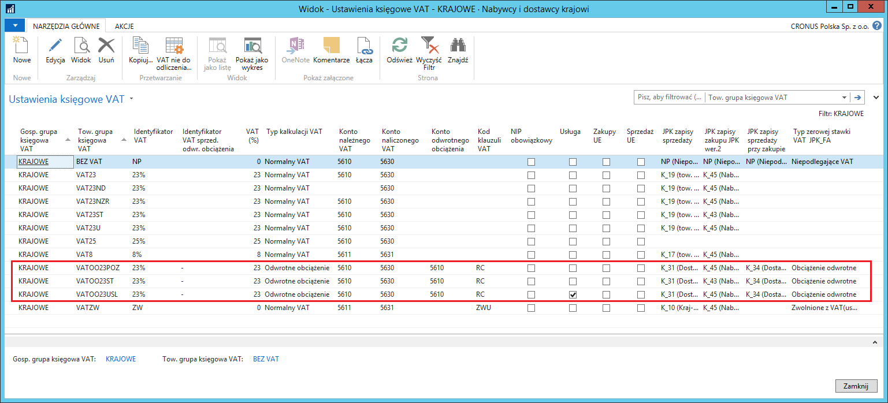
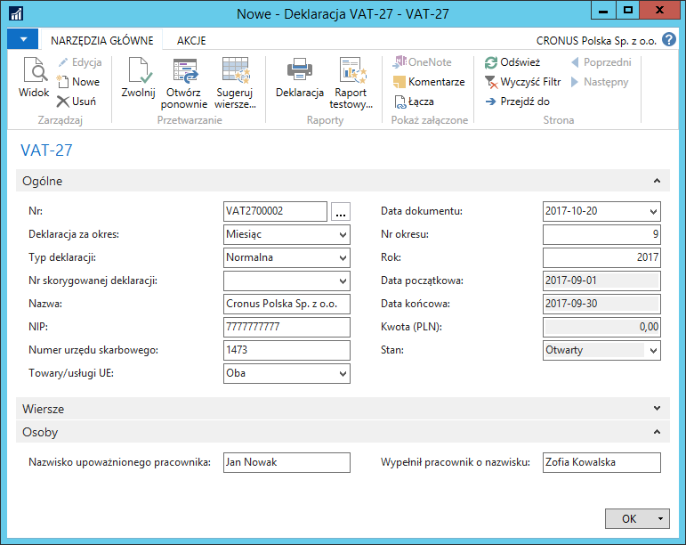

# Deklaracja VAT-27 

## Informacje ogólne

**Deklaracja VAT-27** to informacja podsumowująca o dokonanych w danym
okresie transakcjach, dla których podatnikiem jest nabywca. Obowiązek
składania deklaracji VAT-27 wynika ze zmian, jakie do ustawy o podatku
VAT wprowadza ustawa z 9 kwietnia 2015 r. o zmiana ustawy o podatku
od towarów i usług oraz ustawy – Prawo zamówień publicznych. Deklaracja
VAT-27 dotyczy transakcji (dostawy towarów lub świadczenia usług), dla
których podatnikiem jest nabywca. Wypełnią ją zatem m.in., podatnicy,
którzy stosując odwrotne obciążenie sprzedawać będą towary wrażliwe,
jak laptopy, smartfony, tablety, telefony, metale, makulaturę., a także
usługi w zakresie przenoszenia uprawnień do emisji gazów cieplarnianych.

Polska Lokalizacja wyposażona została w narzędzie ułatwiające
i automatyzujące przygotowanie danych do deklaracji VAT-27.

## Ustawienia

Żeby móc automatycznie tworzyć deklarację VAT-27, muszą być zdefiniowane
odpowiednie ustawienia.

1.  Należy wybrać **Działy \> Zarządzanie Finansami \> Administracja \>
    Ustawienia raportowania stat.**

2.  W oknie **Ustawienia raportowania stat.**, które się otworzy, należy
    odpowiednio wypełnić pola na karcie skróconej **Informacje
    podsumowujące**:

    -   **Seria numeracji deklaracji VAT-27** – z listy rozwijanej w tym
        polu należy wybrać kod serii numeracji, według której system
        będzie nadawał numery kolejnym deklaracjom VAT-27
    
        Jeżeli nie korzystamy z funkcjonalności deklaracji VAT-UE, należy
        dodatkowo uzupełnić poniższe dane:

    -   **Numer urzędu skarbowego** – należy wpisać numer (kod) urzędu
        skarbowego, do którego należy dostarczyć deklarację VAT-27
    
    -   **Nazwisko upoważnionego pracownika (dekl. VAT-UE)** – należy
        wpisać imię i nazwisko przedstawiciela firmy upoważnionego
        do podpisywania deklaracji VAT‑27
    
    -   **Wypełnił pracownik o nazwisku (dekl. VAT-UE)** – należy wpisać
        imię i nazwisko przedstawiciela firmy wypełniającego deklarację
        VAT-27

  

Deklaracja VAT-27 będzie pobierała informacje dotyczące transakcji
sprzedaży, dla których zastosowane zostały ustawienia VAT z **Typem
kalkulacji VAT** **=** **Odwrotne obciążenie**.

Można zastosować poniższe przykładowe ustawienia (usługi, środki trwałe
i pozostałe):

  

## Obsługa

W celu przygotowania deklaracji VAT-27 za wybrany okres, należy
postępować według następujących kroków:

1.  Należy wybrać **Działy \> Zarządzanie Finansami \> Działania
    okresowe \> VAT \> Deklaracje VAT-27**.

2.  W oknie **Deklaracje VAT-27** należy wybrać **Nowe**.

3.  W kartotece nowej deklaracji, na karcie skróconej **Ogólne**, należy
    wypełnić pola:

    -   **Nr** – w tym polu system wstawia numer kolejny deklaracji VAT-27,
         zgodny z serią numeracji wybraną w ustawieniach.
    
    -   **Deklaracja za okres** – z listy opcji dostępnych w tym polu
         należy wybrać, za jaki okres przygotowywana jest deklaracja.
         Możliwe opcje do wyboru, to **Kwartał** i **Miesiąc**.
    
    -   **Typ deklaracji** – od typu deklaracji wybranego w tym polu zależą
         dalsze czynności podczas tworzenia deklaracji VAT-27. Możliwe
         opcje do wyboru, to: **Normalna**, **Korygująca**,
         **Korygująco-uzupełniająca**.
    
    -   **Nr skorygowanej deklaracji** – dostępność tego pola do edycji
         zależy od wybranego **Typu deklaracji**:
    
        -   dla typu **Normalna** – pole jest nieedytowalne.
        
        -   dla typu **Korygująca** – pole jest edytowalne, z listy w nim
             rozwijanej należy wybrać wcześniej utworzoną deklarację, która ma
             zostać skorygowana.
        
        -   dla typu **Korygująco-uzupełniająca** – pole jest edytowalne,
             z listy w nim rozwijanej należy wybrać wcześniej utworzoną
             deklarację, która ma zostać skorygowana lub uzupełniona.
    
    -   **Nazwa** – pole wypełniane automatycznie przez system – wstawiana
         jest nazwa firmy skopiowana z okna **Dane Firmy.**
    
    -   **NIP** – pole wypełniane automatycznie przez system – wstawiany
         jest NIP skopiowany z okna **Dane Firmy.**
    
    -   **Numer urzędu skarbowego** – pole wypełniane automatycznie
         przez system – wstawiany jest numer urzędu skarbowego skopiowany
         z okna **Ustawienia raportowania statystycznego.**
    
    -   **Data dokumentu** – w tym polu system automatycznie wstawia datę
         roboczą jako datę utworzenia deklaracji VAT-27. Datę ta można
         zmienić ręcznie.
    
    -   **Nr okresu** – w zależności od wybranej opcji w polu **Deklaracja
         za okres**, należy podać numer kolejny miesiąca lub kwartału
         w roku, którego dotyczy tworzona deklaracja VAT-27.
    
    -   **Rok** – w tym polu należy wpisać rok, z którego pochodzi okres
         (miesiąc lub kwartał), którego dotyczy tworzona deklaracja VAT-27.
    
    -   **Data początkowa** – pole nieedytowalne, system wstawia w nim datę
         początkową okresu, jakim objęta jest deklaracja, na podstawie
         wcześniej wprowadzonych parametrów w polach **Deklaracja
         za okres**, **Nr okresu**, **Rok**.
    
    -   **Data końcowa** – pole nieedytowalne, system wstawia w nim datę
         końcową okresu, jakim objęta jest deklaracja, na podstawie
         wcześniej wprowadzonych parametrów w polach **Deklaracja
         za okres**, **Nr okresu**, **Rok**.
    
    -   **Kwota (PLN)** – pole nieedytowalne, system wstawia sumę kwot
         z wierszy deklaracji VAT-27.
    
    -   **Stan** – pole nieedytowalne, którego bieżąca opcja wskazuje
         na stan edycji deklaracji. Zmiana stanu następuje poprzez wybranie
         akcji **Zwolnij**, lub **Otwórz ponownie**.
    
    -   **Towary/usługi** – z listy opcji dostępnych w tym polu należy
         wybrać rodzaj transakcji, jakie mają być zestawione w deklaracji.
         Możliwe opcje do wyboru, to: **Oba**, **Towary**, **Usługi**.
         System analizuje **Ustawienia księgowe VAT**,
         dla których zaznaczone jest (lub nie) pole **Usługa**.

4.  Do pól w karcie skróconej **Osoby** system kopiuje dane z wcześniej
     zdefiniowanych ustawień. W razie potrzeby, zawartość tych pól może
     zostać ręcznie zmieniona.

  

5.  Po prawidłowym wypełnieniu pól nagłówka deklaracji, należy wypełnić
     wiersze. W tym celu, w kartotece deklaracji należy wybrać
     **Sugeruj wiersze**.

6.  W oknie **Sugeruj wiersze deklaracji VAT-27**, które się otworzy,
     należy zaznaczyć pole **Usuń istniejące wiersze**, aby skrypt
     nadpisał istniejące wiersze deklaracji.

  

7.  Następnie należy wybrać **OK** w celu wykonania skryptu.

    W wyniku użycia skryptu **Sugeruj wiersze deklaracji VAT-27** system
    wypełnia automatycznie wiersze deklaracji według poniższej logiki:

    -  Skrypt przetwarza **Zapisy VAT** mające datę obowiązku VAT (jeżeli
        pole **Użyj daty obowiązku VAT** jest zaznaczone, w przeciwnym
        wypadku system analizuje datę księgowania) przypadającą w okresie
        wyznaczonym datami w polach **Data początkowa** i **Data końcowa**
        w nagłówku deklaracji VAT-27.
    
    -  System wybiera właściwe **Zapisy VAT** pod względem grup księgowych
        VAT, dla których dla transakcji sprzedaży **Typ kalkulacji VAT**
        jest **Odwrotne obciążenie** i nie dotyczy transakcji
        wewnątrzunijnych. Dodatkowe filtrowanie **Zapisów VAT** zależy
        od wybranego w nagłówku deklaracji **Typu transakcji handlowej**.
        System wybiera **Zapisy VAT** zgodne z opcją wybraną w polu
        **Towary/usługi**. W tym celu analizowane jest zaznaczenie pola
        **Usługa** w oknie **Ustawienia księgowe VAT dla **kombinacji grup
        księgowych VAT w **Zapisach VAT**.
    
    -  Podczas wstawiania wierszy, system automatycznie uzupełnia m.in.
        pola:
    
        -   **Kwota (PLN)** – suma wartości typu transakcji
             zakupu/sprzedaży/obu dla danego wiersza, skalkulowana z pola
             **Podstawa VAT** w **Zapisach VAT**.
    
  

8.  Przygotowana deklaracja VAT-27 może być testowo wydrukowana jeszcze
    przed zatwierdzeniem. W tym celu należy wybrać **Raport testowy**,
    a następnie **Podgląd** lub **Drukuj**:

  

 >[!NOTE]
 >Raport testowy sprawdza wprowadzone dane pod kątem
 wymagalności i wyświetla błędy/ostrzeżenia, które mogłyby uniemożliwić
 zatwierdzenie **Deklaracji VAT-27.**

9.  W kartotece deklaracji VAT-27 należy poprawić/uzupełnić dane tak,
     aby na raporcie testowym nie pojawiały się ostrzeżenia.

10. Deklarację VAT-27 należy zatwierdzić, zmieniając jej stan
     na **Zwolniony**. W tym celu należy wybrać **Zwolnij.**

  

11. Zatwierdzoną deklarację (ze stanem **Zwolniony**) można wydrukować,
    wybierając **Deklaracja**, a następnie **Drukuj lub Podgląd
    wydruku**:

  